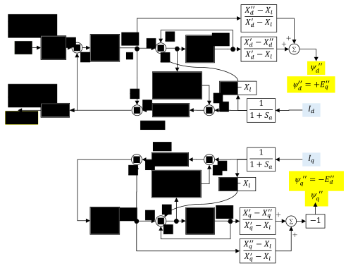

## Context

Saturation modelling in synchronous machines is key to perform transient stability studies. As described in the [GENTPF/GENTPJ](../GENTPJ/) models, a more accurate modeling of the saturation is achieved by defining saturation functions, which depend on the magnetic flux and the currents of the synchronous machine, to scale the reactances and the fluxes. In the GENTPJ model, this is only done for the subtransient reactances. Some issues were found with this model [[1]](#1), which resulted in the development of an improved model, the GENQEC model [[2]](#2), which is described in this page.

## Model use, assumptions, validity domain and limitations

As the GENTPF/GENTPJ model, it is used to perform transient stabililty of synchronous machines with the most complete modeling of saturation.

The model assumptions are the following:

* The three-phase system is balanced.
* The air gap between the stator and rotor is non-uniform, but the relationships between the flux linkages and currents are independent of the position of the rotor when expressed in the *dq0* reference frame.
* The magnetic circuit is considered to be non-linear, considering saturation effects, and can be modeled using different saturation functions.
* The saturation effects are applied to all the reactances, but not at the transient and steady-state reactances.

The GENQEC model is suitable for EMT as it models with detail the non-linearities and the fast dynamics of the machine. It will substitute the GENTPJ in December 2024 after the testing phase is finished, although it is already accepted by the WECC [[3]](#3).

## Model Description

### Parameters

| Parameter | Description | Unit |
| --- | --- | --- |
| $$\omega_s$$ | Synchronous speed | rad/s |
| $$R_s$$ | Stator resistance | $$\Omega$$ |
| $$X_{dsat}$$ | Saturated Direct-axis synchronous reactance| $$\Omega$$ |
| $$X'_{dsat}$$ | Saturated Direct-axis transient reactance | $$\Omega$$ |
| $$X_{qsat}$$ | Saturated Quadrature-axis synchronous reactance | $$\Omega$$ |
| $$X'_{qsat}$$ | Saturated Quadrature-axis transient reactance | $$\Omega$$ |
| $$X''_{dsat}$$ | Saturated Direct-axis subtransient reactance with saturation considered| $$\Omega$$ |
| $$X''_{qsat}$$ | Saturated Quadrature-axis subtransient reactance with saturation considered| $$\Omega$$ |
| $$X_{ls}$$ | Stator leakage reactance | $$\Omega$$ |
| $$T'_{d0sat}$$ | Saturated Direct-axis transient time constant | s |
| $$T''_{d0sat}$$ | Saturated Direct-axis subtransient time constant | s |
| $$T'_{q0sat}$$ | Saturated Quadrature-axis transient time constant | s |
| $$T''_{q0sat}$$ | Saturated Quadrature-axis subtransient time constant | s |
| $$H$$ | Inertia constant | s |

### Variables

| Variable | Description | Unit |
| --- | --- | --- |
| $$\Psi_d$$ | d-axis flux linkage | Wb |
| $$\Psi_q$$ | q-axis flux linkage | Wb |
| $$\Psi_0$$ | Zero-sequence flux linkage | Wb |
| $$\Psi_{1d}$$ | Flux linkage associated with $$X''_{dsat}$$ | Wb |
| $$\Psi_{2q}$$ | Flux linkage associated with $$X''_{qsat}$$ | Wb |
| $$I_d$$ | d-axis current | A |
| $$I_q$$ | q-axis current | A |
| $$I_0$$ | Zero-sequence current | A |
| $$V_d$$ | d-axis voltage | V |
| $$V_q$$ | q-axis voltage | V |
| $$V_0$$ | Zero-sequence voltage | V |
| $$E_{fd}$$ | Field voltage | V |
| $$E'_q$$ | Transient voltage behind transient reactance in d-axis | V |
| $$E'_d$$ | Transient voltage behind transient reactance in q-axis | V |
| $$\delta$$ | Rotor angle | rad |
| $$\omega$$ | Electrical rotational speed | rad/s |
| $$T_m$$ | Mechanical torque | Nm |
| $$T_{fw}$$ | Windage and friction torque | m |
| $$Sat_d$$ | Saturation factor for the d-axis | Unitless |
| $$Sat_q$$ | Saturation factor for the q-axis | Unitless |

### Equations

Electric Dynamics Equations:

$$ V_d = \frac{\omega}{\omega_s} E_d'' + I_q X_{qsat}'' - I_dR_a$$
$$ V_q = \frac{\omega}{\omega_s} E_q'' - I_d X_{dsat}'' - I_qR_a$$
$$ \frac{1}{\omega_s} \frac{d\Psi_0}{dt} = R_s I_0 + V_0$$
$$ E''_q = E_{q1} + E_{q2} - I_d (X_{dsat} - X''_{dsat}) $$
$$ E''_d = E_{d1} + E_{d2} + I_q (X_{qsat} - X''_{qsat}) $$
$$ E'_q = E_{q1} + E_{q2} - \frac{X'_{dsat} - X''_{dsat}}{X_{dsat} - X''_{dsat}} E_{q2} - I_d (X_{dsat} - X'_{dsat}) $$
$$ E'_d = E_{d1} + E_{d2} - \frac{X'_{qsat} - X''_{qsat}}{X_{qsat} - X''_{qsat}} E_{d2} + I_q (X_{qsat} - X'_{qsat}) $$
$$ T''_{d0sat} \frac{dE''_q}{dt} = -\frac{X'_{dsat} - X''_{dsat}}{X_{dsat} - X''_{dsat}} E_{q2} $$
$$ T''_{q0sat} \frac{dE''_d}{dt} = -\frac{X'_{qsat} - X''_{qsat}}{X_{qsat} - X''_{qsat}} E_{d2} $$
$$ T'_{d0sat} \frac{dE'_q}{dt} = E_{fdsat} - E_{q1} $$
$$ T'_{q0sat} \frac{dE'_d}{dt} = -E_{d1} $$

Swing equations:

$$ \frac{d\delta}{dt} = \omega - \omega_s$$
$$ \frac{2H}{\omega_s} \frac{d\omega}{dt} = T_m - (\Psi_d I_q - \Psi_q I_d) - T_{fw}$$

Electrical Torque Equations:

$$ \Psi_q = \Psi_q'' - I_q X''_{qsat} = -E''_d - I_q X''_{qsat} $$
$$ \Psi_d = \Psi_d'' - I_d X''_{dsat} = E''_q - I_d X''_{dsat} $$
$$ T_{elec} = \Psi_d I_q - \Psi_q I_d $$

where the following rearrangement can be done:

$$ E_{q1} = E''_q + \left( E'_q - E''_q \right) \frac{X_{dsat} - X''_{dsat}}{X_{dsat} - X'_{dsat}} = \frac{X_{dsat} - X''_{dsat}}{X_{dsat} - X'_{dsat}} E'_q - \frac{X_{dsat} - X''_{dsat}}{X_{dsat} - X'_{dsat}} E''_q $$
$$ E_{d1} = E''_d + \left( E'_d - E''_d \right) \frac{X_{qsat} - X''_{qsat}}{X_{qsat} - X'_{qsat}} = \frac{X_{qsat} - X''_{qsat}}{X_{qsat} - X'_{qsat}} E'_d - \frac{X_{qsat} - X''_{qsat}}{X_{qsat} - X'_{qsat}} E''_d $$
$$ E_{q2} = -\left( E'_q - E''_q \right) \frac{X_{dsat} - X'_{dsat}}{X_{dsat} - X''_{dsat}} + I_d (X_{dsat} - X''_{dsat}) $$
$$ E_{d2} = -\left( E'_d - E''_d \right) \frac{X_{qsat} - X'_{qsat}}{X_{qsat} - X''_{qsat}} - I_q (X_{qsat} - X''_{qsat}) $$

## Operational principles

The modeling approach is similar to the one used in [GENTPJ](../GENTPJ/), with the following changes.

### Changes in the saturation calculation

As in the GENTPJ model, the three following functions are the most commonly used to calculate the saturation:

* *Quadratic:* $$ Sat(x) = B(x-A)^2$$. Used in GE PSLF and PowerWorld Simulator. 
* *Scaled Quadratic:* $$ Sat(x) = \frac{B(x-A)^2}{x}$$. Used in PTI PSS/E and PowerWorld Simulator. 
* *Exponential:* $$ Sat(x) = Bx^A$$. Used in BPA-IPF nad some specific models of PTI PSS/E and PowerWorld Simualtor. 

In this case, the variable will be the magnetic flux $$ S_a = Sat(\Psi_{ag})$$ which is calculated using the air gap voltage as follows: 

$$ \Psi_{ag} = \frac{1}{1+\omega} \sqrt(V_{qag}^2 + V_{dag}^2) $$
$$ V_{qag} + V_q + I_qR_a + I_dX_l$$
$$ V_{dag} + V_d + I_dR_a - I_dX_l$$

and then, the saturation of each axis is calculated as:

$$ Sat_d = Sat_q = 1 + S_a $$

### Scaling of the fluxes and reactances

In the GENTPJ, only the subtransient reactances were affected by the saturation effects. In this GENQEC model, the saturation effects are extended to all the reactances and fluxes:

$$ X''_{dsat} = \frac{X''_d - X_l}{Sat_d} + X_l $$
$$ X''_{qsat} = \frac{X''_q - X_l}{Sat_q} + X_l $$
$$ X'_{dsat} = \frac{X'_d - X_l}{Sat_d} + X_l $$
$$ X'_{qsat} = \frac{X'_q - X_l}{Sat_q} + X_l $$
$$ X_{dsat} = \frac{X_d - X_l}{Sat_d} + X_l $$
$$ X_{qsat} = \frac{X_q - X_l}{Sat_q} + X_l $$
$$ T'_{d0sat} = \frac{T'_{d0}}{Sat_d} $$
$$ T'_{q0sat} = \frac{T'_{q0}}{Sat_q} $$
$$ T''_{d0sat} = \frac{T''_{d0}}{Sat_d} $$
$$ T''_{q0sat} = \frac{T''_{q0}}{Sat_q} $$
$$ E_{fdsat} = \frac{E_{fd}}{Sat_d} $$
$$ X_{mdsat} I_{fd} = \left( X_{dsat} - X_l \right) I_{fd} = \frac{X_d - X_l}{Sat_d} I_{fd} $$

The following figure shows the block diagram for this GENQEC model [[2]](#2):

Figure 1: Block diagram of the GENQEC model

## Open source implementations

No open-source implementations were found.

## Table of references

<a id="1">[1]</a> Western Electricity Coordinating Council (WECC). "Retirement Plan for GENTPJ" (2022). [Link](https://www.wecc.org/wecc-document/3431)

<a id="2">[2]</a> PowerWorld Corporation. "GENQEC Machine Model" (2022). [Link](https://www.powerworld.com/files/GENQEC-Equations.pdf)

<a id="3">[3]</a> Western Electricity Coordinating Council (WECC). "WECC Aproved Dynamic Model Library" (2024). [Link](https://transmission.bpa.gov/business/operations/GridModeling/Approved%20Dynamic%20Models%20January%202024.pdf)

