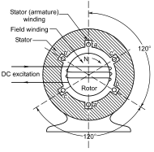

## Context

The synchronous machine is one of the most studied component of a power system, being its main source of electrical energy. It is the most common type of generators, and it is present in most power plants (thermal, hydro, and some wind) as an interface between the mechanical energy and electrical energy. The mathematical model presented in this article develops the dynamic equations of synchronous machines.[[1]](#1) It only covers the physical part of the machine not the regulations nor protections schemes. Variants of the classical model are listed in a dedicated section [Derived models](#derived-models)  below.

## Model use, assumptions, validity domain and limitations

The model presents the general expressions in *abc* reference frame of the differential equations that model a general synchronous machine with the following assumptions:

* There are three stator windings ($$a, b, c$$) distributed 120º apart one from each other, each of them with equal parameters (i.e. same resistance, inductance...).
* The three phases are balanced, meaning the power is shared equally.
* The rotor has one winding with a field ($$e_f$$) applied and three damper windings, with no power source, one of them with the axis parallel to the field winding ($$1d$$) and the other two with a perpendicular axis ($$1q, 2q$$).
* The magnetic field produced by the rotor winding oscillates sinusoidally.
* The machine may have 2 or more poles, noted as $$p_f$$.

The general model can be solved by detailed models that make further assumptions about the rotor structure and the expressions of some of its parameters as functions of some variables, in particular the interaction between rotor and stator due to magnetic saturation. Each particular model is listed, and its additional assumptions are explained before transforming the set of equations. A per-unit system is also proposed.

The resulting models will provide the complete set of dynamic equations of the synchronous machine to perform transient analysis. These equations can be further transformed to perform steady-state analysis.

## Physical description

The following schematic shows the components that participate in the synchronous machine operation:

Figure 1: Synchronous machine model schematic

### Physical parts of a Synchronous Machine

A synchronous machine is formed by the following parts:

#### Rotor

The rotor is the moving part of the generator. It is at the end of the rotation axis of the turbine, which is the component that transfers the energy of a moving fluid (normally steam) into mechanical energy.
As the name indicates, the mechanical energy corresponds to the rotational kinetic energy of the body composed by the blades and axis of the turbine. 

It can be round rotor, commonly used in high rotation speed application, or salient pole, used in lower speed applications (i.e. hydro generation) where multiple pair of poles are needed to work at the grid frequency.[[2]](#2) Both of them will have at least one winding revolving around an axis perpendicular to the rotating axis. The direction of the field produced by the DC excitation will rotate at the same rate as the rotor, pointing in the perpendicular direction of the rotating axis. 

#### Exciter

The exciter is the source of power that generates the current flowing through the rotor winding. It applies a DC voltage that generates a current in the rotor winding, creating an electromagnet. It is important for voltage control as increasing the current supplied to the rotor winding increases the induced voltage in the stator winding, providing the ability to apply control loops that ensure the terminal voltage keeps at a setpoint.

This electromagnet can be replaced by a permanent magnet, in which case there would be no need to have a DC excitation to create a rotating field. These types of generators (PMSG), which can be found in newer models of wind turbines, have better efficiency as there are no losses associated with the excitation circuit, and lowers the maintenance needed since all the excitation parts are substituted by a single element. As a downside, there is no possibility to control the field by changing the level of excitation.
The field magnitude will remain constant value, with a value dependent on the geometry and material of the magnet.

#### Stator

It is the static part of the machine, as its name indicates. This structure gives physical support to the whole machine, while it typically contains the armature winding. It is a three-phase winding distributed in a circular cavity 120º apart one from each other. The uniform rotation of the magnetic field created by the rotor winding will generate currents at each winding 120º apart in the phasorial space. The instantaneous value for each phase is noted as $$i_a$$, $$i_b$$, and $$i_c$$. The following Figure [[2]](#2)
shows the structure of the synchronous machine, including the windings.

Figure 2: Synchronous machine static part diagram

#### Governor

The governor is the controller of the speed of the motor. Its primary function is to maintain the speed of the rotor, and hence the frequency of the electrical output of the generator. It is necessary for adapting to load changes, since a sudden increase or decrease of the load would decelerate or accelerate the generator if no actions are taken.
Since it is connected to the prime mover of the generator (generally a turbine), the control will adjust the amount of energy entering the turbine, increasing or decreasing the rate of energy as if it needs to accelerate or decelerate the rotation.

### Synchronous machine equations

#### Variables

| Variable    | details  | Unit |
| --------------| ------ | ----- |
| $$\theta_{shaft}$$ | Rotor angle | $$rad$$ |
| $$\omega$$ | Electrical rotational speed | $$rad/s$$ |
| $$T_m$$ | Mechanical torque | $$Nm$$ |
| $$T_e$$ | Electrical torque | $$Nm$$ |
| $$T_{fw}$$ | Windage and friction torque | $$Nm$$ |
| $$v_a$$, $$v_b$$, $$v_c$$ | Stator phase voltages | $$V$$ |
| $$i_a$$, $$i_b$$, $$i_c$$ | Stator phase currents | $$A$$ |
| $$\psi_a$$, $$\psi_b$$, $$\psi_c$$ | Stator phase flux linkages | $$Wb$$ |
| $$\psi_f$$, $$\psi_{1d}$$, $$\psi_{1q}$$, $$\psi_{2q}$$ | Rotor flux linkages | $$Wb$$ |
| $$v_f$$ | Field voltage | $$V$$ |
| $$\mathcal{L}_{ww'}$$ | Total inductance between two windings (can be itself) | $$H$$ |

#### Parameters

| Parameter | Description | Unit |
| --- | --- | --- |
| $$J$$ | Moment of inertia | $$kgm^2$$ |
| $$p_f$$ | Number of pole pairs | - |
| $$R_a$$, $$R_b$$, $$R_c$$ | Stator phase resistances | $$\Omega$$ |
| $$R_f$$, $$R_{1d}$$, $$R_{1q}$$, $$R_{2q}$$ | Rotor windings resistances | $$\Omega$$ |
| $$L_{ww0}$$ | Self-inductance of a winding | $$H$$ |
| $$L_{wl}$$ | Leakage inductance of a winding | $$H$$ |
| $$L_{wg2}$$ | Mutual inductance between windings | $$H$$ |
| $$L_{af}$$ | Mutual inductance between stator and rotor | $$H$$ |

#### System of equations

The following system of equations describe a general synchronous machine with the considered assumptions. Some of its parameters are generally non-constant, meaning it is not directly solved without making some additional assumptions. The particular models are derivations of this system of equations.

Mechanical dynamic equations:

$$J\frac{2}{p_f}  \frac{d\omega_m}{dt} = T_m - T_e - T_{fw}$$
$$\frac{d\theta_{shaft}}{dt} = \frac{2}{p_f} \omega$$

Stator dynamic equations:

$$v_a = R_a i_a + \frac{d\psi_a}{dt}$$
$$v_b = R_b i_b + \frac{d\psi_b}{dt}$$
$$v_c = R_c i_c + \frac{d\psi_c}{dt}$$

Rotor dynamic equations:

$$v_f = R_f i_f + \frac{d\psi_f}{dt} $$
$$0 = R_{1d} i_{1d} + \frac{d\psi_{1d}}{dt} $$
$$0 = R_{1q} i_{1q} + \frac{d\psi_{1q}}{dt} $$
$$0 = R_{2q} i_{2q} + \frac{d\psi_{2q}}{dt} $$

With the general flux expressions as follows:

Stator fluxes:

$$\psi_a = \mathcal{L}_{aa} i_a + \mathcal{L}_{ab} i_b +\mathcal{L}_{ac} i_c + \mathcal{L}_{af} i_f + \mathcal{L}_{a1d} i_{1d} + \mathcal{L}_{a1q} i_{1q} + \mathcal{L}_{a2q} i_{2q}$$
$$\psi_b = \mathcal{L}_{ba} i_a + \mathcal{L}_{bb} i_b +\mathcal{L}_{bc} i_c + \mathcal{L}_{bf} i_f + \mathcal{L}_{b1d} i_{1d} + \mathcal{L}_{b1q} i_{1q} + \mathcal{L}_{b2q} i_{2q}$$
$$\psi_c = \mathcal{L}_{ca} i_a + \mathcal{L}_{cb} i_b +\mathcal{L}_{cc} i_c + \mathcal{L}_{cf} i_f + \mathcal{L}_{c1d} i_{1d} + \mathcal{L}_{c1q} i_{1q} + \mathcal{L}_{c2q} i_{2q}$$

Rotor fluxes:

$$\psi_f = \mathcal{L}_{fa} i_a + \mathcal{L}_{fb} i_b +\mathcal{L}_{fc} i_c + \mathcal{L}_{ff} i_f + \mathcal{L}_{f1d} i_{1d}$$
$$\psi_{1d} = \mathcal{L}_{1da} i_a + \mathcal{L}_{1db} i_b +\mathcal{L}_{1dc} i_c + \mathcal{L}_{1df} i_f + \mathcal{L}_{1dqd} i_{1d}$$
$$\psi_{1q} = \mathcal{L}_{1qa} i_a + \mathcal{L}_{1qb} i_b +\mathcal{L}_{1qc} i_c + \mathcal{L}_{1q1q} i_{1q} + \mathcal{L}_{1q2q} i_{2q}$$
$$\psi_{2q} = \mathcal{L}_{2qa} i_a + \mathcal{L}_{2qb} i_b +\mathcal{L}_{2qc} i_c + \mathcal{L}_{2q1q} i_{1q} + \mathcal{L}_{2q2q} i_{2q}$$

### Operational principles

#### Swing equation of the synchronous machine

The dynamic equation that governs the system relates the mechanical torque applied by the turbine and the electrical torque applied by the grid[[3]](#3):

$$J\frac{2}{p_f}  \frac{d\omega}{dt} = T_m - T_e - T_{fw}$$

where $$\omega$$ is the rotational speed in $$rad/s$$, $$J$$ is the inertia of the rotating body in $$kgm^2$$, $$T_m$$ is the mechanical torque, $$T_e$$ is the electrical torque and $$T_{fw}$$ is the friction and windage torque, all in $$Nm$$.

#### Electric equations of the synchronous machine in *abc* reference frame

Regarding the electrical part of the model, the rotor winding is magnetized by the exciter current, creating a magnetic field that will rotate with the rotor's angular velocity. As it spins, the stator windings will be subjected to a variable magnetic flux caused by the rotation of the produced magnetic field which, according to Faraday's Law, will induce an electromotive force in the windings.

$$e_{emf} = \frac{d\psi}{dt}$$

The rotational speed of the rotor of a synchronous machine is proportional to the grid frequency times the number of poles (i.e. number of different three-phase windings). The induced field in each phase $$e_{ir}$$ will lead the terminal voltage $$v_i$$ by a load angle denoted as $$\delta$$.

$$n = \frac{120f}{p_f} \quad (2)$$

where $$n$$ is the rotational speed in $$rev/min$$, $$f$$ is the stator currents frequency in $$Hz$$, and $$p_f$$ is the number of field poles.

The coupling between the rotor and the stator windings can be modelled using the terminal voltage equations:

$$v_a = R_a i_a + \frac{d\psi_a}{dt}$$
$$v_b = R_b i_b + \frac{d\psi_b}{dt}$$
$$v_c = R_c i_c + \frac{d\psi_c}{dt}$$
$$v_f = R_f i_f + \frac{d\psi_f}{dt}$$
$$v_{1d} = R_{1d} i_{1d} + \frac{d\psi_{1d}}{dt} $$
$$v_{1q} = R_{1q} i_{1q} + \frac{d\psi_{1q}}{dt} $$
$$v_{2q} = R_{2q} i_{2q} + \frac{d\psi_{2q}}{dt} $$

where $$\psi_i$$ is the magnetic flux passing through the $$i$$ winding in $$Wb$$, $$R_i$$ is the resistance of the associated circuit in $$\Omega$$, $$v_i$$ is the terminal voltage in $$V$$ and $$i_i$$ is the current in $$A$$.

The total fluxes are calculated taking into account all the present windings in the synchronous machine, which are the three stator windings and the rotor winding.
The fluxes for all the windings are calculated as follows:

Stator fluxes:

$$\psi_a = \mathcal{L}_{aa} i_a + \mathcal{L}_{ab} i_b +\mathcal{L}_{ac} i_c + \mathcal{L}_{af} i_f + \mathcal{L}_{a1d} i_{1d} + \mathcal{L}_{a1q} i_{1q} + \mathcal{L}_{a2q} i_{2q}$$
$$\psi_b = \mathcal{L}_{ba} i_a + \mathcal{L}_{bb} i_b +\mathcal{L}_{bc} i_c + \mathcal{L}_{bf} i_f + \mathcal{L}_{b1d} i_{1d} + \mathcal{L}_{b1q} i_{1q} + \mathcal{L}_{b2q} i_{2q}$$
$$\psi_c = \mathcal{L}_{ca} i_a + \mathcal{L}_{cb} i_b +\mathcal{L}_{cc} i_c + \mathcal{L}_{cf} i_f + \mathcal{L}_{c1d} i_{1d} + \mathcal{L}_{c1q} i_{1q} + \mathcal{L}_{c2q} i_{2q}$$

Rotor fluxes:

$$\psi_f = \mathcal{L}_{fa} i_a + \mathcal{L}_{fb} i_b +\mathcal{L}_{fc} i_c + \mathcal{L}_{ff} i_f + \mathcal{L}_{f1d} i_{1d}$$
$$\psi_{1d} = \mathcal{L}_{1da} i_a + \mathcal{L}_{1db} i_b +\mathcal{L}_{1dc} i_c + \mathcal{L}_{1df} i_f + \mathcal{L}_{1dqd} i_{1d}$$
$$\psi_{1q} = \mathcal{L}_{1qa} i_a + \mathcal{L}_{1qb} i_b +\mathcal{L}_{1qc} i_c + \mathcal{L}_{1q1q} i_{1q} + \mathcal{L}_{1q2q} i_{2q}$$
$$\psi_{2q} = \mathcal{L}_{2qa} i_a + \mathcal{L}_{2qb} i_b +\mathcal{L}_{2qc} i_c + \mathcal{L}_{2q1q} i_{1q} + \mathcal{L}_{2q2q} i_{2q}$$

with $$\mathcal{L}_{pp}$$ being the self inductance of the winding and $$\mathcal{L}_{pp'}$$ the mutual inductance between winding $$p$$ and winding $$p'$$, both in $$H$$. As it can be seen, the *q* axis damper windings and the *d* axis damper and rotor windings do not interact since they are perpendicular.

The inductance values expressed using the notation $$\mathcal{L}$$ express a general dependency with respect to the rotor position $$\theta_{shaft} = \omega t + \theta_0$$ [[4]](#4). It is modelled as a sinusoidal dependency with respect to the electrical angle $$\theta_{me}$$. This angle can be calculated as a function of the rotor position angle expression seen before as $$\theta_{me} = \frac{p_f}{2}\theta_{shaft} = \omega_{me} t + \theta_{e0}$$. 

The general expression for mutual inductance would be $$\mathcal{L}_{pp} = L_{pp} = L_{pp0} + L_{pl} + L_{g2}\cos(2\theta_{me})$$ where the first term corresponds to the portion of the inductance due to the air gap, and the second term corresponds to the leakage flux. The mutual inductances, considering a perfect 120º separation between windings, and having $$\cos(120º) = -1/2$$ take the values $$\mathcal{L}_{pp'} = -\frac{1}{2} L_{pp0} + L_{g2}\cos(2\theta_{me})$$.

Considering that all the windings are assumed to have the same characteristics, the inductances for the different phases will only differ in the angular term of the rotor position, which will have additional phase terms of $$(0º, 120º, -120º)$$ for phases $$(a, b, c)$$ respectively.

The stator-rotor inductance also depends on the electrical angle $$\theta_{me}$$ between the rotor winding axis and the stator winding axis. The value of this inductance for phase $$a$$ can be calculated with the expression $$\mathcal{L}_{af} = \mathcal{L}_{fa} = L_{af}\cos(\theta_{me})$$, while the same expression can be applied for phase $$b$$ and $$c$$ but replacing $$\theta_{me}$$ with $$\theta_{me} - 120º$$ and $$\theta_{me} + 120º$$ respectively.

### Operational limits

Depending on the difference in phase between the rotor and grid rotation, the power transferred will be composed of active ($$P$$) and reactive ($$Q$$) power.

These generated powers are limited by the heat limits of the components of the generator. The limits considered are the Armature and field current limit, due to Joule effect heating of both windings, and end region heating limit, which occurs due to currents in the structure of the stator when the field is underexcited.

The following charts show the capability and compound curves for different power factors[[1]](#1).

Figures 5 and 6: Capability and compound curves of a synchronous machine

 

The left chart shows the $$P$$ and $$Q$$ maximum values for different limit curves, which depend on the refrigerator used, while the right chart shows the dependency on exciter current and apparent power for different values of the power factor.

## Derived models

The model can be solved by performing some additional assumptions and transformations. Here some submodels that have arised from different works are listed, with its particularities:

- **GENSAL/GENROU without saturation**: This model is described in Sauer and Pai formulation [[6]](#6), and is valid for both round-rotor and salient-poles synchronous machine.

- **GENROU with saturation**: This model is an extension of the previous one, considering the saturation of the magnetic circuit.

- **GENSAL with saturation**: Same as the previous model, but in this case it is treated slightly different due to the saturation occuring only in the salient-poles axis only, while the previous model considers saturation along both *d* and *q* axis.

- **GENTPF/GENTPJ**: It models the saturation in a different way, including the saturation in the network interface equations, something that the GENSAL/GENROU models do not consider, and it reflects better the saturation effects in the whole machine.

Details can be found here:



## Open source implementations

This model has been successfully implemented in:

| Software      | URL | Language | Open-Source License | Last consulted date | Comments |
| --------------| --- | --------- | ------------------- |------------------- | -------- |
|Dynawo|[Link](https://github.com/dynawo/dynawo/blob/master/dynawo/sources/Models/Modelica/Dynawo/Electrical/Machines/OmegaRef/GeneratorSynchronous.mo)| modelica | [MPL v2.0](https://www.mozilla.org/en-US/MPL/2.0/)  | 23/04/2024 | no comment |
|OpenIPSL|[Link](https://github.com/OpenIPSL/OpenIPSL/blob/master/OpenIPSL/Electrical/Machines/PSSE/BaseClasses/baseMachine.mo) | modelica | [3-clause-BSD](https://opensource.org/license/BSD-3-Clause) | 24/05/2024 | no comment |
|Pandapower|[Link](https://github.com/e2nIEE/pandapower/blob/develop/pandapower/converter/cim/cim2pp/converter_classes/generators/synchronousMachinesCim16.py) | python | [3-clause_BSD](https://opensource.org/license/BSD-3-Clause) | 24/05/2024 | no comment |

## Table of references

<a id="1">[1]</a> Kundur, Prabha. "Power System Stability and Control" New York, USA, 1994, McGraw-Hill.

<a id="2">[2]</a> Kothari, D. P.; Nagrath, I. J. "Modern Power System Analysis", 4th ed., New Delhi, India, 2011, Tata McGraw-Hill.

<a id="3">[3]</a> PowerWorld Corporation. "ECE 310 Synchronous Machine Modeling".

<a id="4">[4]</a> Fitzgerald, A. E.; Kingsley, C.; Umans, S. D. "Electric Machinery", New York, USA, 6th ed., 2002, McGraw-Hill.

<a id="5">[5]</a> Krause, P.; Wasynczuk, O.; Sudhoff, S.; Pekarek, S. "Analysis of Electric Machinery and Drive Systems", 3rd ed., New Jersey, USA, 2013, Wiley.

<a id="6">[6]</a> Sauer, P.W.; Pai, M. A. "Power System Dynamics and Stability", Urbana, IL, USA, 2006.