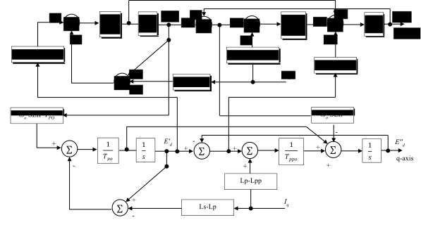

## Context

Motors are a particular kind of load that can account for a large share of the total load especially in industrialised countries. Adequate representation of motors is important, especially in short-term voltage stability studies as motors can cause fault-induced delayed voltage recovery [[1]](#1).

## Model use, assumptions, validity domain and limitations

The motor model can be used for short-term voltage stability studies. The assumptions made for this model are:

* The rotor resistance is constant (no skin-effect or double-cage motors).
* The motor is balanced.
* The magnetic circuit is considered to be linear, neglecting saturation effects.
* The mechanical torque varies as a constant power of the rotor speed (e.g. constant torque or quadratic torque).

The model takes into account transient and subtransient phenomena and is therefore suitable for systems with a very large motor share (>50% of the total load) or to compute the short-circuit contribution from motors.

## Model description

### Parameters

| Parameter| Description | Unit | Typical value
| ---| ---  | --- | --- |
| $$\omega_s$$ | Synchronous speed | $$rad/s$$ | $$314rad/s$$ |
| $$R_s$$ | Stator resistance | $$\Omega$$ | $$0.02pu$$ |
| $$L_s$$ | Synchronous reactance  | $$\Omega$$ | $$1.8pu$$ |
| $$L_p$$ | Transient reactance  | $$\Omega$$ | $$0.12pu$$ |
| $$L_{pp}$$ | Subtransient reactance  | $$\Omega$$ | $$0.104pu$$ |
| $$t_{p0}$$ | Transient open circuit time constant  | $$s$$ | $$0.08s$$ |
| $$t_{pp0}$$ | Subtransient open circuit time constant  | $$s$$ | $$0.0021s$$ |
| $$J$$ | Moment of inertia | $$kgm^2$$ | 0.1 to 5s |
| $$\eta$$ | Exponent of the torque speed dependency | Unitless | 0 to 3 |
| $$C_{l, 0}$$ | Initial load torque | $$Nm$$ | N/A |
| $$\omega_0$$ | Initial rotor speed | $$rad/s$$ | N/A |

### Variables

| Variable | Description | Unit |
| --- | --- | --- |
| $$V$$ | Stator voltage | $$V$$ |
| $$E_d'$$ | Voltage behind transient reactance d component | $$V$$ |
| $$E_q'$$ | Voltage behind transient reactance q component | $$V$$ |
| $$E_d''$$ | Voltage behind subtransient reactance d component | $$V$$ |
| $$E_q''$$ | Voltage behind subtransient reactance q component | $$V$$ |
| $$I_d$$ | Current of direct axis | $$A$$ |
| $$I_q$$ | Current of quadrature axis | $$A$$ |
| $$C_e$$ | Electrical torque | $$Nm$$ |
| $$C_l$$ | Load torque | $$Nm$$ |
| SLIP | Rotor slip | Unitless |
| $$\omega$$ | Rotor speed | $$rad/s$$ |

### Equations

The electrical equations are described by the figure below [[1]](#1).

And is interfaced to the grid with

$$V = (E_d'' + j E_q'') + (R_s + j L_{pp}) (I_d + j I_q)$$

And the mechanical equations are

$$2 J  \frac{d\omega}{dt} = C_e - C_l$$
$$SLIP = \frac{\omega_s - \omega}{\omega_s}$$
$$C_e = E_d'' I_d + E_q'' I_q$$
$$C_l = C_{l, 0} \left(\frac{\omega}{\omega_0}\right)^\eta$$

## Open source implementations

This model has been successfully implemented in :

| Software      | URL | Language | Open-Source License | Last consulted date | Comments |
| --------------| --- | --------- | ------------------- |------------------- | -------- |
|Dynawo|[Link](https://github.com/dynawo/dynawo/blob/master/dynawo/sources/Models/Modelica/Dynawo/Electrical/Machines/Motors/MotorFifthOrder.mo)| modelica | [MPL v2.0](https://www.mozilla.org/en-US/MPL/2.0/)  | 12/08/2024 | no comment |

## Table of references

<a id="1">[1]</a> PowerWorld. "Load Characteristic MOTORW", [https://www.powerworld.com/WebHelp/Content/TransientModels_HTML/Load%20Characteristic%20MOTORW.htm](https://www.powerworld.com/WebHelp/Content/TransientModels_HTML/Load%20Characteristic%20MOTORW.htm)
