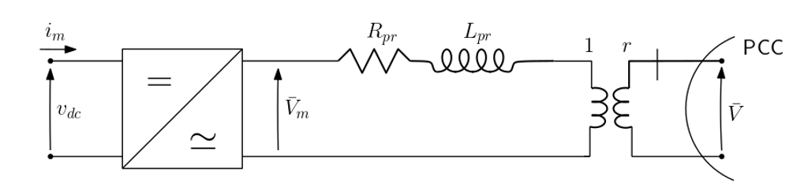
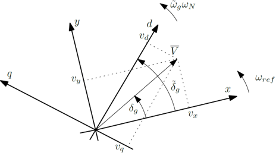
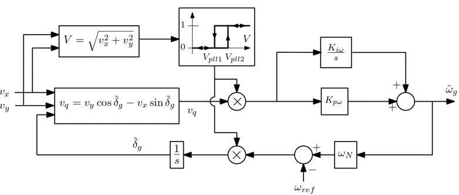
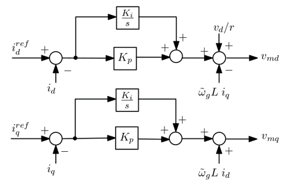
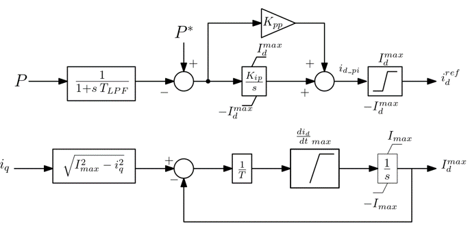
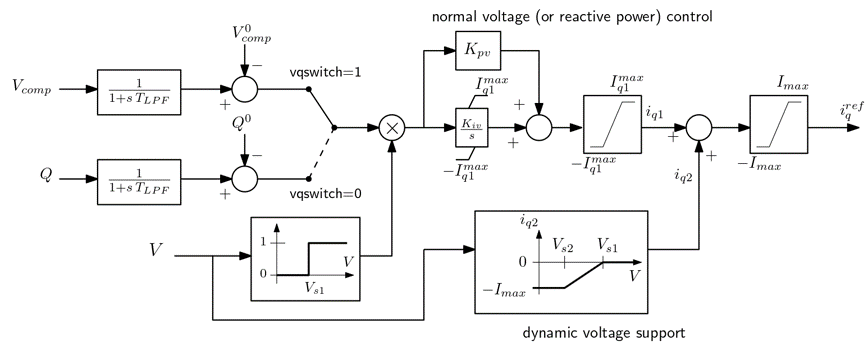
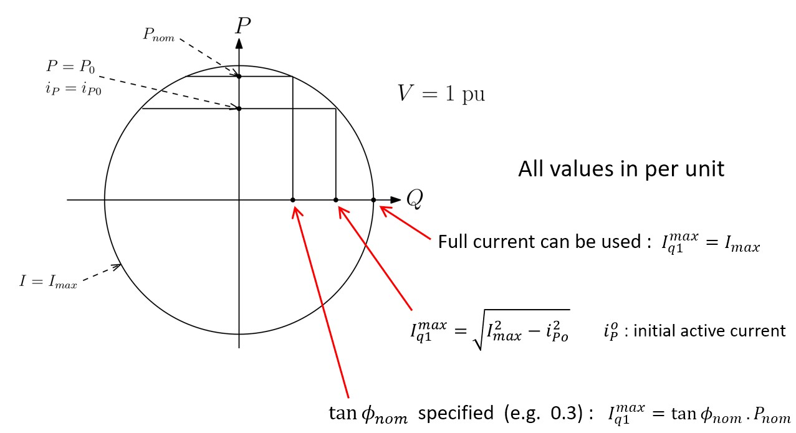

## Context

This grid-following voltage source converter is a generic RMS model that encompasses many variants found in the literature. The dynamic model was developed and validated by the team of Professor Xavier Guillaud at Ecole centrale de Lille; The parameters were tuned using time-scale decomposition principles (for instance, current control loops are faster than active power control loop, etc.). The RMS implementation and testing were performed by Prof. Thierry Van Cutsem with a view to building test cases to study the impact of converters on stability of power networks.

## Model use, assumptions, validity domain and limitations

The model pertains to an MMC-type converter connected to the grid through its transformer, without LC filter. The focus being essentially on the AC side dynamics, the DC side of the converter is not considered; the DC voltage $$v_{dc}$$ is considered constant. The model can be used for studying voltage, frequency and angle stability and, to some extent converter-driven stability of the slow interaction type. It is not aimed at being used in EMT studies. As a generic model it renders the overall dynamics observed in real-life systems; it is not aimed at studying a specific behaviour of an existing converter.

Unlike usual RMS models, the dynamics of the transformer connecting the converter to the grid are represented with their differential (instead of algebraic) equations. On the same time scale the current control loops have been taken into account (instead of being assumed infinitely fast).

## Model description

The model consists of :

- a physical part that includes the above mentionned MMC-type converter and its transformer, represented by a voltage source in series with a resistance ($$R_{pr}$$) and reactance ($$L_{pr}$$) and an ideal transformer leading to the  point of common coupling.
- a number of classical converter controls: a Phase Locked Loop (PLL), current control loops, an active power control loop, an AC voltage or reactive power controlloop. Those control loops include limiters to prevent the converter current from exceeding its limit.

### Physical part

The physical part is presented in the following figure:

The reference frame of the network $$(x,y)$$ is different from the internal converter $$(d,q)$$ reference frame. their relationship can be represented by:  

where:

- $$(𝑥,𝑦)$$ axes are rotating at angular speed $$𝜔_{𝑟𝑒𝑓}$$ in (rad/s)
- $$𝑣_𝑥, 𝑣_𝑦$$ are the rectangular components of PCC voltage phasor $$\bar{𝑉}$$
- $$(𝑑,𝑞)$$ axes are tracking the voltage phasor and are given by the PLL
- $$𝑣_𝑑, 𝑣_𝑞$$ are the $$𝑑,𝑞$$ components of $$\bar{𝑉}$$
- $$𝛿_𝑔$$ is the phase angle of $$\bar{𝑉}$$ with respect to the network $$x$$ reference (in rad)
- $$\tilde{𝛿}_𝑔$$ is the angle between $$𝑑$$ and $$𝑥$$ (in rad). In steady-state, we have : $$\tilde{𝛿}_𝑔= 𝛿_𝑔$$
- $$\tilde{𝜔}_𝑔$$ is the angular speed of $$(𝑑,𝑞)$$ axes (in pu/s)
- $$\omega_N$$ is the nominal angular speed (in rad/s)

The equations of the physical part are the following:

**Change in the reference from $$(x,y)$$  to $$(d,q)$$ :**

$$ v_d = v_x * cos(\tilde{\delta}_g) + v_y * sin(\tilde{\delta}_g) $$
$$ i_d = r * i_x * cos(\tilde{\delta}_g) + r* i_y * sin(\tilde{\delta}_g) $$

**Dynamics of current in transformer in $$(𝑑,𝑞)$$ reference frame:**

$$ L_{pr} \frac{di_d}{dt} = \omega_N* ( v_{md} - \frac{v_d}{r} - R_{pr} i_d + \tilde{\omega}_g L_{pr} i_q)$$
$$ L_{pr} \frac{di_q}{dt} = \omega_N* ( v_{mq} - \frac{v_q}{r} - R_{pr} i_q + \tilde{\omega}_g L_{pr} i_d)$$

### PLL

The generic model of the PLL is shown in the following block-diagram:

where the following gains are in per unit on the $$S_{nom}$$ base (nominal apparent power of converter):

 $$K_{p\omega} = \frac{10}{T_{pll} \omega_N}$$
 $$K_{i\omega} = \frac{25}{T_{pll}^2 \omega_N}$$

 $$T_{pll}$$ is the time constant of the PLL (in s); a typical value is 100 ms.

The PLL is blocked in low voltage conditions and restarts when the voltage recovers. A hysteresis mechanism is implemented, involving the $$V_{pll1}$$ and $$V_{pll2}$$ thresholds (with typical values 0.4 and 0.5 pu, respectively)

### d-q current control

The d-q current control loop is shown in the following block-diagram:

where:

- $$K_{i}= R_{pr} \omega_c$$ is the gain of the integrator (in pu/s) 
- $$K_{p}= L_{pr} \frac{\omega_c}{\omega_N}$$ is the proportional gain (in pu)

### Active power control

The active power control is shown in the following block-diagram:

where:

- $$T_{LPF} = \frac{1}{\omega_{LPF}}$$ is the time constant of the low-pass filter (in s)
- $$𝐾_{𝑝𝑝}= \frac{𝐾_{𝑖𝑝}}{𝜔_{𝐿𝑃𝐹}}$$ is the proportional gain (in pu)
- $$I_max$$ is the maximum allowed current (in pu). It could be slightly larger than 1
- $$K_{ip}$$ is the integral gain (in $$pu/s$$)

The lower block-diagram aims at limiting the rate of recovery of  $$𝐼_𝑑^{𝑚𝑎𝑥}$$ after it has been decreased by an increase of $$𝑖_𝑞$$, as the priority is given to the reactive current.
$$T$$ is a small time constant (in s) for this purpose and the value of $$\frac{di_q}{dt}_{max}$$ depends on the type of converter (wind park or HVDC link).

### Reactive power control

The voltage/reactive power control loop is shown in the following block-diagram:

When $$vqswitch=1$$, the VSC operates in voltage control mode, whereas when $$vqswitch =0$$ it is in reactive power control mode.

The lower block-diagram provides a dynamic voltage support in case of important voltage drop below $$V_{s2}$$. Dynamic voltage support can be discarded by putting $$𝑖_{𝑞2}=0$$.

The variables and parameters are as follows:

- $$𝑄$$ is the reactive power injected into the grid (in pu)
- $$T_{LPF}$$ is the time constant of the low-pass filter (in s)
- $$𝑉_{𝑐𝑜𝑚𝑝}$$ is the compensated voltage :
  $$ V_{comp}= | \frac{\bar{V}}{r}$$
  $$ + (R_c + j X_c) r \bar{I} | $$
- If this degree of freedom is not exploited, $$R_c$$ is set to $$R_{pr}$$ and $$X_c$$ to $$L_{pr}$$
- $$I^{q1}_{max}$$ is equal to $$I_{max}$$. Alternative choices are presented below
- $$V_{s1}$$ and $$V_{s2}$$ are respectively the upper and lower bounds of the voltage support (in pu).
- $$K_{pv}$$ and K_{iv} are the proportional and integral gains of the control.

### Limitations of current

The current limitations can be explained with the following scheme:

Three modes can be selected:

- the full current can be used for $$i_{q}$$: $$I_{q1max}= I_{max}$$
- the reactive current is limited to the maximum value corresponding to the initial active current $$i_{P0}$$: $$I^{q1}_{max}= \sqrt{I^2_{max}- i_{P0}^2}$$
- the reactive current is limited according to a specified value of $$\tan(\phi_{𝑛𝑜𝑚})$$:  $$𝐼_{𝑞1}^{𝑚𝑎𝑥}=\tan(\phi_{𝑛𝑜𝑚}) P_{nom}$$ where $$P_{nom}$$ is the nominal actoive power of the converter.

## Open source implementations (if any)

This model has been successfully implemented in :

| Software      | URL | Language | Open-Source License | Last consulted date | Comments |
| --------------| --- | --------- | ------------------- |------------------- | -------- |
| STEPSS | [Link](https://github.com/CRESYM/BiGER/tree/main/testModels/gridFollowing/STEPPS) | txt | [MPL v2.0](https://www.mozilla.org/en-US/MPL/2.0/)  | 17/05/2024 | - |
| dynawo | [Link](https://github.com/dynawo/dynawo/) | modelica | [MPL v2.0](https://www.mozilla.org/en-US/MPL/2.0/)  | 17/05/2024 | - |

## Table of references
