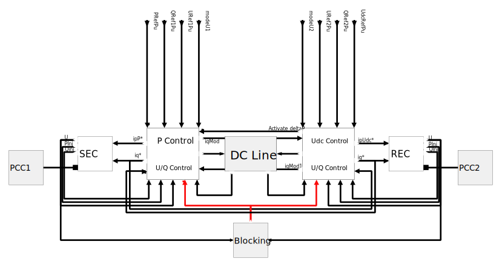
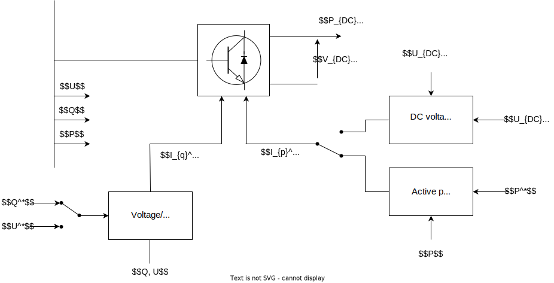
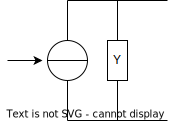
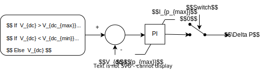
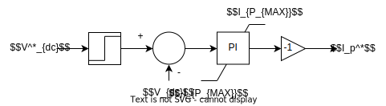
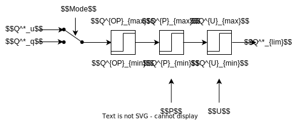
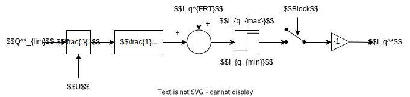

## Context

This average phasor voltage source converter based high voltage DC transmission line (VSC-HVDC) model has been developed by RTE [[1]](#1)  based on some work done by ENTSOE G-HVDC WP.
 It gathers most of the features of specific detailed models, while being kept as simple and generic as possible.

## Model use, assumptions, validity domain and limitations

It can be used for voltage and transient stability studies by using the link specifications or customer data, when a detailed specific model can't be used (data isn't available or can't be shared).

It can't be used for studies that look at the DC side behaviour (a simplified DC bus is considered in the model) nor the frequency behaviour (the secondary voltage control isn't implemented in this model) as the DC link and its interaction with the converter isn't properly modelled.

Details on the voltage control, reactive power control, active/reactive limits are represented and key for the voltage studies.  This model contains UQ and PQ diagrams limitations, current limitations to respect the apparent power constraints and operator-defined PQ limitations.

Additional reactive current injection ($$I_{q}^{FFC}$$) during fault and current blocking function is also represented in this model for an acurate behaviour during a fault for transient stability studies [[2]](#2).

The modeling choice for HVDC VSC for stability studies is an ongoing active research topic. The fast interaction between AC and DC systems requires changes in the manner in which the modeling and computation of the system is done, both at the DC and the AC side [[3]](#3).

## Model description

The general structure of the HVDC VSC standard model is this one:

### DC transmission line and converters model

In the AC grid sending-end and receiving-end converters (SEC and REC) of the HVDC system are represented by controlled Thévenin sources. The controllers act on the two voltage sources to provide the prescribed terminal conditions by adjusting the magnitude and frequency of the source voltage.

There is no transformer between the converter and the PCC. The modeling choice is deliberated and is motivated by several reasons:

- Most of the data (nominal power, nominal voltage ranges, PQ and UQ diagrams) are provided at the PCC. The addition of a transformer makes the limits implementation more complex.
- There is no standardized behavior for the tap changer of the transformer.
- Reactive power or AC voltage control is done at the PCC. Introducing a transformer demands to compensate for the reactive losses in the control scheme, leading to a more complex and less readable model, without adding a real added value.

### HVDC physical parts

The physical parts of the HVDC line consist in two AC/DC converters and a DC line connecting them.

#### Converters

The VSC converter is modelled on the AC side by a current injector with a parallel admittance.
It transforms the set points of active and reactive currents $$I_q^*$$ and $$I_p^*$$ and the internal angle given by the HVDC control into a couple of to be injected in the network currents, which are the real $$I_r$$ and imaginary $$I_i$$ values.

#### DC link model

The DC link model is incorporated into the controller description and not explicitly physically represented.
However, the relationships between DC currents and voltages of the receiving-end and sending-end sides are represented by the following figure:

Where :

- $$C_{DC}$$ represents the equivalent capacity of the converter ( in $$F$$)
- $$R_{DC}$$ represents the resistance of the DC cable (in $$\Omega$$)

### Control parts

The control is divided into two main functions, each one of them associated to one converter:

- the part in charge of the DC voltage control (also called Udc Control) and
- the part in charge of the active power control (also called P Control).

Both parts control the reactive power or the voltage at each converter’s terminal (named U/Q Control).

#### Active power control

 It deduces the active current reference $$I_p^*$$ to give to the converter from an active
power reference $$P^*$$ and a measure of the active power $$P$$ flowing through the HVDC line thanks to an anti-wind-up proportional integral block.

The $$r_{p_{fault}}$$ signal is equal to 1 under normal conditions, and is set to zero when the converter is blocked. It comes back at value 1 following a ramp when the converter is unblocked. This allows to model the ramping power recovery after blocking of the converter.

The $$block$$ signal indicates if the converter is blocked (=1) or not.
$$P_{max}$$ and $$P_{min}$$ are operating limits (user defined), $$I_{p_{max}}$$ and $$I_{p_{min}}$$ are active power limits of the converter.

$$\Delta P$$ is a corrector that allows to adjust the active power of the current converter when the other converter isn't able to control the DC voltage. It is calculated as follows:

The Switch signal goes to 1 if the active current $$I_p^*$$ reaches its caps (by a matter of DUDC, margin added to increase model stability).

#### DC Voltage Control 

The DC voltage control deduces the active current reference $$I_p^*$$ to give to the converter from a DC voltage reference $$V_{DC}^*$$ and a measure of the DC voltage $$V_{DC}$$, thanks to an anti-wind-up proportional integral block.

$$I_{P_{MAX}}$$ is the nominal active current of the DC line (in pu).

NB: if the nominal power $$S_n$$ is assumed equal to nominal active power $$P_n$$, there is a correspondance between pu and SI units, $$I_{p_{max}}$$ will be equal to 1, and InPu will be equal to $$I_n^{Pu} = \frac{\sqrt{P_{max}^2 + Q_{max}^2}}{S_n}$$.

#### AC Voltage control
This part of the control contains the reactive power/AC voltage control loop (Q-Mode or U-Mode).
There is one AC voltage control/reactive power control for each converter, as the AC voltage/reactive power is controlled at each terminal of the HVDC line.

In both modes, a reference of the reactive power to be injected to the grid is assessed.

**Q-mode:**

**U-mode:**
In the AC voltage control the control is ensured by the anti-windup proportional integral block, and contains a deadband and a reactive power droop.

$$Q_{max_{comb}}$$ and $$Q_{min_{comb}}$$ are a combinaison of the operational limits, the PQ limits and the UQ limits as follows:

The limits $$Q_{max}^P$$/$$Q_{min}^P$$ and $$Q_{max}^U$$/$$Q_{min}^U$$ respectively represent the PQ and UQ diagrams of the link.

Finally, the reactive power is converted into a reactive reference current $$I_q^*$$ by the following control:

Where:

- $$U$$ represents the voltage value at the PCC.it is limited to a minimum value to avoid divsion by zero.
- The $$T_Q$$ time constant represents the dynamics of the voltage/reactive power control.
- The $$I_q^{FRT}$$ represents the additional reactive current in case of fault or overvoltage on the AC side. It very much depends on the AC voltage value and gives a fast response to a large disturbance, giving then priority to the reactive current. It is compliant with the HVDC network code [[4]](#4)  and RfG [[5]](#5)  describing the HVDC VSC capability to provide fast fault current (FFC) at a connection point the grid.  Reactive current injection during faults helps to both recovering the voltage during faults and to injecting enough current quickly enough for system protections to function reliably.

### Current limits

Active and reactive current limits are calculated in the model depending on the value of $$I_q^{FRT}$$. By default, the priority is given to the active power control side - i.e no fast reactive current injection ($$I_q^{FRT}=0$$) - and the limits are given by the following equations:

$$I_{p_{max}} = I_{P_{MAX}}$$

$$I_{p_{min}} = -I_{P_{MAX}}$$

$$I_{q_{max}} = \sqrt{I_n^2 - I_p^{*2}}$$

$$I_{q_{min}} = -I_{q_{max}}$$

where $$I_n (pu)$$ is to total link nominal current.

if the priority is given to the reactive power control side, then the equations are:

$$I_{q_{max}} = I_n$$

$$I_{q_{min}} = -I_{q_{max}}$$

$$I_{p_{max}} = \sqrt{I_n^2 - I_q^{*2}}$$

$$I_{p_{min}} = -I_{p_{max}}$$

### Blocking function

When the voltage goes below at certain threshold $$U_{block}$$, the converter is blocked for a certain duration $$T_{block}$$. If the voltage gets back into the range $$[U_{min_{block}}, U_{max_{block}}]$$, it gets unblocked after $$T_{unblock}$$ seconds.

## Initial equations

The initial values of the active and reactive powers $$P_{SEC}(t=0)$$, $$Q_{SEC}(t=0)$$, $$P_{REC}(t=0)$$ and $$Q_{SEC}(t=0)$$ at both converters PCC are determined by the power flow calculation, assuming a steady state is achieved.
The rest of the initial values of the internal variables can be determined by the following equations:

$$U_{DC}^*(t=0) = 1$$

$$P_{SEC}(t=0) = - U_{SEC}(t=0) * I_{p,SEC}(t=0) * \frac{S_n}{Sn^*} $$

$$Q_{SEC}(t=0) = U_{SEC}(t=0) * I_{q,SEC}(t=0) * \frac{S_n}{S_n^*} $$

Same equations apply on the REC converter side.

 if $$ P_{SEC}^*(t=0) > 0 $$ then:

 $$U_{DC, SEC}(t=0) = 1$$ and
 $$U_{DC, REC}(t=0) = 1 - R_{DC} * P_{SEC}(t=0)$$

 else

 $$U_{DC, SEC}(t=0) = 1 + R_{DC} * P_{SEC}(t=0)$$ and
 $$U_{DC, REC}(t=0) = 1 $$

 $$Q_{SEC}^*(t=0) = - Q_{SEC}(t=0) * \frac{S_n^*}{S_n}$$

$$P_{SEC}^*(t=0) = - P_{SEC}(t=0) * \frac{S_n^*}{S_n} $$

$$U_{SEC}^*(t=0) = U_{SEC}(t=0) - \lambda *Q_{SEC}(t=0)* \frac{S_n^*}{S_n} $$

The mode of the AC voltage control can be either set to 1 or 0.

## Open source implementations

This model has been successfully implemented in :

| Software      | URL | Language | Open-Source License | Last consulted date | Comments |
| --------------| --- | --------- | ------------------- |------------------- | -------- |
| Dynawo| [Link](https://github.com/dynawo/dynawo/tree/master/dynawo/sources/Models/Modelica/Dynawo/Electrical/HVDC/HvdcVsc) | modelica | [MPL v2.0](https://www.mozilla.org/en-US/MPL/2.0/)  | 29/03/2024 | No comment |

## Table of references

<a id="1">[1]</a>  Q. Cossart, M. Saugier and A. Guironnet, "An Open-Source Average HVDC Model for Stability Studies," 2021 IEEE Madrid PowerTech, Madrid, Spain, 2021, pp. 1-6, doi: 10.1109/PowerTech46648.2021.9495096.

<a id="2">[2]</a> A fundamental study on the impact of HVDC lines on transient stability of power systems, Lukas Sigrist; Francisco Echavarren; Luis Rouco; Patrick Panciatici

<a id="3">[3]</a> Modeling and control of HVDC grids: A key challenge for the future power system, Jef Beerten; Oriol Gomis-Bellmunt; Xavier Guillaud; Johan Rimez; Arjen van der Meer

<a id="4">[4]</a> NC HVDC Commission Regulation (EU) 2016/1447 of 26 August 2016 establishing a network code on requirements for grid connection of high voltage direct current systems and direct current-connected power park modules (Text with EEA relevance) - Articles: 19

<a id="5">[5]</a> NC Rfg Commission Regulation (EU) 2016/631 of 14 April 2016 establishing a network code on requirements for grid connection of generators (Text with EEA relevance) - Articles: 20 2 (b) and (c)