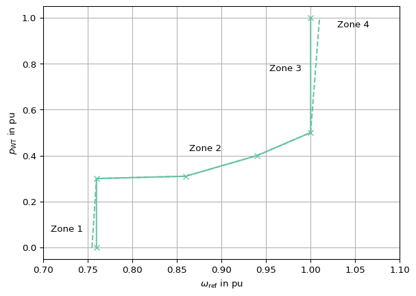

## List Of Acronyms


|----------|-------------------------------------|
| DFIG     | Doubly-Fed Induction Generator      |
| FRT      | Fault Ride Through                  |
| GSC      | Grid Side Converter                 |
| PCC      | Point of Common Coupling            |
| PD       | Power Device                        |
| RSC      | Rotor Side Converter                |
| WP       | Wind Plant                          |
| WT       | Wind Turbine                        |

## Context

This document refers to the IEC 61400-27-1 models which have been
developed with the following specifications in mind [[1]](#1):

- Use in wind power plant models or standalone wind turbines

- Specification for generic simulation models covering most WT types

- Models address four categories of existing WT technologies (NERC
  nomenclature):

  - **Type 1:** Conventional asynchronous generators (squirrel cage)
  - **Type 2:** Variable rotor resistance asynchronous generators
  - **Type 3:** Doubly-fed induction generators (stator connected
    directly; rotor through converter)
  - **Type 4:** Synchronous generator, grid-connected via a full-size
    power converter

Other model considerations according to [[1]](#1):

- Include over/under frequency and voltage protection for realistic WT
  disconnection modeling
- Account for turbine-generator inertia and first drive train torsional
  mode impacts on power swings
- Phase-locked loop dynamics are not included in the models (they are
  modeled through a first order lag element)

The IEC 61400-27-1 [[1]](#1) defines one of the most widely used series of
RMS models for Wind Turbine (WT) generators, another one being the WECC
model series, developed by EPRI.

The models are separated in several sub systems. The information and
drawings are taken from [[1]](#1) [[2]](#2) [[3]](#3) [[4]](#4) [[5]](#5) [[6]](#6).

## Model use, assumptions, validity domain and limitations

The controller of the generic Type 3 WT model does not represent the
actual controller of the WT, which sets the references of the
Rotor Side Converter (RSC) and the Grid Side Converter (GSC), but
provides the current command signals to obtain an accurate response of
active and reactive power, observed from the grid side.

The models are positive-sequence RMS models, hence they assume
symmetrical operating conditions and neglect high-frequency dynamics.
This type of models is often used in large-scale stability studies, for
which it reflects the relevant phenomena. It is not a detailed physical
model of the unit. Also for some stability phenomena (e.g. resonance
stability) this model is not sufficient and EMT models or other
approaches may be necessary.

Specifically, [[1]](#1) defines the following validity domain:

- positive sequence dynamics
- transmission grid simulations
- reference value changes
- steady state voltage deviations (0.85 pu … 1.15 pu)
- phase jumps
- symmetrical faults, including short-circuits of varying impedance,
  where voltage can dip to close to zero (typical e.g. 0.18 pu)
- frequency disturbances, variations $$\pm$$ 6 %
- electromechanical modes of synchronous generator rotor oscillations
  (0.2 Hz … 4 Hz)
- Typical simulation time frame: 10 s … 30 s
- Wind speed assumed to be constant during simulation time (wind speed
  could be included as an external condition through the available
  power)
- Simulation step width up to 1/4 fundamental frequency cycle (5 ms at
  50 Hz), which implies that the model Bandwidth cannot be above 15 Hz.
- According to [[2]](#2), the Type 3 WT model can operate with variable
  speed with slip values from -0.3 to +0.4.

Vice versa, [[1]](#1) states that the models are not intended for the
following:

- The models are not designed for long-term stability assessments.
- The models do not facilitate the exploration of sub-synchronous
  interaction phenomena.
- The models do not account for fluctuations due to wind speed
  variability over time and space, excluding factors such as turbulence,
  tower shadow, wind shear, and wakes.
- The models do not encompass phenomena like harmonics, flicker, or
  other EMC emissions outlined in the IEC 61000 series.
- Linearization for eigenvalue analysis is complex and may not be
  suitable for these simplified models.
- The IEC standard does not cover the details of short-circuit
  calculations.
- The models are not suitable for analyzing extremely weak systems,
  including scenarios where wind turbines operate in isolation from
  other synchronous generation or in cases with very low short-circuit
  ratios.
- The models do not incorporate negative and zero sequence components.

## Wind turbine type 3


<div id="fig-wtSystem">
Figure 1: Wind turbine type 3 model, based on <a href="#1">[1]</a>

</div>


<div id="fig-wtControlSubstructure">
Figure 2: Wind turbine generator control sub-structure for Type 3A and
3B WT, based on <a href="#1">[1]</a>

</div>

### P control module

For detailed assessment of the parameters’ impact on model behaviour,
see <a href="#5">[5]</a>.


<div id="fig-wtPControl">

Figure 3: Wind turbine P control module (Type 3), based on <a href="#1">[1]</a>

</div>


<a href="#fig-wtPControl" class="quarto-xref">Figure 3</a> shows the
wind turbine active power control scheme.

The control’s general behaviour is dominated by $$\omega(p)$$, a
lookup-table that provides the angular velocity at which the turbine
should rotate when it is injecting a certain active power [[6]](#6). A
possible look-up table for this system is shown in
<a href="#fig-lookup-table-omega-pref" class="quarto-xref">Figure 4</a>,
which is representing example values from *DIgSILENT PowerFactory*
[[7]](#7).

The power-speed-characteristic in
<a href="#fig-lookup-table-omega-pref" class="quarto-xref">Figure 4</a>
has four main operating zones according to <a href="#5">[5]</a>:

- **Zone 1:** The minimum rotational speed has been reached and hence
  cannot decrease further due to physical (component) limits, mainly
  maximum slip of the converter.
- **Zone 2:** Between minimum rotational speed to rated rotational
  speed; maximum power tracking mode.
- **Zone 3:** Fixed at rated speed and below the rated active power. In
  some cases, instead of a fixed rated rotational speed, there is a
  linear rotational speed variation to achieve the rated rotational
  speed at the rated active power.
- **Zone 4:** Rated rotational speed and rated active power.

> [!NOTE]
>
> Dotted lines in
> <a href="#fig-lookup-table-omega-pref" class="quarto-xref">Figure 4</a>
> imply that, for simulations, the active power reference presents a
> certain slope, offering more stable simulations. Under real control
> conditions, this look-up table has two vertical lines, as shown by the
> solid lines. [[5]](#5)

<details class="code-fold">
<summary>Code</summary>

``` python
from matplotlib import pyplot as plt
import seaborn as sns
colors = sns.color_palette('Set2')
sns.set_palette(colors)

plt.plot(
    [0.755,  0.76,   0.86,   0.94,   1,      1.01], 
    [0,      0.3,    0.31,   0.4,    0.5,    1], 
    '--', c=colors[0])
plt.plot(
    [0.76,  0.76,   0.86,   0.94,   1,      1], 
    [0,     0.3,    0.31,   0.4,    0.5,    1], 
    '-x', c=colors[0])
plt.grid()
_ = plt.ylabel(r'$$p_\mathrm{WT}$$ in pu')
_ = plt.xlabel(r'$$\omega_\mathrm{ref}$$ in pu')
plt.xlim(0.7,1.1)
_ = plt.text(1.03, .99, 'Zone 4', ha='left', va='top')
_ = plt.text(.99, .8, 'Zone 3', ha='right', va='top')
_ = plt.text(.9, .45, 'Zone 2', ha='right', va='top')
_ = plt.text(.745, .1, 'Zone 1', ha='right', va='top')
```

</details>




<div id="fig-lookup-table-omega-pref">
Figure 4: Lookup table for reference rotation speed as a function of WT
active power; according to <a href="#5">[5]</a> and with data from <a href="#5">[7]</a> (see
<a href="#tbl-wtLookupTable" class="quarto-xref">Table 2</a>)

</div>

The power-speed-characteristic’s speed reference output is then filtered
($$T_\mathrm{\omega ref}$$) to avoid sudden changes.

> [!NOTE]
>
> The time constant $$T_\mathrm{\omega ref}$$ can be set to a very high
> value to enforce a fixed reference rotational speed during the
> simulation, which can be a desired operational mode. [[5]](#5)

The filtered speed reference $$\omega_\mathrm{ref}$$ is subtracted from
the measured angular velocity $$\omega_\text{gen}$$ (generator speed) or
$$\omega_\mathrm{WTR}$$ (turbine speed), depending on the mode
$$M_\mathrm{\omega Tqpi}$$ to get the speed error $$\omega_\mathrm{err}$$.
The measured speed can be filtered by the first order lag element with
time constant $$T_\mathrm{\omega filtp3}$$.

Since $$\omega_\mathrm{gen}$$ comes from the mechanical module which only
models the drive train resonant frequency, this first order lag is
intended as a filter for only this oscillation. Since it is a low pass,
it won’t be able to efficiently filter that resonance from the signal.
Alternatively, by setting $$M_\mathrm{\omega Tqpi}=\mathrm{true}$$, the
rotor speed $$\omega_\mathrm{WTR}$$ can be used instead of the generator
speed, which acts as a simpler way to determine a filtered value of
$$\omega_\mathrm{gen}$$ <a href="#5">[5]</a>.

The speed error $$\omega_\mathrm{err}$$ is then given to the *Torque PI
controller* (<a href="#fig-torquePi" class="quarto-xref">Figure 5</a>),
which outputs the electromagnetic torque reference $$\tau_\mathrm{out}$$
[[6]](#6).

Another input to the torque PI subsystem (see [Torque PI block](#torque-pi-block)) is the
maximum electromagnetic torque $$\tau_\mathrm{emax}$$. It is determined by
calculating a torque value from <a href="#5">[5]</a>:

- The reference power value $$p_\mathrm{WTref}$$, during voltage dips
  optionally scaled down by the terminal voltage $$u_\mathrm{WTC}$$ (if
  $$M_\mathrm{pUscale}=\mathrm{true}$$)
- And a rotational speed, either the turbine rotor speed
  $$\omega_\mathrm{WTR}$$ (if $$M_\mathrm{\omega Tmax}=\mathrm{false}$$) or
  the speed reference value $$\omega_\mathrm{ref}$$ (if
  $$M_\mathrm{\omega Tmax}=\mathrm{true}$$).

After the torque PI controller, the electromagnetic torque reference
$$\tau_\mathrm{out}$$ is multiplied by the generator’s rotational speed
$$\omega_\mathrm{gen}$$ to obtain a power reference <a href="#6">[6]</a>.

To obtain the active current command $$i_\mathrm{pcmd}$$, $$p_\mathrm{ord}$$
is divided by the measured voltage $$u_\mathrm{WTCfilt}$$.

To the active power order $$p_\mathrm{ord}$$ an additional component from
the Drive Train Damping (DTD) system is added. Physically, the DTD
provides an electrical torque that accounts for natural damping by
considering speed differences between both low and high speed shafts
(either side of the gearbox) [[5]](#5). It is modeled through a second-order
transfer function as shown towards the bottom right of
<a href="#fig-wtPControl" class="quarto-xref">Figure 3</a>:

$$
K_{\text{DTD}} \cdot \frac{2 \zeta \omega_{\text{DTD}} s}{s^2 + 2 \zeta \omega_{\text{DTD}} s + \omega_{\text{DTD}}^2}
$$

As mentioned above, in this model the DTD is represented by an active
power component, not a torque. The transfer function outputs an
oscillating electrical power that has an efficient damping effect [[5]](#5)
(for parameters see 
<a href="#tbl-parameters" class="quarto-xref">Table 1</a>).


#### Torque PI block


<div id="fig-torquePi">
Figure 5: Wind turbine torque PI block (Type 3), based on <a href="#1">[1]</a>

</div>

In <a href="#fig-torquePi" class="quarto-xref">Figure 5</a> the Torque
PI Block can be seen. It acts as a PI-controller and is a subsystem of
the active power control in
<a href="#fig-wtPControl" class="quarto-xref">Figure 3</a> <a href="#6">[6]</a>.

For the calculation of the speed error input $$\omega_\mathrm{err}$$ and
the maximum electromagnetic torque input $$\tau_\mathrm{emax}$$, see 
<a href="#sec-wt-p-control" class="quarto-xref">Section 4.1</a>.

**Proportional and integral parts of the controller**

The proportional controller part is realized by $$K_\mathrm{Pp}$$.

The integral part of the controller output is the minimum of the
following two signals [[6]](#6):

- The output of the integral controller $$K_\mathrm{Ip}/K_\mathrm{Pp}$$
- A torque value increasing as a ramp with rising rate
  $$\mathrm{d}\tau_\mathrm{max}$$, which can be used to control the
  mechanical stress or to meet grid code requirements. This is set to
  $$\tau_\mathrm{reset}$$ when a low voltage fault occurs and ramps
  upwards after the fault.

**Behavior during low voltage faults**

The *Delay Flag* block takes a boolean value $$F_\mathrm{i}$$ as input. If
$$F_\mathrm{i}$$ steps to 1, the integer output $$F_\mathrm{o}$$ is 1 and a
*timer* starts to run. As soon as $$F_\mathrm{i}$$ steps back to 0,
$$F_\mathrm{o}$$ steps to 2 if the *timer* has not reached
$$T_\mathrm{DVS}$$. Once the timer reaches $$T_\mathrm{DVS}$$,
$$F_\mathrm{o}$$ steps back to 0. <a href="#1">[1]</a>

The delay flag block is used to implement the following fault signals:

- $$F_\mathrm{reset}$$ is true during a volage dip
  ($$u_\mathrm{WTC} < u_\mathrm{pdip}$$) as well as during and
  $$T_\mathrm{DVS}$$ after a deep voltage dip
  ($$u_\mathrm{WTC} < u_\mathrm{DVS}$$).
- $$F_\mathrm{freeze\,I}$$ is true during a voltage dip
  ($$u_\mathrm{WTC} < u_\mathrm{pdip}$$)

These fault signals have the following functions:

- $$F_\mathrm{reset}$$, while true,
  - resets and holds both integrators at $$\tau_\mathrm{reset}$$ (see
    below); for the $$K_\mathrm{Ip}/K_\mathrm{Pp}$$-integrator this can be
    prevented by setting $$M_\mathrm{pUVRT} = \mathrm{false}$$.
  - sets the speed error $$\omega_\mathrm{err}$$, i.e. the input to the
    proportional controller part $$K_\mathrm{Pp}$$, to zero
  - changes the upper ramp rate limit of $$\tau_\mathrm{reset}$$ to
    $$\mathrm{d}\tau_\mathrm{maxUVRT}$$ (usually set to zero, preventing
    $$\tau_\mathrm{reset}$$ from inceasing during fault) <a href="#6">[6]</a>
- $$F_\mathrm{freeze\,I}$$ freezes the integral controller part
  ($$K_\mathrm{Ip}/K_\mathrm{Pp}$$) while true.

The reset value $$\tau_\mathrm{reset}$$ is the minimum value of:

- The measured voltage (during fault) multiplied by factor
  $$\tau_\mathrm{uscale}$$
- The output $$\tau_\mathrm{I}$$ of the integrator itself
- $$u_\mathrm{TChook} + 1$$

$$\tau_\mathrm{uscale}$$ can be used to alter the power injection
behaviour during fault and also the starting point for power recovery
after post-fault. For example, setting it to zero results in zero power
injection during fault. Higher values increase power injection, until
the current limitation system begins to act. See [[6]](#6) for further
details.

When $$F_\mathrm{reset}$$ returns to false, the proportional controller
$$K_\mathrm{Pp}$$ will work again as before the fault. The integral
controller will increase from $$\tau_\mathrm{reset}$$ to steady-state,
with a maximum rate dictated by $$\mathrm{d}\tau_\mathrm{max}$$ [[6]](#6).

#### Variable limits integrator with set/reset and freeze

The integrators used in the Torque PI model in
<a href="#fig-torquePi" class="quarto-xref">Figure 5</a> need variable
limits, set/reset and freeze functionalities. A suggestion for the
implementation is shown below and the description follows thereafter.

``` {modelica}
model IntegratorVariableLimitsContinuousSetFreeze "Integrator with limited value of output (variable limits), set/reset and freeze"
    parameter Boolean DefaultLimitMax = true "If limitMin > limitMax : if true, y = limitMax, if false, y = limitMin";
    parameter Real K = 1 "Integrator gain";
    parameter Real LimitMax0 "Initial value of upper limit";
    parameter Real LimitMin0 "Initial value of lower limit";
    parameter Boolean ReinitWhenResetIsReleased = true "true: integrator state gets reinitialized to 'set' when 'reset' turns false. false: integrator state gets reinitialized to 'set' when 'reset' turns true.";
    parameter Real tDer = 1e-3 "Time constant of derivative filter for limits in s";
    parameter Real TolInput = 1e-5 "Tolerance on limit crossing for integrator input";
    parameter Real TolOutput = 1e-5 "Tolerance on limit crossing for integrator output";
    parameter Real LimitDeadband = 0.001 "Deadband for detecting a limit crossing of the integrator's state";
    Real w(start = Y0) "Integrator state variable";
    parameter Real Y0 = 0 "Initial or guess value of output (must be in the limits limitMin .. limitMax)";

    Real kFreezeMax "Freeze coefficient for upper limit";
    Real kFreezeMin "Freeze coefficient for lower limit";
    Real derLimitMax "Filtered derivative of upper limit of output";
    Real derLimitMin "Filtered derivative of lower limit of output";
    Modelica.Blocks.Interfaces.BooleanInput freeze "Optional connector of freeze signal";
    Modelica.Blocks.Interfaces.RealInput limitMax "Connector of Real input signal used as maximum of output y";
    Modelica.Blocks.Interfaces.RealInput limitMin "Connector of Real input signal used as minimum of output y";
    Modelica.Blocks.Interfaces.BooleanInput reset "Optional connector of reset signal";
    Modelica.Blocks.Interfaces.RealInput set "Optional connector of set signal";
equation
    
    ////////// reset or freeze: keep input = 0
    if freeze or reset then
        v = 0;
    else
        v = K * u;
    end if;
    
    ////////// reset: reinit integrator's state when set becomes false (or true, depending on ReinitWhenResetIsReleases)
    when if ReinitWhenResetIsReleased then not reset else reset then
      reinit(w, set);
    end when;
    
    ////////// integrator with limits
    derLimitMax = der(limitMax);
    derLimitMin = der(limitMin);
    kFreezeMax = 1 / 4 * (1 + tanh((w - limitMax) / TolOutput)) * (1 + tanh((v - derLimitMax) / TolInput));
    kFreezeMin = 1 / 4 * (1 + tanh((limitMin - w) / TolOutput)) * (1 + tanh((derLimitMin - v) / TolInput));
    der(w) = derLimitMax * kFreezeMax + derLimitMin * kFreezeMin + v * (1 - kFreezeMax - kFreezeMin);
    
    ////////// apply limit or set to output
    if limitMin > limitMax and DefaultLimitMax then
        y = limitMax;
    elseif limitMin > limitMax then
        y = limitMin;
    elseif w > limitMax+LimitDeadband then
        y = limitMax;
    elseif w < limitMin-LimitDeadband then
        y = limitMin;
    elseif reset then
        y = set;
    else
        y = w;
    end if;
end IntegratorVariableLimitsContinuousSetFreeze;
```

This blocks computes `w` as integral of the input `u` multiplied by the
gain `K`, with `v = K * u`. If the integral reaches a given upper limit
limitMax or lower limit limitMin, the integration is halted and only
restarted if the input drives the integral away from the bounds.

This freeze is imposed through two coefficients `kFreezeMax` and
`kFreezeMin`, each defined by a continuous expression involving the
hyperbolic tangent, the integrator input `v`, the integrator output `w`,
the limit `limitMax` or `limitMin` and its filtered derivative
`derLimitMax` or `derLimitMin`.

The parameters `TolInput` and `TolOutput` determine the width of the
transition zone from one domain to another.

The output `y` is the result of the limitation of `w` by both variable
limits.

If the “upper” limit is smaller than the “lower” one, the output `y` is
ruled by the parameter `DefaultLimitMax`: `y` is equal to either
`limitMax` or `limitMin`.

**set/reset**

The integrator’s output is forced to the value of `set` while
`reset=true`, as it is descibed in [[1]](#1).

When `reset` returns to false (=falling edge), the integrator’s state is
reinitialized to set to resume integration without a jump discontinuity
(change `ReinitWhenResetIsReleased` to `false` to reinitialize at a
rising edge instead).

**freeze**

If boolean input is set to true, the derivative of the state variable is
set to zero.

#### Parameters

Typical values were gathered from the *DIgSILENT PowerFactory* [[7]](#7)
implementation of the model.

<div id="tbl-parameters">

Table 1: Parameters of WT P control module, based on <a href="#1">[1]</a>, <a href="#5">[5]</a> and <a href="#7">[7]</a>
</div>

| name                                  | type  | unit | base                                                        | description                                                                                                                                     | typical value                                                    |
| :------------------------------------ | :---- | :--- | :---------------------------------------------------------- | :---------------------------------------------------------------------------------------------------------------------------------------------- | :--------------------------------------------------------------- |
| $$\mathrm{d}p_{\mathrm{max}}$$        | float | pu   | $$S_{\mathrm{base}} / \mathrm{s}$$                          | Maximum ramp rate of wind turbine power                                                                                                         | 999                                                              |
| $$\mathrm{d}p_{\mathrm{refmax}}$$     | float | pu   | $$S_{\mathrm{base}} / \mathrm{s}$$                          | Maximum ramp rate for reference power of the wind turbine                                                                                       | 0.3                                                              |
| $$\mathrm{d}p_{\mathrm{refmin}}$$     | float | pu   | $$S_{\mathrm{base}} / \mathrm{s}$$                          | Minimum ramp rate for reference power of the wind turbine                                                                                       | -0.3                                                             |
| $$\mathrm{d}\tau_{\mathrm{max}}$$     | float | pu   | $$T_{\mathrm{base}} / \mathrm{s}$$                          | Torque ramp rate limit, as required by some grid codes                                                                                          | 0.25                                                             |
| $$\mathrm{d}\tau_{\mathrm{maxUVRT}}$$ | float | pu   | $$T_{\mathrm{base}} / \mathrm{s}$$                          | Torque rise rate limit during UVRT                                                                                                              | 0                                                                |
| $$K_{\mathrm{DTD}}$$                  | float | pu   | $$S_{\mathrm{base}} / \Omega_{\mathrm{base}}$$              | Active drive train damping: gain                                                                                                                | 1.5 (or 0 if $$M_\mathrm{\omega Tqpi}=\mathrm{false}$$) [[5]](#5)      |
| $$K_{\mathrm{Ip}}$$                   | float | pu   | $$T_{\mathrm{base}} / \Omega_{\mathrm{base}} / \mathrm{s}$$ | Integrator time constant of the PI controller                                                                                                   | 5                                                                |
| $$K_{\mathrm{Pp}}$$                   | float | pu   | $$T_{\mathrm{base}} / \Omega_{\mathrm{base}}$$              | Proportional gain of the PI controller                                                                                                          | 3                                                                |
| $$M_\mathrm{\omega Tmax}$$            | bool  | \-   | \-                                                          | Mode for source of rotational speed for maximum torque calculation $$(false: \omega_{\mathrm{WTR}} - true: \omega_{\mathrm{ref}})$$             | true                                                             |
| $$M_\mathrm{\omega Tqpi}$$            | bool  | \-   | \-                                                          | Mode for source of rotational speed for torque PI controller error calculation $$(false: \omega_{\mathrm{gen}} - true: \omega_{\mathrm{WTR}})$$ | true (or false if $$K_\mathrm{DTD}=0$$) [[5]](#5)                      |
| $$M_{\mathrm{pUscale}}$$              | bool  | \-   | \-                                                          | Enable voltage scaling for power reference during a voltage dip (false: no scaling – true: u scaling)                                           | false                                                            |
| $$M_{\mathrm{pUVRT}}$$                | bool  | \-   | \-                                                          | Mode for UVRT power control (false: reactive power control – true: voltage control)                                                             | true                                                             |
| $$\omega_{\mathrm{DTD}}$$             | float | pu   | $$\Omega_{\mathrm{base}}$$                                  | Active drive train damping: frequency, derived from two-mass model parameters, see <a href="#eq-omegaDtd" class="quarto-xref">Equation 1</a>    | 11.3                                                             |
| $$\omega_{\mathrm{offset}}$$          | float | pu   | $$\Omega_{\mathrm{base}}$$                                  | Offset from the reference value to limit controller action during rotor speed changes                                                           | 0                                                                |
| $$\omega(p)$$                         | float | pu   | $$\Omega_{\mathrm{base}}(S_{\mathrm{base}})$$               | Lookup table for power as a function of speed                                                                                                   | see <a href="#tbl-wtLookupTable" class="quarto-xref">Table 2</a> |
| $$p_{\mathrm{DTDmax}}$$               | float | pu   | $$S_{\mathrm{base}}$$                                       | Active drive train damping: maximum power                                                                                                       | 0.15                                                             |
| $$\tau_{\mathrm{emin}}$$              | float | pu   | $$T_{\mathrm{base}}$$                                       | Minimum torque for the electrical generator                                                                                                     | 0.001                                                            |
| $$\tau_{\mathrm{uscale}}$$            | float | pu   | $$T_{\mathrm{base}} / U_{\mathrm{base}}$$                   | Voltage scaling factor for reset torque                                                                                                         | 1                                                                |
| $$T_{\mathrm{DVS}}$$                  | float | s    | \-                                                          | Time delay following deep a voltage dip                                                                                                         | 0.05                                                             |
| $$T_{\mathrm{\omega filtp3}}$$        | float | s    | \-                                                          | Filter time constant for measuring generator speed                                                                                              | 0.005                                                            |
| $$T_{\mathrm{\omega ref}}$$           | float | s    | \-                                                          | Time constant in the speed reference filter                                                                                                     | 0.005                                                            |
| $$T_{\mathrm{pord}}$$                 | float | s    | \-                                                          | Power order lag time constant                                                                                                                   | 0.01                                                             |
| $$u_{\mathrm{DVS}}$$                  | float | pu   | $$U_{\mathrm{base}}$$                                       | Voltage limit for maintaining UVRT status after a deep voltage dip                                                                              | 0.15                                                             |
| $$u_{\mathrm{pdip}}$$                 | float | pu   | $$U_{\mathrm{base}}$$                                       | Voltage dip threshold for active power control, often different from converter thresholds (e.g., 0.8)                                           | 0.9                                                              |
| $$\zeta$$                             | float | pu   | \-                                                          | Active drive train damping: damping coefficient                                                                                                 | 0.5                                                              |


> [!NOTE]
>
> According to [[1]](#1), using rotor speed instead of generator speed (by
> setting $$M_\mathrm{\omega Tqpi} = true$$) is an easy way to filter the
> speed measurement.

Table 2: Typical values for lookup table $$ \omega(p) $$, based on [[7]](#7)
implementation

<!--<div id="tbl-wtLookupTable">

Table 2: Typical values for lookup table <span> \omega(p) </span>, based on [7]
implementation
</div>-->

| $$p$$  | $$\omega(p)$$ |
|:-----|:------------|
| 0    | 0.76        |
| 0.3  | 0.76        |
| 0.31 | 0.86        |
| 0.4  | 0.94        |
| 0.5  | 1           |
| 1    | 1           |


#### Variables

##### Inputs

<div id="tbl-inputsPControl">

Table 3: Inputs, based on <a href="#1">[1]</a> and <a href="#5">[5]</a>
</div>

| name                    | type  | unit | base                                                | description                                                                                                        |
| :---------------------- | :---- | :--- | :-------------------------------------------------- | :----------------------------------------------------------------------------------------------------------------- |
| $$i_\mathrm{pmax}$$     | float | pu   | $$\frac{S_\mathrm{base}}{\sqrt{3}U_\mathrm{base}}$$ | Maximum active current able to be injected into the grid by the WT as determined by the current limitation system. |
| $$\omega_\mathrm{gen}$$ | float | pu   | $$\Omega_\mathrm{base}$$                            | Angular velocity of generator                                                                                      |
| $$\omega_\mathrm{WTR}$$ | float | pu   | $$\Omega_\mathrm{base}$$                            | Angular velocity of Wind Turbine Rotor (WTR)                                                                       |
| $$p_\mathrm{WTCfilt}$$  | float | pu   | $$S_\mathrm{base}$$                                 | Measured (=filtered) active power for Wind Turbine Control (WTC), obtained from the electrical generator system    |
| $$p_\mathrm{WTref}$$    | float | pu   | $$S_\mathrm{base}$$                                 | Active power reference to be injected into the grid by the wind turbine (WT) (manually adjusted)                   |
| $$u_\mathrm{TChook}$$   | float | pu   | $$U_\mathrm{base}$$                                 | Turbine control voltage external hook, usually = 0                                                                 |
| $$u_\mathrm{WTC}$$      | float | pu   | $$U_\mathrm{base}$$                                 | Unfiltered voltage for Wind Turbine Control (WTC) obtained from the electrical generator system                    |
| $$u_\mathrm{WTCfilt}$$  | float | pu   | $$U_\mathrm{base}$$                                 | Measured (=filtered) voltage for Wind Turbine Control (WTC) obtained from the electrical generator system          |


##### Outputs

<div id="tbl-outputsPControl">

Table 4: Outputs, based on <a href="#1">[1]</a>
</div>

| name                    | type  | unit | base                                                | description                                       |
| :---------------------- | :---- | :--- | :-------------------------------------------------- | :------------------------------------------------ |
| $$i_\mathrm{pcmd}$$     | float | pu   | $$\frac{S_\mathrm{base}}{\sqrt{3}U_\mathrm{base}}$$ | Active current command for generator system model |
| $$\omega_\mathrm{ref}$$ | float | pu   | $$\Omega_\mathrm{base}$$                            | Angular velocity reference value                  |
| $$p_\mathrm{ord}$$      | float | pu   | $$S_\mathrm{base}$$                                 | Active power order from wind turbine controller   |


#### Equations & algorithm  

<span id="eq-omegaDtd">$$
\omega_{\mathrm{DTD}} = \sqrt{k_{\mathrm{drt}} \left( \frac{1}{2 \cdot H_{\mathrm{WTR}}} + \frac{1}{2 \cdot H_{\mathrm{gen}}} \right)}
 \qquad(1)$$</span>

(parameters from mechanical module)

#### Initial equations

For the used initialization helper variables, see [Operating point and initialization helpers](#operating-point-and-initialization-helpers)
<!--<a href="#sec-initHelpersGlobal" class="quarto-xref">Section 7</a>.-->

The lookup-table $$\mathbf{\omega}(p)$$ is the same as described in
<a href="#fig-lookup-table-omega-pref" class="quarto-xref">Figure 4</a>.

<span id="eq-initPOrd">$$
x_\mathrm{pord\,0} = P_\mathrm{ord\,0}
 \qquad(2)$$</span>

<span id="eq-initDtd">$$
x_\mathrm{DTD1\,0} = x_\mathrm{DTD2\,0} = 0 \text{ (make sure to obtain steady zero output)}
 \qquad(3)$$</span>

<span id="eq-initOmegaRef">$$
x_\mathrm{\omega ref\,0} = \mathbf{\omega}(P_\mathrm{0})
 \qquad(4)$$</span>

<span id="eq-initOmegaFiltP3">$$
x_\mathrm{\omega filtp3\,0} = \omega_0
 \qquad(5)$$</span>

<span id="eq-initDPRefMax">$$
x_\mathrm{dprefmax\,0} = P_\mathrm{WTRef\,0}
 \qquad(6)$$</span>

<span id="eq-initDTauMax">$$
x_\mathrm{\tau reset\,0} = 
\begin{cases}
    U_\mathrm{0} \cdot \tau_\mathrm{uscale}, & \text{if } U_\mathrm{0} \cdot \tau_\mathrm{uscale} < P_\mathrm{ord\,0}/\omega_0\\
    P_\mathrm{ord\,0}/\omega_0,              & \mathrm{otherwise}
\end{cases}
 \qquad(7)$$</span>

<span id="eq-initDTauMax">$$
x_\mathrm{d\tau max\,0} = \tau_\mathrm{emax\,0}
 \qquad(8)$$</span>

<span id="eq-initTauEMax">$$
\tau_\mathrm{emax\,0} = 
\begin{cases}
    P_\mathrm{WTRef\,0} / \mathbf{\omega}(P_\mathrm{0}),& \text{if } M_\mathrm{\omega T max}\\
    P_\mathrm{WTRef\,0} / \omega_0,              & \mathrm{otherwise}
\end{cases}
 \qquad(9)$$</span>

<span id="eq-initTauEMax">$$
x_\mathrm{KIpKPp\,0} = 
\begin{cases}
    \tau_\mathrm{emax\,0},& \text{if } P_\mathrm{ord\,0}/\omega_0 > \tau_\mathrm{emax\,0}\\
    \tau_\mathrm{emin},& \text{if } P_\mathrm{ord\,0}/\omega_0 < \tau_\mathrm{emin}\\
    P_\mathrm{ord\,0}/\omega_0,              & \mathrm{otherwise}
\end{cases}
 \qquad(10)$$</span>

### Q control module


<div id="fig-QControlModule">
Figure 6: Wind turbine Q control module, based on <a href="#1">[1]</a>

</div>

The WT Q Control Module consists of a normal path and a fast reactive
current injection path, which acts during and some time after an event
(voltage drop or rise). There are multiple possible operating modes for
each path, described in detail in [[8]](#8).

Depending on the mode, $$x_\mathrm{WTref}$$ can be a voltage or reactive
power setpoint.

The available control modes are listed in
<a href="#tbl-qControlModesNormal" class="quarto-xref">Table 5</a> and
<a href="#tbl-qControlModesFast" class="quarto-xref">Table 6</a>. The
following descriptions have been based on <a href="#8">[8]</a> and <a href="#1">[1]</a>.

For example in mode 1, the normal path consists of two cascaded
Proportional-Integral (PI) controllers. The first one (reactive power
controller) controls reactive power by generating a voltage reference
for the second controller (voltage controller), which then generates the
reactive current command $$i_\mathrm{qbasehook}$$. Input and output
limitations are applied.

During faults, the fast injection path adds an additional component to
the q-axis current which is computed based on the voltage deviation
$$\Delta u$$, a dead-band and droop (gain $$K_\mathrm{qv}$$).

Special attention must be paid to the reactive current signs in [1],
as they seem to be inconsistent [8]. In the fast injection path,
$$u_\mathrm{WTC}$$ voltage drop leads to $$\Delta u < 0$$, resulting in
$$i_\mathrm{qvhook} < 0$$. This behavior is opposite to the normal path.
To solve this, the fast injection path’s sign can be inverted, as has
been done in
<a href="#fig-QControlModule" class="quarto-xref">Figure 6</a> (red -1
block).

<div id="tbl-qControlModesNormal">

Table 5: Q control normal path control modes, based on <a href="#1">[1]</a>
</div>

| $$M_\mathrm{qG}$$ | Description |
|:---|:---|
| 0 | Voltage control |
| 1 | Reactive power control |
| 2 | Open loop reactive power control (only used with closed loop at plant level) |
| 3 | Power factor control |
| 4 | Open loop power factor control |

<div id="tbl-qControlModesFast">

Table 6: Q control reactive current injection path control modes, based
on <a href="#1">[1]</a>
</div>

| $$M_\mathrm{qFRT}$$ | During Fault | Post Fault |
|:---|:---|:---|
| 0 | A function of the voltage change compared to the pre-fault voltage | Same function as during fault |
| 1 | Pre-fault current plus a term depending on the voltage change compared to the pre-fault voltage | Same function as during fault |
| 2 | Pre-fault current plus a term depending on the voltage change compared to the pre-fault voltage | Pre-fault current plus a constant |
| 3 | User defined | User defined |


#### Parameters

<div id="tbl-parametersQControl">

Table 7: Parameters of WT Q control, based on <a href="#1">[1]</a> and <a href="#7">[7]</a>
</div>

| name | type | unit | base | description | typical value |
|:---|:---|:---|:---|:---|:---|
| $$\Delta u_\mathrm{db1}$$ | float | pu | $$U_\mathrm{base}$$ | Voltage difference dead band lower limit | -0.1 |
| $$\Delta u_\mathrm{db2}$$ | float | pu | $$U_\mathrm{base}$$ | Voltage differnce dead band upper limit | 0.1 |
| $$i_\mathrm{qh1}$$ | float | pu | $$I_\mathrm{base}$$ | Maximum reactive current injection during FRT | 1.05 |
| $$i_\mathrm{qmax}$$ | float | pu | $$I_\mathrm{base}$$ | Maximum reactive current injection | 1.05 |
| $$i_\mathrm{qmin}$$ | float | pu | $$I_\mathrm{base}$$ | Minimum reactive current injection | -1.05 |
| $$i_\mathrm{qpost}$$ | float | pu | $$I_\mathrm{base}$$ | Post-fault reactive current injection | 0 |
| $$K_\mathrm{Iq}$$ | float | pu | $$U_\mathrm{base}/S_\mathrm{base}/s$$ | Q PI controller integral gain | 2 |
| $$K_\mathrm{Iu}$$ | float | pu | $$I_\mathrm{base}/U_\mathrm{base}/s$$ | U PI controller integral gain | 2 |
| $$K_\mathrm{Pq}$$ | float | pu | $$U_\mathrm{base}/S_\mathrm{base}$$ | Q PI controller proportional gain | 0 |
| $$K_\mathrm{Pu}$$ | float | pu | $$I_\mathrm{base}/U_\mathrm{base}$$ | U PI controller proportional gain | 2 |
| $$K_\mathrm{PuFRT}$$ | float | pu | $$I_\mathrm{base}/U_\mathrm{base}$$ | U PI controller proportional gain during FRT | 0 |
| $$K_\mathrm{qv}$$ | float | pu | $$I_\mathrm{base}/U_\mathrm{base}$$ | Droop for fast reactive current injection | 2 |
| $$M_\mathrm{qFRT}$$ | bool | \- | \- | Fast reactive current injection Q control mode (<a href="#tbl-qControlModesFast" class="quarto-xref">Table 6</a>) | 2 |
| $$M_\mathrm{qG}$$ | bool | \- | \- | Normal path Q control mode (<a href="#tbl-qControlModesNormal" class="quarto-xref">Table 5</a>) | 1 |
| $$r_\mathrm{drop}$$ | float | pu | $$Z_\mathrm{base}$$ | Voltage drop resistance | 0 |
| $$T_\mathrm{post}$$ | float | s | \- | Duration of post-fault period | 0 |
| $$T_\mathrm{qord}$$ | float | s | \- | Time constant in reactive power order lag | 0 |
| $$T_\mathrm{uss}$$ | float | s | \- | Steady state voltage filter time constant | 30 |
| $$u_\mathrm{max}$$ | float | pu | $$U_\mathrm{base}$$ | Upper limit in U PI controller integrator | 2 |
| $$u_\mathrm{min}$$ | float | pu | $$U_\mathrm{base}$$ | Lower limit in U PI controller integrator | 0 |
| $$u_\mathrm{qdip}$$ | float | pu | $$U_\mathrm{base}$$ | Q control: voltage threshold for UVRT detection | 0.9 |
| $$u_\mathrm{qrise}$$ | float | pu | $$U_\mathrm{base}$$ | Q Control: Voltage threshold for OVRT detection | 1.1 |
| $$u_\mathrm{ref0}$$ | float | pu | $$U_\mathrm{base}$$ | Voltage reference bias | 0 |
| $$x_\mathrm{drop}$$ | float | pu | $$Z_\mathrm{base}$$ | Voltage drop reactance | 0 |


#### Variables:

##### Inputs

<div id="tbl-inputsQControl">

Table 8: Inputs, based on <a href="#1">[1]</a> and <a href="#5">[5]</a>
</div>

| name | type | unit | base | description |
|:---|:---|:---|:---|:---|
| $$i_\mathrm{dfhook}$$ | float | pu | $$I_\mathrm{base}$$ | user-defined input for during-fault reactive current |
| $$i_\mathrm{pfhook}$$ | float | pu | $$I_\mathrm{base}$$ | user-defined input for post-fault period reactive current |
| $$p_\mathrm{WTCfilt}$$ | float | pu | $$S_\mathrm{base}$$ | measured active power |
| $$q_\mathrm{WTCfilt}$$ | float | pu | $$S_\mathrm{base}$$ | measured reactive power |
| $$q_\mathrm{WTmax}$$ | float | pu | $$S_\mathrm{base}$$ | maximum reactive power from Q limitation module (may be used to implement a capability curve) |
| $$q_\mathrm{WTmin}$$ | float | pu | $$S_\mathrm{base}$$ | minimum reactive power from Q limitation module (may be used to implement a capability curve) |
| $$u_\mathrm{WTCfilt}$$ | float | pu | $$U_\mathrm{base}$$ | measured voltage |
| $$x_\mathrm{WTref}$$ | float | pu | $$Z_\mathrm{base}$$ | voltage or reactive power reference, depending on control mode |


##### Outputs

<div id="tbl-outputsQControl">

Table 9: Outputs, based on <a href="#1">[1]</a>
</div>

| name | type | unit | base | description |
|:---|:---|:---|:---|:---|
| $$F_\mathrm{FRT}$$ | integer | \- | \- | Fault signal: 0=no fault, 1=fault, 2=post-fault |
| $$i_\mathrm{qbasehook}$$ | float | pu | $$I_\mathrm{base}$$ | Normal path component of reactive current command |
| $$I_\mathrm{qcmd}$$ | float | \- | $$I_\mathrm{base}$$ | reactive current command |
| $$I_\mathrm{qvhook}$$ | float | \- | $$I_\mathrm{base}$$ | Fast reactive current injection path component of reactive current command |


#### Initial equations

For the used initialization helper variables, see [Operating point and initialization helpers](#operating-point-and-initialization-helpers)
<!--<a href="#sec-initHelpersGlobal" class="quarto-xref">Section 7</a>.-->

<span id="eq-initXiu">$$
x_\mathrm{Iu\,0} = x_\mathrm{qord\,0} = Q_\mathrm{ord\,0}/U_\mathrm{0}
 \qquad(11)$$</span>

<span id="eq-initXiq">$$
x_\mathrm{Iq\,0} = U_\mathrm{0}
 \qquad(12)$$</span>

<span id="eq-initXuss">$$
x_\mathrm{uss\,0} = 0
 \qquad(13)$$</span>

### Q limitation


<div id="fig-WTQLim">
Figure 7: WT Q limitation module, based on <a href="#1">[1]</a>

</div>

The Q limitation module consists of a set of lookup-tables that
determine the maximum and minimum reactive power that can be supplied by
the WT depending on active power and voltage. It can be used to
implement the generator’s capability curve.

#### Parameters

<div id="tbl-parametersWTQlim">

Table 10: Parameters of Q limitation module, based on <a href="#1">[1]</a> and <a href="#7">[7]</a>
</div>

| name | type | unit | base | description | typical value |
|:---|:---|:---|:---|:---|:---|
| $$\mathbf{q_\mathrm{maxp}}(p)$$ | lookup-table | pu | $$S_\mathrm{base}$$ | Maximum Q as a function of P | [0,0; 0.3,0.33; 1,0.33] |
| $$\mathbf{q_\mathrm{maxu}}(u)$$ | lookup-table | pu | $$S_\mathrm{base}$$ | Maximum Q as a function of U | [0,0; 0.8,0.33; 0.9,0.33] |
| $$\mathbf{q_\mathrm{minp}}(p)$$ | lookup-table | pu | $$S_\mathrm{base}$$ | Minimum Q as a function of P | [0,0; 0.3,-0.33; 1,-0.33] |
| $$\mathbf{q_\mathrm{minu}}(u)$$ | lookup-table | pu | $$S_\mathrm{base}$$ | Minimum Q as a function of U | [0,0; 0.8,-0.33; 0.9,-0.33] |


#### Variables

##### Inputs

<div id="tbl-inputsWTQlim">

Table 11: Inputs, based on <a href="#1">[1]</a>
</div>

| name | type | unit | base | description |
|:---|:---|:---|:---|:---|
| $$F_\mathrm{FRT}$$ | boolean | \- | \- | WT Fault Ride Through (FRT) flag signal |
| $$p_\mathrm{WTCfilt}$$ | float | pu | $$S_\mathrm{base}$$ | Measured active power at the WT terminal |
| $$u_\mathrm{WTCfilt}$$ | float | pu | $$U_\mathrm{base}$$ | Measured voltage of the WT terminal |


##### Outputs

<div id="tbl-outputsWTQlim">

Table 12: Outputs, based on <a href="#1">[1]</a>
</div>

| name                 | type  | unit | base              | description               |
|:---------------------|:------|:-----|:------------------|:--------------------------|
| $$q_\mathrm{WTmax}$$ | float | pu   | $$S_\mathrm{base}$$ | Maximum WT reactive power |
| $$q_\mathrm{WTmin}$$ | float | pu   | $$S_\mathrm{base}$$ | Minimum WT reactive power |


### Current limitation

The current limitation acts after the P and Q controls as shown in
<a href="#fig-wtControlSubstructure" class="quarto-xref">Figure 2</a>.
The priority between active and reactive current can be set by
$$M_\mathrm{qpri}$$. Outside FRT, P-Priority is always active regardless
of $$M_\mathrm{qpri}$$.

Current is limited to the maximum admissible current $$i_\mathrm{max}$$.
During FRT there is a separate maximum current value $$i_\mathrm{maxdip}$$.

In addition to $$i_\mathrm{max}$$, Voltage Dependent Limits (VDL) are
defined for active and reactive current components through the look-up
tables $$\mathbf{i_\mathrm{pmax}}(u_\mathrm{WT})$$ and
$$\mathbf{i_\mathrm{qmax}}(u_\mathrm{WT})$$.

The current limitation contains an additional high-voltage current limit
logic (Kpqu-logic), which limits voltage-supporting reactive current
injection when voltage is already high (parameters $$u_\mathrm{pqumax}$$,
$$K_\mathrm{pqu}$$).

The following
<a href="#fig-currentLimCode" class="quarto-xref">Figure 9</a> shows a
python inspired pseudo-code implementation of the the current limitation
as shown in <a href="#8">[8]</a>.


<div id="fig-WTCurrentLim">
Figure 8: Wind turbine current limitation, based on <a href="#1">[1]</a>

</div>

    M_DFSLim,imax_hook,iqmax_hook = (0,0,0)
    if F_FRT == 1:
        i_maxset = i_maxdip
    else: 
        i_maxset = i_max
    # P Priority
    if (M_qpri == 0) or (F_FRT == 0):
        i_pmax = i_pmaxVDL(u_WTCfilt)
        
        i_qlimit = min(
            i_qmaxVDL(u_WTCfilt),
            sqrt(max(0,
                i_maxset**2 - min(
                    i_pcmd, 
                    i_pmaxVDL(u_WTCfilt))**2) 
        ))
        i_qmin = -i_qlimit
        i_qmax = K_pqulogic(i_qlimit)
    # Q Priority
    else: 
        i_qlimit = i_qmaxVDL(u_WTCfilt)
        
        i_qmin = -i_qlimit
        i_qmax = K_pqulogic(i_qlimit)
        i_pmax = min(
            i_pmaxVDL(u_WTCfilt),
            sqrt(max(0,
                i_maxset**2 - min(
                    abs(i_qcmd), 
                    i_qmaxVDL(u_WTCfilt))**2)
        ))

<div id="fig-currentLimCode">
Figure 9: Python-inspired pseoudo code implementation of the current
limitation block <a href="#8">[8]</a>

</div>

#### Parameters

<div id="tbl-parametersCurrentLim">

Table 13: Parameters of current limitation module, based on <a href="#1">[1]</a> and <a href="#7">[7]</a>
</div>

| name | type | unit | base | description | typical value |
|:---|:---|:---|:---|:---|:---|
| $$i_\mathrm{max}$$ | float | pu | $$I_\mathrm{base}$$ | WT terminal maximum admissible current | 1.3 |
| $$i_\mathrm{maxdip}$$ | float | pu | $$I_\mathrm{base}$$ | WT terminal maximum admissible current during fault | 1.3 |
| $$\mathbf{i_\mathrm{pmax}}(u_\mathrm{WT})$$ | lookup-table | pu | $$I_\mathrm{base}$$ | lookup-table for maximum active current as a function of voltage | [0,0; 0.1,0; 0.15,1; 0.9,1; 0.91,1.2; 1.2,1.2] |
| $$\mathbf{i_\mathrm{qmax}}(u_\mathrm{WT})$$ | lookup-table | pu | $$I_\mathrm{base}$$ | lookup-table for maximum reactive current as a function of voltage | [0,0.1; 0.2,0.95; 0.2,1; 0.9,1; 0.9,0.36; 1.1,0.3] |
| $$K_\mathrm{pqu}$$ | float | pu | $$I_\mathrm{base}/U_\mathrm{base}$$ | Droop of reactive current limit with resepect to voltage | 20 |
| $$M_\mathrm{DFSLim}$$ | boolean | \- | \- | Type 3 stator current limitation (false = total current limitation, true = stator current limitation) | false |
| $$M_\mathrm{qpri}$$ | boolean | \- | \- | Active or reactive power priority during fault (false = active power priority, true = reactive power priority) | true |
| $$u_\mathrm{pqumax}$$ | float | pu | $$U_\mathrm{base}$$ | Operation point of WT voltage where where no reactive current can be delivered | 1.1 |


#### Variables

##### Inputs

<div id="tbl-inputsCurrentLim">

Table 14: Inputs, based on <a href="#1">[1]</a> 
</div>

| name | type | unit | base | description |
|:---|:---|:---|:---|:---|
| $$F_\mathrm{FRT}$$ | integer | \- | \- | FRT signal |
| $$i_\mathrm{max\_hook}$$ | float | pu | $$I_\mathrm{base}$$ | External offset value of maximum current module |
| $$i_\mathrm{pcmd}$$ | float | pu | $$I_\mathrm{base}$$ | Active current command |
| $$i_\mathrm{qcmd}$$ | float | pu | $$I_\mathrm{base}$$ | Reactive current command |
| $$i_\mathrm{qmax\_hook}$$ | float | pu | $$I_\mathrm{base}$$ | External offset value of maximum reactive current |
| $$\omega_\mathrm{gen}$$ | float | pu | $$\Omega_\mathrm{base}$$ | Generator speed |
| $$u_\mathrm{WTCfilt}$$ | float | pu | $$U_\mathrm{base}$$ | Measured voltage |


##### Outputs

<div id="tbl-outputsCurrentLim">

Table 15: Outputs, based on <a href="#1">[1]</a>
</div>

| name | type | unit | base | description |
|:---|:---|:---|:---|:---|
| $$i_\mathrm{pmax}$$ | float | pu | $$I_\mathrm{base}$$ | Maximum active current limit |
| $$i_\mathrm{qmax}$$ | float | pu | $$I_\mathrm{base}$$ | Maximum reactive current limit |
| $$i_\mathrm{qmin}$$ | float | pu | $$I_\mathrm{base}$$ | Minimum reactive current limit |


### Mechanical module

Two-mass model to represent drive train oscillations (mass oscillations
between generator rotor and WT rotor).


<div id="fig-mechanicalModule">
Figure 10: Wind turbine two mass mechanical module, based on <a href="#1">[1]</a>

</div>

#### Parameters

<div id="tbl-parametersMechanical">

Table 16: Parameters of mechanical module, based on <a href="#1">[1]</a> and <a href="#9">[9]</a>
</div>

| name | type | unit | base | description | typical value |
|:---|:---|:---|:---|:---|:---|
| $$c_\mathrm{drt}$$ | float | pu | $$T_\mathrm{base}/\Omega_\mathrm{base}$$ | Damping of drive train | 2.344 |
| $$H_\mathrm{gen}$$ | float | s | \- | Inertia of generator rotor (inertial time constant) | 3.395 |
| $$H_\mathrm{WTR}$$ | float | s | \- | Inertia of WT rotor (inertial time constant) | 0.962 |
| $$k_\mathrm{drt}$$ | float | pu | $$T_\mathrm{base}$$ | Stiffness of drive train | 1.378 |


#### Variables

##### Inputs

<div id="tbl-inputsMechanical">

Table 17: Inputs, based on <a href="#1">[1]</a>
</div>

| name | type | unit | base | description |
|:---|:---|:---|:---|:---|
| $$p_\mathrm{aero}$$ | float | pu | $$S_\mathrm{base}$$ | Aerodynamic power (Power transferred from wind to WT rotor |
| $$p_\mathrm{ag}$$ | float | pu | $$S_\mathrm{base}$$ | Air gap power (power transferred from generator rotor to stator) |


##### Outputs

<div id="tbl-outputsMechanical">

Table 18: Outputs, based on <a href="#1">[1]</a>
</div>

| name | type | unit | base | description |
|:---|:---|:---|:---|:---|
| $$\omega_\mathrm{gen}$$ | float | pu | $$\Omega_\mathrm{base}$$ | generator rotor speed |
| $$\omega_\mathrm{WTR}$$ | float | pu | $$\Omega_\mathrm{base}$$ | Wind turbine rotor speed |


#### Initial equations

For the used initialization helper variables, see [Operating point and initialization helpers](#operating-point-and-initialization-helpers)
<!--<a href="#sec-initHelpersGlobal" class="quarto-xref">Section 7</a>.-->

<span id="eq-initXwtr">$$
x_\mathrm{WTR\,0} = x_\mathrm{gen\,0} = \omega_0
 \qquad(14)$$</span>

<span id="eq-initXdrt">$$
x_\mathrm{drt\,0} = P_\mathrm{ag\,0} / \omega_0
 \qquad(15)$$</span>

### Two-dimensional aerodynamic module

The two-dimensional aerodynamic module is shown in
<a href="#fig-wtAerodynamic" class="quarto-xref">Figure 11</a>.
$$\theta_0$$ represents the rated pitch angle (refers to the angle at
which the turbine blades are positioned to achieve maximum power output
at a specific wind speed).


<div id="fig-wtAerodynamic">
Figure 11: Wind turbine two-dimensional aerodynamic module (Type 3),
based on <a href="#1">[1]</a>

</div>

The rated pitch angle $$\theta_0$$ is subtracted from the actual wind
turbine pitch angle $$\theta$$ to obtain $$\Delta\theta$$. The pitch angle
difference $$\Delta\theta$$ is then multiplied by $$\mathrm{d}p_{\theta}$$
to compute $$\Delta p_\mathrm{\theta}$$, the change of aerodynamic power
depending on the pitch angle change [3]. $$\mathrm{d}p_{\theta}$$ is the
the aerodynamic power partial derivative with respect to $$\theta$$.

$$\Delta p_\mathrm{\theta}$$ is typically negative because
$$\mathrm{d}p_{\theta}<0$$ and represents power redution because of pitch
angle change. It is then added to the available power
$$p_\mathrm{avail}$$, which depends on wind speed.

To get the speed-dependent component $$\Delta p_\mathrm{\omega}$$, first
$$\Delta\omega$$ is calculated from the wind turbine’s reference speed
$$\omega_\mathrm{0}$$ and the actual speed $$\omega_\mathrm{WTR}$$.
$$\Delta\omega$$ is then multiplied by $$\mathrm{d}p_\mathrm{\omega}$$, the
aerodynamic power partial derivative with respect to $$\omega$$.

$$\mathrm{d}p_\mathrm{\omega}$$ is itself dependent on the pitch angle
$$\theta$$, so it is calculated from $$\theta$$,
$$\mathrm{d}p_\mathrm{\omega\theta}$$ and $$\mathrm{d}p_\mathrm{\omega0}$$,
where $$\mathrm{d}p_\mathrm{\omega\theta}$$ is the pitch-dependency of
$$\mathrm{d}p_\mathrm{\omega}$$. $$\mathrm{d}p_{\omega0}$$ is the constant
term of $$\mathrm{d}p_{\omega}$$ and depends on the wind speed.

The resulting change $$\Delta p_\mathrm{\omega}$$ of aerodynamic power
depending on rotor speed is added to $$p_\mathrm{avail}$$ as well,
resulting in the wind turbine aerodynamic power $$p_\mathrm{aero}$$ [[3]](#3).

#### Parameters

Typical values were gathered from the *DIgSILENT PowerFactory* [[7]](#7)
implementation of the model.

<div id="tbl-parametersAero">

Table 19: Parameters, based on <a href="#1">[1]</a>
</div>

| name                                   | type  | unit | base                                                          | description                                                                                       | typical values |
| :------------------------------------- | :---- | :--- | :------------------------------------------------------------ | :------------------------------------------------------------------------------------------------ | -------------: |
| $$\mathrm{d}p_\mathrm{\omega 0}$$      | float | pu   | $$S_{\mathrm{base}} / \Omega_{\mathrm{base}}$$                | Constant term of aerodynamic power partial derivative with respect to wind turbine rotor speed    |           0.48 |
| $$\mathrm{d}p_\mathrm{\omega \theta}$$ | float | pu   | $$S_{\mathrm{base}} / \Omega_{\mathrm{base}} / \mathrm{deg}$$ | Pitch dependency of aerodynamic power partial derivative with respect to wind turbine rotor speed |          0.028 |
| $$\mathrm{d}p_\mathrm{\theta}$$        | float | pu   | $$S_{\mathrm{base}} / \mathrm{deg}$$                          | Aerodynamic power partial derivative with respect to pitch angle (usually $$<0$$)                 |          -0.03 |
| $$\omega_0$$                           | float | pu   | $$\Omega_{\mathrm{base}}$$                                    | Rotor speed of the wind turbine, if not derated                                                   |              1 |
| $$p_{\mathrm{avail}}$$                 | float | pu   | $$S_{\mathrm{base}}$$                                         | Available power; $$p_\mathrm{aero}$$ cannot be greater than $$p_\mathrm{avail}$$                  |              1 |
| $$\theta_0$$                           | float | deg  | deg                                                           | Pitch angle of the wind turbine in maximum available power operation                              |              0 |


> [!NOTE]
>
> According to [[1]](#1), for $$0 < p_\mathrm{avail} < 1$$ the pitch angle
> should be zero. It should be greater than zero if
> $$p_\mathrm{avail} = 1$$ or if the initial value of $$p_\mathrm{aero}$$ is
> less than $$p_\mathrm{avail}$$.

#### Variables

##### Inputs

<div id="tbl-inputsAero">

Table 20: Inputs, based on <a href="#1">[1]</a>
</div>

| name                    | type  | unit | base                       | description              |
| :---------------------- | :---- | :--- | :------------------------- | :----------------------- |
| $$\omega_\mathrm{WTR}$$ | float | pu   | $$\Omega_{\mathrm{base}}$$ | Wind Turbine Rotor speed |
| $$\theta$$              | float | deg  | Deg                        | Wind Turbine Pitch angle |


##### Outputs

<div id="tbl-outputsAero">

Table 21: Outputs, based on <a href="#1">[1]</a>
</div>

| name                | type  | unit | base | description                    |
| :------------------ | :---- | :--- | :--- | :----------------------------- |
| $$p_\mathrm{aero}$$ | float |      | Deg  | Wind Turbine aerodynamic power |


### Pitch angle control module


<div id="fig-wtPitchAngleControl">
Figure 12: Wind turbine pitch angle module (Type 3), based on <a href="#1">[1]</a>

</div>

The pitch angle control module is shown in
<a href="#fig-wtPitchAngleControl" class="quarto-xref">Figure 12</a>. It
uses two PI controllers to control the pitch angle $$\theta$$, one
associated with rotor speed ($$K_\mathrm{I\omega}$$, $$K_\mathrm{P\omega}$$)
and one with generator power ($$K_\mathrm{Ic}$$, $$K_\mathrm{Pc}$$) <a href="#2">[2]</a>.

The outputs of both PI controllers are pitch angle setpoints
($$\theta_\mathrm{\omega}$$ and $$\theta_\mathrm{c}$$). They are kept inside
their respective limits ($$\theta_\mathrm{\omega min|max}$$ and
$$\theta_\mathrm{cmin|max}$$), similarly for the pitch angles’ rates of
change.

The rotor speed and power integrators are anti-windup, which means that
the integrator is blocked when the lower or upper limit of $$\theta$$ are
reached, until the error input changes direction. Both controller
outputs are added before a low-pass filter (time constant $$T_\theta$$) is
applied. The filter with limitation detection considers the pitch angle
limitation $$\theta_\mathrm{min|max}$$ and pitch angle rate of change
$$\mathrm{d}\theta_{\mathrm{min|max}}$$.

The pitch angle rate of change plays a crucial role during power system
faults since it avoids overspeeding during faults by controlling how
fast the aerodynamic power is reduced [[2]](#2).

Since a Doubly-Fed Induction Generator (DFIG) turbine is already
operating at rated rotor speed before reaching nominal wind speed, under
certain conditions, the pitch ($$\theta$$ \> 0) could be activated even
though the generated active power is lower than 1 pu. Therefore, the
cross-coupling gain $$K_\mathrm{PX}$$ is used to modify the signal
introduced into the rotor speed error [[2]](#2).

#### Parameters

Typical values were gathered from the *DIgSILENT PowerFactory* [[7]](#7)
implementation of the model.

<div id="tbl-parametersPitch">

Table 22: Parameters, based on <a href="#1">[1]</a>
</div>

| name                                      | type  | unit  | base                                                   | description                                              | typical values |
| :---------------------------------------- | :---- | :---- | :----------------------------------------------------- | :------------------------------------------------------- | :------------- |
| $$\mathrm{d}\theta_{\mathrm{cmax}}$$      | float | deg/s | \-                                                     | Pitch maximum positive ramp rate of power PI controller  | 6              |
| $$\mathrm{d}\theta_{\mathrm{cmin}}$$      | float | deg/s | \-                                                     | Pitch minimum positive ramp rate of power PI controllerr | -3             |
| $$\mathrm{d}\theta_{\mathrm{max}}$$       | float | deg/s | \-                                                     | Pitch maximum positive ramp rate                         | 6              |
| $$\mathrm{d}\theta_{\mathrm{min}}$$       | float | deg/s | \-                                                     | Pitch maximum negative ramp rate                         | -3             |
| $$\mathrm{d}\theta_{\omega\mathrm{max}}$$ | float | deg/s | \-                                                     | Pitch maximum positive ramp rate of speed PI controller  | 6              |
| $$\mathrm{d}\theta_{\omega\mathrm{min}}$$ | float | deg/s | \-                                                     | Pitch maximum negative ramp rate of speed PI controller  | -3             |
| $$K_\mathrm{Ic}$$                         | float | pu    | $$\mathrm{deg} / S_{\mathrm{base}} / \mathrm{s}$$      | Integration gain of power PI controller                  | 0.0            |
| $$K_\mathrm{I\omega}$$                    | float | pu    | $$\mathrm{deg} / \Omega_{\mathrm{base}} / \mathrm{s}$$ | Integration gain of speed PI controller                  | 15             |
| $$K_\mathrm{Pc}$$                         | float | pu    | $$\mathrm{deg} / S_{\mathrm{base}}$$                   | Proportional gain of power PI controller                 | 0              |
| $$K_\mathrm{P\omega}$$                    | float | pu    | $$\mathrm{deg} / \Omega_{\mathrm{base}}$$              | Proportional gain of speed PI controller                 | 15             |
| $$K_\mathrm{PX}$$                         | float | pu    | $$\Omega_{\mathrm{base}} / S_{\mathrm{base}}$$         | Cross coupling pitch gain                                | 0.03           |
| $$\theta_\mathrm{cmax}$$                  | float | deg   | \-                                                     | Maximum WT pitch angle of power PI controller            | 35             |
| $$\theta_\mathrm{cmin}$$                  | float | deg   | \-                                                     | Minimum WT pitch angle of power PI controller            | 0              |
| $$\theta_\mathrm{max}$$                   | float | deg   | \-                                                     | Maximum WT pitch angle                                   | 35             |
| $$\theta_\mathrm{min}$$                   | float | deg   | \-                                                     | Minimum WT pitch angle                                   | 0              |
| $$\theta_\mathrm{\omega max}$$            | float | deg   | \-                                                     | Maximum WT pitch angle of speed PI controller            | 35             |
| $$\theta_\mathrm{\omega min}$$            | float | deg   | \-                                                     | Minimum WT pitch angle of speed PI controller            | 0              |
| $$T_\theta$$                              | float | s     | \-                                                     | WT pitch time constant                                   | 0.25           |


##### Variables

###### Inputs

<div id="tbl-inputsPitch">

Table 23: Inputs, based on <a href="#1">[1]</a>
</div>

| name                    | type  | unit | base                     | description                         |
| :---------------------- | :---- | :--- | :----------------------- | :---------------------------------- |
| $$\omega_\mathrm{ref}$$ | float | pu   | $$\Omega_\mathrm{base}$$ | Wind Turbine rotor speed reference  |
| $$\omega_\mathrm{WTR}$$ | float | pu   | $$\Omega_\mathrm{base}$$ | Wind Turbine rotor speed            |
| $$p_\mathrm{ord}$$      | float | pu   | $$S_\mathrm{base}$$      | Wind Turbine active power           |
| $$p_\mathrm{WTref}$$    | float | pu   | $$S_\mathrm{base}$$      | Wind Turbine active power reference |


###### Outputs

<div id="tbl-outputsPitch">

Table 24: Outputs, based on <a href="#1">[1]</a>
</div>

| name       | type  | unit | base | description              |
| :--------- | :---- | :--- | :--- | :----------------------- |
| $$\theta$$ | float | deg  | \-   | Wind Turbine pitch angle |


#### Initial equations

For the used initialization helper variables, see [Operating point and initialization helpers](#operating-point-and-initialization-helpers)
<!--<a href="#sec-initHelpersGlobal" class="quarto-xref">Section 7</a>.-->

For the used parameters of the aerodynamic module, see
<a href="#sec-aerodynamic2d" class="quarto-xref">Section 4.6</a>

<span id="eq-initIomega">$$ 
x_\mathrm{I\omega} = x_\mathrm{\theta \omega} = x_\mathrm{\theta} = \theta_0 + (P_\mathrm{ag\,0}-p_\mathrm{avail})/\mathrm{d}p_\mathrm{\theta}
 \qquad(16)$$</span>

<span id="eq-initIc">$$
x_\mathrm{Ic} = x_\mathrm{\theta c} = 0
 \qquad(17)$$</span>


### Generator system type 3

#### Description

Two different models (3A and 3B) have been definded in the IEC [[1]](#1),
depending on the FRT solution implemented for the WT.

FRT implies large currents in the rotor and large power injected into
the DC circuit of the converter [[2]](#2). Rotor and converter protection
against high currents and voltages is realized by a DC chopper and/or an
AC crowbar circuit.

**A DC chopper** basically keeps the DC voltage constant by dissipating
energy through a switched resistor. This implies controllability of the
rotor by the converter during FRT.

**A crowbar circuit** consists of switchable resistances between the
rotor’s phases. In case of undesirably high currents in the machine
rotor or high DC voltages, the crowbar switches are closed and the
rotor’s windings short-circuited through the crowbar resistances. This
way, overcurrents and -voltages are prevented but there is no control
action by the converter on the rotor windings anymore and the generator
acts like a conventional slip-ring induction machine (Type 1 machine)
[[4]](#4). This leads to a delay on the delivery of voltage control
functionality as well as active and reactive power transients after
fault inception and fault clearance [[2]](#2).

##### Type 3A


<div id="fig-generatorType3a">
Figure 13: Wind turbine type 3A generator system model, based on <a href="#1">[1]</a>

</div>

The Type 3A Generator System represents a DFIG. Inside the WT controls,
$$i_\mathrm{p}$$ and $$i_\mathrm{q}$$ represent active and reactive current
components. On the grid side (gs), after the reference frame rotation,
this is not the case, because the voltage angle is different. Hence, the
PI current controller’s output as well as the feedback of the generator
system’s current need to be rotated in either direction to match the
respective reference frames.

Because the stator is directly coupled to the grid in case of a DFIG, an
abrupt voltage variation will cause a change in the reactive power flow.
The addition/subtraction of $$u / x_\mathrm{eqv}$$ is added to simulate
these electromagnetic transients (related to rotor flux derivative)
[[2]](#2) [[6]](#6).

The air-gap power $$p_\mathrm{ag}$$ is an additional output of the model,
which is used as an input for the mechanical model in
<a href="#fig-mechanicalModule" class="quarto-xref">Figure 10</a>.

In this model a DC chopper is assumed. The model is not applicable for
older DFIG systems that require a crowbar during grid faults ([[3]](#3),
p. 111).

##### Type 3B


<div id="fig-generatorType3b">
Figure 14: Wind turbine type 3B generator system model, based on <a href="#1">[1]</a>

</div>

The Type 3B Generator System models a DFIG with crowbar circuit.

In the model, as shown in
<a href="#fig-generatorType3b" class="quarto-xref">Figure 14</a>, the
crowbar system is not physically modeled but instead represented by
multiplying the current commands by zero for a certain period of time
when the voltage module’s derivative goes beyond a certain threshold
<a href="#5">[5]</a>.

<div>

</div>

#### Paramaters

##### Type 3A

<div id="tbl-parametersGenSys3a">

Table 25: Parameters of Type 3A Generator System, based on <a href="#1">[1]</a> and
<a href="#7">[7]</a>
</div>

| name                          | type  | unit | base                | description                                                            | typical value |
| :---------------------------- | :---- | :--- | :------------------ | :--------------------------------------------------------------------- | :------------ |
| $$\mathrm{d}i_\mathrm{pmax}$$ | float | pu/s | $$I_\mathrm{base}$$ | Active current ramp rate limit                                         | 9999          |
| $$\mathrm{d}i_\mathrm{qmax}$$ | float | pu/s | $$I_\mathrm{base}$$ | Reactive current ramp rate limit                                       | 9999          |
| $$K_\mathrm{Pc}$$             | float | \-   | \-                  | Proportional gain of current controller                                | 40            |
| $$T_\mathrm{Ic}$$             | float | s    | \-                  | Integral gain of current controller                                    | 0.02          |
| $$x_\mathrm{eqv}$$            | float | pu   | $$Z_\mathrm{base}$$ | Transient reactance (calculated from transient inductance like in [4]) | 0.4           |


##### Type 3B

<div id="tbl-parametersGenSys3a">

Table 26: Parameters of Type 3B Generator System, based on <a href="#1">[1]</a> and <a href="#7">[7]</a>

</div>

| name                          | type    | unit | base                | description                                                                         | typical value                  |
| :---------------------------- | :------ | :--- | :------------------ | :---------------------------------------------------------------------------------- | :----------------------------- |
| $$\mathrm{d}i_\mathrm{pmax}$$ | float   | pu/s | $$I_\mathrm{base}$$ | Active current ramp rate limit                                                      | 1                              |
| $$\mathrm{d}i_\mathrm{qmax}$$ | float   | pu/s | $$I_\mathrm{base}$$ | Reactive current ramp rate limit                                                    | 100                            |
| $$M_\mathrm{CRB}$$            | boolean | \-   | \-                  | Control mode                                                                        | false                          |
| $$\mathbf{T_\mathrm{CRB}}$$   | float   | s    | \-                  | look-up table: Crowbar duration (output) as a function of voltage variation (input) | [-99,0.1; -1,0.1; -0.1,0; 0,0] |
| $$T_\mathrm{g}$$              | float   | s    | \-                  | Time constant of current generation                                                 | 0.01                           |
| $$T_\mathrm{wo}$$             | float   | s    | \-                  | Crowbar washout filter time constant                                                | 0.001                          |
| $$x_\mathrm{eqv}$$            | float   | pu   | $$Z_\mathrm{base}$$ | Transient reactance (calculated from transient inductance like in [4])              | 10                             |


#### Variables

##### Inputs

<div id="tbl-inputsGensys">

Table 27: Inputs, based on <a href="#1">[1]</a> and <a href="#5">[5]</a>
</div>

| name                          | type    | unit | base                | description                       |
| :---------------------------- | :------ | :--- | :------------------ | :-------------------------------- |
| $$i_\mathrm{pcmd}$$           | float   | pu   | $$I_\mathrm{base}$$ | Active current command            |
| $$i_\mathrm{pmax}$$           | float   | pu   | $$I_\mathrm{base}$$ | Maximum active current            |
| $$i_\mathrm{qcmd}$$           | float   | pu   | $$I_\mathrm{base}$$ | Reactive current command          |
| $$i_\mathrm{qmax}$$           | float   | pu   | $$I_\mathrm{base}$$ | Maximum reactive current          |
| $$i_\mathrm{qmin}$$           | float   | pu   | $$I_\mathrm{base}$$ | Minimum reactive current          |
| $$\underline{u}_\mathrm{gs}$$ | complex | pu   | $$U_\mathrm{base}$$ | Generator system terminal voltage |


##### Outputs

<div id="tbl-outputsGensys">

Table 28: Outputs, based on <a href="#1">[1]</a>
</div>

| name                          | type    | unit | base                | description                                                              |
| :---------------------------- | :------ | :--- | :------------------ | :----------------------------------------------------------------------- |
| $$p_\mathrm{ag}$$             | float   | pu   | $$S_\mathrm{base}$$ | Air gap power (before losses due to connection impedance and admittance) |
| $$\underline{i}_\mathrm{gs}$$ | complex | pu   | $$I_\mathrm{base}$$ | Generator system terminal current                                        |


#### Initial equations

For the used initialization helper variables, see [Operating point and initialization helpers](#operating-point-and-initialization-helpers)
<!--<a href="#sec-initHelpersGlobal" class="quarto-xref">Section 7</a>.-->

<span id="eq-initXip">$$ 
x_\mathrm{Ip} = P_\mathrm{ord\,0}/U_0
 \qquad(18)$$</span>

<span id="eq-initXiq">$$ 
x_\mathrm{Iq} = Q_\mathrm{ord\,0}/U_0
 \qquad(19)$$</span>

<span id="eq-initXpip">$$ 
x_\mathrm{PIp} = x_\mathrm{PIq} = 0
 \qquad(20)$$</span>

<span id="eq-initXintp">$$ 
x_\mathrm{intp} = I_\mathrm{gs\,re\,0} + \frac{U_\mathrm{gs\,im\,0}}{X_\mathrm{eqv}}
 \qquad(21)$$</span>

<span id="eq-initXintq">$$ 
x_\mathrm{intq} = I_\mathrm{gs\,im\,0} - \frac{U_\mathrm{gs\,re\,0}}{X_\mathrm{eqv}}
 \qquad(22)$$</span>

<span id="eq-initXtgp">$$ 
x_\mathrm{Tgp} = I_\mathrm{gs\,re\,0} + \frac{U_\mathrm{gs\,im\,0}}{X_\mathrm{eqv}}
 \qquad(23)$$</span>

<span id="eq-initXtgq">$$ 
x_\mathrm{Tgq} = I_\mathrm{gs\,im\,0} - \frac{U_\mathrm{gs\,re\,0}}{X_\mathrm{eqv}}
 \qquad(24)$$</span>

<span id="eq-initXwo">$$ 
x_\mathrm{wo} = 0
 \qquad(25)$$</span>

#### Assumptions in Modelica implementation

### Grid measurement module

Calculates measured values from complex grid voltage and current and
grid frequency.


<div id="fig-measurementModule">
Figure 17: Grid measurement module

</div>

#### Parameters

<div id="tbl-parametersMeasurement">

Table 29: Parameters of measurement module, based on <a href="#1">[1]</a> and <a href="#7">[7]</a>
</div>

| name | type | unit | base | description | typical value |
|:---|:---|:---|:---|:---|:---|
| $$\mathrm{d}\Phi_\mathrm{max}$$ | float | pu | $$f_\mathrm{n}/\mathrm{s}$$ | Max. rate of change of frequency, should be larger than any ROCOF protection threshold in the system. | 0.1 (5 Hz/s) |
| $$T_\mathrm{ffilt}$$ | float | s | \- | frequency measurement fitler time constant | 0.005 |
| $$T_\mathrm{ifilt}$$ | float | s | \- | current measurement fitler time constant | 0.005 |
| $$T_\mathrm{pfilt}$$ | float | s | \- | active power measurement fitler time constant | 0.005 |
| $$T_\mathrm{qfilt}$$ | float | s | \- | reactive power measurement fitler time constant | 0.005 |
| $$T_\mathrm{ufilt}$$ | float | s | \- | voltage measurement fitler time constant | 0.005 |


#### Variables

##### Inputs

<div id="tbl-inputsMeasurement">

Table 30: Inputs, based on <a href="#1">[1]</a>
</div>

| name | type | unit | base | description |
|:---|:---|:---|:---|:---|
| $$f_\mathrm{sys}$$ | float | pu | $$\Omega_\mathrm{base}$$ | grid frequency of global power system |
| $$\underline{i}$$ | complex | pu | $$I_\mathrm{base}$$ | measured current |
| $$\underline{u}$$ | complex | pu | $$U_\mathrm{base}$$ | measured voltage |


##### Outputs

<div id="tbl-outputsMeasurement">

Table 31: Outputs, based on <a href="#1">[1]</a>
</div>

| name | type | unit | base | description |
|:---|:---|:---|:---|:---|
| $$f_\mathrm{filt}$$ | float | pu | $$\Omega_\mathrm{base}$$ | frequency with measurement delay |
| $$i_\mathrm{filt}$$ | float | pu | $$I_\mathrm{base}$$ | current with measurement delay |
| $$p_\mathrm{filt}$$ | float | pu | $$S_\mathrm{base}$$ | active power with measurement delay |
| $$q_\mathrm{filt}$$ | float | pu | $$S_\mathrm{base}$$ | reactive power with measurement delay |
| $$u$$ | float | pu | $$U_\mathrm{base}$$ | voltage without measurement delay |
| $$u_\mathrm{filt}$$ | float | pu | $$U_\mathrm{base}$$ | voltage with measurement delay |


#### Initial equations

For the used initialization helper variables, see [Operating point and initialization helpers](#operating-point-and-initialization-helpers)
<!--<a href="#sec-initHelpersGlobal" class="quarto-xref">Section 7</a>.-->

<span id="eq-initXmeasp">$$
x_\mathrm{meas\,p} = P_0
 \qquad(26)$$</span>

<span id="eq-initXmeasq">$$
x_\mathrm{meas\,q} = Q_0
 \qquad(27)$$</span>

<span id="eq-initXmeasi">$$
x_\mathrm{meas\,i} = \frac{\sqrt{P_0^2 + Q_0^2}}{U_0}
 \qquad(28)$$</span>

<span id="eq-initXmeasu">$$
x_\mathrm{meas\,u} = U_0
 \qquad(29)$$</span>

<span id="eq-initXmeasf">$$
x_\mathrm{meas\,f} = x_\mathrm{meas\,df} = 0
 \qquad(30)$$</span>

### Protection module

The grid protection module offers protection against both over-voltage
and under-voltage, as well as over-frequency and under-frequency
conditions. As desribed in [[1]](#1), this time-based grid protection has
specific ranges of protection levels along with associated disconnection
times.


#### Parameters

<div id="tbl-parametersProtection">

Table 32: Parameters of measurement module, based on <a href="#1">[1]</a> and <a href="#7">[7]</a>
</div>

| name | type | unit | base | description | typical value |
|:---|:---|:---|:---|:---|:---|
| $$f_\mathrm{over}$$ | float | pu | $$f_\mathrm{n}$$ | over frequency protection threshold of WT | 1.02 |
| $$f_\mathrm{under}$$ | float | pu | $$f_\mathrm{n}$$ | under frequency protection threshold of WT | 0.98 |
| $$\mathbf{T_\mathrm{fover}}(f_\mathrm{WT})$$ | float | s | \- | lookup-table: disconnection time as a function of over frequency | [1.02,1800; 1.03,1800; 1.03,0.1] |
| $$\mathbf{T_\mathrm{funder}}(f_\mathrm{WT})$$ | float | s | \- | lookup-table: disconnection time as a function of under frequency | [0.95,0.1; 0.95,1800; 0.98,1800] |
| $$\mathbf{T_\mathrm{uover}}(u_\mathrm{WT})$$ | float | s | \- | lookup-table: disconnection time as a function of over voltage | [1.2,60; 1.2,0.1; 1.3,0.1] |
| $$\mathbf{T_\mathrm{uunder}}(u_\mathrm{WT})$$ | float | s | \- | lookup-table: disconnection time as a function of under voltage | [0,0.15; 0.85,3] |
| $$u_\mathrm{over}$$ | float | pu | $$U_\mathrm{base}$$ | over voltage protection threshold of WT | 1.2 |
| $$u_\mathrm{under}$$ | float | pu | $$U_\mathrm{base}$$ | under voltage protection threshold of WT | 0.85 |


#### Variables

##### Inputs

<div id="tbl-inputsProtection">

Table 33: Inputs, based on <a href="#1">[1]</a>
</div>

| name | type | unit | base | description |
|:---|:---|:---|:---|:---|
| $$f_\mathrm{WTPfilt}$$ | float | pu | $$\Omega_\mathrm{base}$$ | Measured frequency of wind plant |
| $$u_\mathrm{WTPfilt}$$ | float | pu | $$U_\mathrm{base}$$ | Measured voltage of wind plant |


##### Outputs

<div id="tbl-outputsProtection">

Table 34: Outputs, based on <a href="#1">[1]</a>
</div>

| name             | type    | unit | base | description                         |
|:-----------------|:--------|:-----|:-----|:------------------------------------|
| $$F_\mathrm{OCB}$$ | boolean | \-   | \-   | Flag-signal to open circuit breaker |


## Wind power plant model


<div id="fig-wp">
Figure 18: Wind plant control and communictaion, based on <a href="#1">[1]</a>

</div>

The Wind Plant (WP) model includes two controllers: active power /
frequency controller
(<a href="#fig-wpActivePower" class="quarto-xref">Figure 19</a>) and and
reactive power / voltage control
(<a href="#fig-wpReactivePower" class="quarto-xref">Figure 20</a>).

Both, the P and Q controllers, freeze their state variables during FRT.

The WP model controls one single Point of Common Coupling (PCC).
According to [[1]](#1) it is normally enough to use a single aggregated
model for all WTs in a WP. Still, also large WP can be modeled by using
multiple WT models which all get the same reference values from the WP
controller.

### WP P Control


<div id="fig-wpActivePower">
Figure 19: WPP P control module, based on <a href="#1">[1]</a>

</div>

The active power controller controls P as a function of frequency or
external reference changes [[1]](#1).

#### Parameters

<div id="tbl-parametersWPP">

Table 35: Parameters of WP P control, based on <a href="#1">[1]</a> and <a href="#7">[7]</a>
</div>

| name | type | unit | base | description | typical value |
|:---|:---|:---|:---|:---|:---|
| $$\mathrm{d}p_\mathrm{refmax}$$ | float | pu/s | $$S_\mathrm{base}$$ | Positive ramp rate limit of active power reference | 0.01 |
| $$\mathrm{d}p_\mathrm{refmin}$$ | float | pu/s | $$S_\mathrm{base}$$ | Negative ramp rate limit of active power reference | -0.01 |
| $$\mathrm{d}p_\mathrm{WPrefmax}$$ | float | pu/s | $$S_\mathrm{base}$$ | Positive ramp rate limit for power reference | 1 |
| $$\mathrm{d}p_\mathrm{WPrefmin}$$ | float | pu/s | $$S_\mathrm{base}$$ | Negative ramp rate limit for power reference | -1 |
| $$K_\mathrm{IWPp}$$ | float | 1/s | \- | PI controller integrator gain | 1 |
| $$K_\mathrm{PWPp}$$ | float | \- | \- | PI controller proportional gain | 0.5 |
| $$K_\mathrm{WPpref}$$ | float | \- | \- | Gain of power reference | 0.5 |
| $$p_\mathrm{errmax}$$ | float | pu | $$S_\mathrm{base}$$ | PI controller maximum control error | 1 |
| $$p_\mathrm{errmin}$$ | float | pu | $$S_\mathrm{base}$$ | PI controller minimum control error | -1 |
| $$p_\mathrm{KIWPpmax}$$ | float | pu | $$S_\mathrm{base}$$ | PI controller integrator upper limit | 2 |
| $$p_\mathrm{KIWPpmin}$$ | float | pu | $$S_\mathrm{base}$$ | PI controller integrator lower limit | 0 |
| $$p_\mathrm{refmax}$$ | float | pu | $$S_\mathrm{base}$$ | Upper limit of active power reference | 1.1 |
| $$p_\mathrm{refmin}$$ | float | pu | $$S_\mathrm{base}$$ | Lower limit of active power reference | 0 |
| $$\mathbf{p_\mathrm{WPbias}}(f)$$ | lookup-table | pu | $$S_\mathrm{base}$$ | Power variation as a function of frequency (lookup-table) | [0,0; 1,0; 1.004,0; 1.104,-1] |


#### Variables

##### Inputs

<div id="tbl-inputsWPP">

Table 36: Inputs, based on <a href="#1">[1]</a>
</div>

| name | type | unit | base | description |
|:---|:---|:---|:---|:---|
| $$f_\mathrm{WPfiltCom}$$ | float | pu | $$f_\mathrm{n}$$ | Measured frequency |
| $$F_\mathrm{WPfiltCom}$$ | boolean | \- | \- | WP FRT signal |
| $$p_\mathrm{WPfiltCom}$$ | float | pu | $$S_\mathrm{n}$$ | Measured active power |
| $$p_\mathrm{WPhook}$$ | float | pu | $$S_\mathrm{base}$$ | External active power reference offset |
| $$p_\mathrm{WPrefCom}$$ | float | pu | $$S_\mathrm{base}$$ | Active power WP reference value |


##### Outputs

<div id="tbl-outputsWPP">

Table 37: Outputs, based on <a href="#1">[1]</a>
</div>

| name | type | unit | base | description |
|:---|:---|:---|:---|:---|
| $$p_\mathrm{PDref}$$ | float | pu | $$S_\mathrm{base}$$ | Power Device (PD) active power reference |


#### Initial equations

For the used initialization helper variables, see [Operating point and initialization helpers](#operating-point-and-initialization-helpers)
<!--<a href="#sec-initHelpersGlobal" class="quarto-xref">Section 7</a>.-->

<span id="eq-initXwppref">$$
x_\mathrm{WPPref} = P_\mathrm{WTRef\,0}
 \qquad(31)$$</span>

<span id="eq-initXwpip">$$
x_\mathrm{WPIp} = (1-K_\mathrm{WppRef})P_\mathrm{WTRef\,0}
 \qquad(32)$$</span>

### WP Q Control


<div id="fig-wpReactivePower">
Figure 20: WP Q control module, based on <a href="#1">[1]</a>

</div>

The reactive power controller can control power factor, reactive power,
or voltage [[1]](#1). Reactive power capability limitations are taken into
account through the limitations in the WT model (Q limitation module).

<div id="tbl-parametersWPQ">

Table 38: Parameters of WP Q control, based on <a href="#1">[1]</a> and <a href="#7">[7]</a>
</div>

| name | type | unit | base | description | typical value |
|:---|:---|:---|:---|:---|:---|
| $$\mathrm{d}x_\mathrm{refmax}$$ | float | pu/s | $$x_\mathrm{base}$$ | Positive ramp rate limit of reference value | 1 |
| $$\mathrm{d}x_\mathrm{refmin}$$ | float | pu/s | $$x_\mathrm{base}$$ | Negative ramp rate limit of reference value | -1 |
| $$K_\mathrm{IWPx}$$ | float | 1/s | \- | PI controller integrator gain | 1 |
| $$K_\mathrm{PWPx}$$ | float | \- | \- | PI controller proportional gain | 0.2 |
| $$K_\mathrm{WPqref}$$ | float | \- | \- | Gain of reactive power reference | 0.1 |
| $$K_\mathrm{WPqu}$$ | float | \- | \- | Cross coupling gain of U controller | 0.5 |
| $$M_\mathrm{WPqmode}$$ | integer | \- | \- | Control mode (0 = reactive power reference, 1 = power factor reference, 2 = Q(U) droop, 3 = voltage reference) | 2 |
| $$\mathbf{q_\mathrm{WPmax}}(p_\mathrm{WP})$$ | lookup-table | pu | $$S_\mathrm{base}$$ | Q upper limit lookup-table | [0,1.5; 999,1.5] |
| $$\mathbf{q_\mathrm{WPmin}}(p_\mathrm{WP})$$ | lookup-table | pu | $$S_\mathrm{base}$$ | Q lower limit lookup-table | [0,-1.5; 999,-1.5] |
| $$\mathbf{q_\mathrm{WP}}(u_\mathrm{err})$$ | lookup-table | pu | $$S_\mathrm{base}$$ | Q(U) static lookup-table | [-0.06,-0.4; 0.06,0.4] |
| $$r_\mathrm{WPdrop}$$ | float | pu | $$Z_\mathrm{base}$$ | WP voltage drop resistance | 0 |
| $$T_\mathrm{uqfilt}$$ | float | s | \- | for Q(U) mode time constant | 0.01 |
| $$u_\mathrm{WPqdip}$$ | float | pu | $$U_\mathrm{base}$$ | UVRT detection U threshold | 0.9 |
| $$u_\mathrm{WPqrise}$$ | float | pu | $$U_\mathrm{base}$$ | OVRT detection U threshold | 1.1 |
| $$x_\mathrm{errmax}$$ | float | pu | $$x_\mathrm{base}$$ | Maximum control error | 0.2 |
| $$x_\mathrm{errmin}$$ | float | pu | $$x_\mathrm{base}$$ | Minimum control error | -0.2 |
| $$x_\mathrm{KIWPxmax}$$ | float | pu | $$x_\mathrm{base}$$ | PI controller integrator upper limit | 1.5 |
| $$x_\mathrm{KIWPxmin}$$ | float | pu | $$x_\mathrm{base}$$ | PI controller integrator lower limit | -1.5 |
| $$x_\mathrm{refmax}$$ | float | pu | $$x_\mathrm{base}$$ | Upper limit of reference value | 1.3 |
| $$x_\mathrm{refmin}$$ | float | pu | $$x_\mathrm{base}$$ | Lower limit of reference value | -1.3 |
| $$x_\mathrm{WPdrop}$$ | float | pu | $$Z_\mathrm{base}$$ | WP voltage drop reactance | 0 |


#### Variables

##### Inputs

<div id="tbl-inputsWPQ">

Table 39: Inputs, based on <a href="#1">[1]</a>
</div>

| name | type | unit | base | description |
|:---|:---|:---|:---|:---|
| $$p_\mathrm{WPfiltCom}$$ | float | pu | $$S_\mathrm{base}$$ | Measured active power |
| $$q_\mathrm{WPfiltCom}$$ | float | pu | $$S_\mathrm{base}$$ | Measured reactive power |
| $$u_\mathrm{WPfiltCom}$$ | float | pu | $$U_\mathrm{base}$$ | Measured voltage |
| $$x_\mathrm{WPrefCom}$$ | float | pu | $$x_\mathrm{base}$$ | voltage or reactive power reference |


##### Outputs

<div id="tbl-outputsWPQ">

Table 40: Outputs, based on <a href="#1">[1]</a>
</div>

| name | type | unit | base | description |
|:---|:---|:---|:---|:---|
| $$F_\mathrm{WPFRT}$$ | boolean | \- | \- | WP FRT signal |
| $$x_\mathrm{PDref}$$ | float | pu | $$x_\mathrm{base}$$ | PD voltage or reactive power reference |


#### Initial equations

For the used initialization helper variables, see [Operating point and initialization helpers](#operating-point-and-initialization-helpers)
<!--<a href="#sec-initHelpersGlobal" class="quarto-xref">Section 7</a>.-->

<span id="eq-initXuqfilt">$$
x_\mathrm{uqfilt} = Q_0
 \qquad(33)$$</span>

<span id="eq-initXwpiq">$$
x_\mathrm{WPIq} = \frac{Q_\mathrm{ord\,0}}{U_0} - Q_0 \cdot K_\mathrm{WPqref}
 \qquad(34)$$</span>

<span id="eq-initXpdreframprate">$$
x_\mathrm{PDrefRamprate} = \frac{Q_\mathrm{ord\,0}}{U_0}
 \qquad(35)$$</span>

### Linear communication delay module


<div id="fig-wpCommunication">
Figure 21: Linear communication delay module, example with 3 delayed
variables, based on <a href="#1">[1]</a>

</div>

#### Parameters

<div id="tbl-parametersLinearCommunictation">

Table 41: Parameters of linear communication module, based on <a href="#1">[1]</a> and
<a href="#7">[7]</a>
</div>

| name              | type  | unit | base | description        | typical value |
|:------------------|:------|:-----|:-----|:-------------------|:--------------|
| $$T_\mathrm{lag}$$  | float | s    | \-   | Lag time constant  | 0.005         |
| $$T_\mathrm{lead}$$ | float | s    | \-   | Lead time constant | 0.005         |


#### Variables

##### Inputs

<div id="tbl-inputsLinearCommunication">

Table 42: Inputs, based on <a href="#1">[1]</a>
</div>

| name                             | type  | unit | base | description          |
|:---------------------------------|:------|:-----|:-----|:---------------------|
| $$y_\mathrm{1}\dots y_\mathrm{n}$$ | float | any  | any  | number of inputs = n |


##### Outputs

<div id="tbl-outputsLinearCommunication">

Table 43: Outputs, based on <a href="#1">[1]</a>
</div>

| name                                   | type  | unit | base | description           |
|:---------------------------------------|:------|:-----|:-----|:----------------------|
| $$y_\mathrm{1Com}\dots y_\mathrm{nCom}$$ | float | any  | any  | number of outputs = n |


## Base values

The following base values are defined according to [[1]](#1):

<span id="eq-sBase">$$ 
S_\mathrm{base} = 
\begin{cases}
P_\mathrm{WT\,n} &\mbox{(wind turbine nominal power) if referring to the wind turbine}\\
S_\mathrm{AUX\,n} &\mbox{(auxiliary nominal power) if referring to auxiliary components}\\
P_\mathrm{WP\,n} &\mbox{(plant nominal power) if referring to the wind power plant}
\end{cases}
 \qquad(36)$$</span>

<span id="eq-uBase">$$ 
U_\mathrm{base} = 
\begin{cases}
U_\mathrm{WT\,n} &\mbox{(wind turbine nominal voltage) if referring to the wind turbine}\\
U_\mathrm{AUX\,n} &\mbox{(auxiliary nominal voltage) if referring to auxiliary components}\\
U_\mathrm{WP\,n} &\mbox{(plant nominal voltage) if referring to the wind power plant}
\end{cases}
 \qquad(37)$$</span>

<span id="eq-iBase">$$ 
I_\mathrm{base} = \dfrac{S_\mathrm{base}}{\sqrt{3}U_\mathrm{base}}
 \qquad(38)$$</span>

<span id="eq-zBase">$$ 
Z_\mathrm{base} = \dfrac{U_\mathrm{base}^2}{S_\mathrm{base}}
 \qquad(39)$$</span>

<span id="eq-omegaBase">$$ 
\Omega_\mathrm{base} = 
\begin{cases}
\omega_\mathrm{n} &\mbox{if referring to generator}\\
\dfrac{\omega_\mathrm{n}}{n_\mathrm{gearbox}} & \mbox{if referring to wind turbine rotor}
\end{cases}
 \qquad(40)$$</span>

<span id="eq-tBase">$$ 
T_\mathrm{base} = \dfrac{P_\mathrm{WT\,n}}{\Omega_\mathrm{base}} \mbox{ (use turbine nominal power)}
 \qquad(41)$$</span>

<span id="eq-xBase">$$ 
x_\mathrm{base} = 
\begin{cases}
S_\mathrm{base} &\mbox{if in reactive power control mode}\\
U_\mathrm{base} &\mbox{if in voltage control mode}
\end{cases}
 \qquad(42)$$</span>

## Operating point and initialization helpers

| Operating point parameter | Description                              |
|---------------------------|------------------------------------------|
| $$P_\mathrm{0}$$            | Active power at point of connection      |
| $$U_\mathrm{0}$$            | Voltage magnitude at point of connection |
| $$\varphi_\mathrm{0}$$      | Voltage angle at point of connection     |
| $$Q_\mathrm{0}$$            | Reactive power at point of connection    |
| $$\omega_0$$                | Grid frequency (typically 1 pu)          |
| $$P_\mathrm{WTRef\,0}$$     | Active power setpoint                    |
| $$\underline{Z}$$           | Connection impedance                     |
| $$\underline{Y}$$           | Connection admittance                    |

Initial operating point parameters

<span id="eq-u0">$$
\underline{u}_0 =  U_0 \exp (\mathrm{j}\varphi_\mathrm{0})
 \qquad(43)$$</span>

<span id="eq-i0">$$
\underline{i}_0 =  ((P_0 + \mathrm{j}Q_0)/\underline{u}_0)^*
 \qquad(44)$$</span>

<span id="eq-ugs0">$$
U_\mathrm{gs\,re\,0} + \mathrm{j}U_\mathrm{gs\,im\,0} = \underline{u}_\mathrm{gs\,0} = \underline{u}_0 - \underline{Z} \cdot \underline{i}_0
 \qquad(45)$$</span>

<span id="eq-igs0">$$
I_\mathrm{gs\,re\,0} + \mathrm{j}I_\mathrm{gs\,im\,0} = \underline{i}_\mathrm{gs\,0} = \underline{i}_0 - \underline{Y} \cdot \underline{u}_\mathrm{gs\,0}
 \qquad(46)$$</span>

<span id="eq-initPOrd">$$
P_\mathrm{ord\,0} = 
\begin{cases}
    P_\mathrm{0} & \text{for Type 3A}\\
    U_\mathrm{0} \cdot ((I_\mathrm{gs\,re\,0} + \frac{U_\mathrm{gs\,im\,0}}{X_\mathrm{eqv}})\cos(\varphi_\mathrm{u\,0}) + (I_\mathrm{gs\,im\,0} - \frac{U_\mathrm{gs\,re\,0}}{X_\mathrm{eqv}})\sin(\varphi_\mathrm{u\,0})) & \text{for Type 3B}
\end{cases}
 \qquad(47)$$</span>

<span id="eq-initQOrd">$$
Q_\mathrm{ord\,0} = 
\begin{cases}
    Q_\mathrm{0} & \text{for Type 3A}\\
    -U_\mathrm{0} \cdot ((I_\mathrm{gs\,re\,0} + \frac{U_\mathrm{gs\,im\,0}}{X_\mathrm{eqv}})\sin(\varphi_\mathrm{u\,0}) - (I_\mathrm{gs\,im\,0} - \frac{U_\mathrm{gs\,re\,0}}{X_\mathrm{eqv}})\cos(\varphi_\mathrm{u\,0}) &~\\ 
    + \frac{\sqrt{U_\mathrm{gs\,re\,0}^2+U_\mathrm{gs\,im\,0}^2}}{X_\mathrm{eqv}}) & \text{for Type 3B}
\end{cases}
 \qquad(48)$$</span>

<span id="eq-initPAg">$$
P_\mathrm{ag\,0} = \Re \left( (U_\mathrm{gs\,re\,0}+ \mathrm{j}U_\mathrm{gs\,im\,0}) \cdot (I_\mathrm{gs\,re\,0}- \mathrm{j}I_\mathrm{gs\,im\,0}) \right)
 \qquad(49)$$</span>

## Open questions

- It remained unclear to the authors what the torque PI input
  $$u_\mathrm{TChook}$$ represents in the P Controller.

## Open source implementations

This model has been successfully implemented in :

| Software               | URL                                        | Language | Open-Source License                                | Last consulted date | Comments                                                                                              |
| ---------------------- | ------------------------------------------ | -------- | -------------------------------------------------- | ------------------- | ----------------------------------------------------------------------------------------------------- |
| Open Modelica / Dynawo | [Dynawo](https://github.com/dynawo/dynawo) | modelica | [MPL v2.0](https://www.mozilla.org/en-US/MPL/2.0/) | 29/01/2025          | For modeling assumptions and test results, see [Dynawo](https://github.com/dynawo/dynawo) repository. |


## Table of references


<a id="1">[1]</a> **IEC 61400-27-1** Wind Energy Generation Systems – Part 27 – Electrical simulation models – Generic models. Jul. 2020.

<a id="2">[2]</a> A. Honrubia-Escribano, E.
Gómez-Lázaro, J. Fortmann, P. Sørensen, and S. Martin-Martinez, “Generic
dynamic wind turbine models for power system stability analysis: A
comprehensive review,” *Renewable and Sustainable Energy Reviews*, vol.
81, pp. 1939–1952, Jan. 2018, doi:
[10.1016/j.rser.2017.06.005](https://doi.org/10.1016/j.rser.2017.06.005).

<a id="3">[3]</a> J. Fortmann, *Modeling of wind
turbines with doubly fed generator system*. Wiesbaden: Springer Vieweg,
1. doi:
[10.1007/978-3-658-06882-0](https://doi.org/10.1007/978-3-658-06882-0).

<a id="4">[4]</a> J. Fortmann, S. Engelhardt, J.
Kretschmann, C. Feltes, and I. Erlich, “New Generic Model of DFG-Based
Wind Turbines for RMS-Type Simulation,” *IEEE Transactions on Energy
Conversion*, vol. 29, no. 1, pp. 110–118, Mar. 2014, doi:
[10.1109/TEC.2013.2287251](https://doi.org/10.1109/TEC.2013.2287251).

<a id="5">[5]</a> A. Lorenzo-Bonache, A.
Honrubia-Escribano, F. Jiménez-Buendía, Á. Molina-García, and E.
Gómez-Lázaro, “Generic Type 3 Wind Turbine Model Based on IEC
61400-27-1: Parameter Analysis and Transient Response under Voltage
Dips,” *Energies*, vol. 10, no. 9, 9, p. 1441, Sep. 2017, doi:
[10.3390/en10091441](https://doi.org/10.3390/en10091441).

<a id="6">[6]</a> A. Lorenzo-Bonache, A.
Honrubia-Escribano, J. Fortmann, and E. Gómez-Lázaro, “Generic Type 3 WT
models: Comparison between IEC and WECC approaches,” *IET Renewable
Power Generation*, vol. 13, no. 7, pp. 1168–1178, 2019, doi:
[10.1049/iet-rpg.2018.6098](https://doi.org/10.1049/iet-rpg.2018.6098).

<a id="7">[7]</a> DIgSILENT, “PowerFactory.” 2024.
Available: <https://www.digsilent.de/>

<a id="8">[8]</a> M. Franke, A. Guironnet, and C.
Cardozo, “Comparing IEC and WECC Generic Dynamic Models for Type 4 Wind
Turbines,” 2024.

<a id="9">[9]</a> G. Tsourakis, B. M. Nomikos, and
C. D. Vournas, “Contribution of Doubly Fed Wind Generators to
Oscillation Damping,” *IEEE Trans. Energy Convers.*, vol. 24, no. 3, pp.
783–791, Sep. 2009, doi:
[10.1109/TEC.2009.2025330](https://doi.org/10.1109/TEC.2009.2025330).

