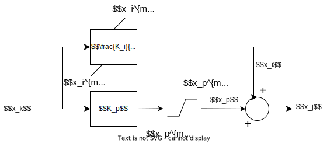

## Diagram



Syntax:  

- function name: pictl2lim
- input variable : $$x_k$$
- output variable: $$x_j$$
- data name, parameter name or math expression for $$K_I$$
- data name, parameter name or math expression for $$K_p$$
- data name, parameter name or math expression for $$x_i^{min}$$
- data name, parameter name or math expression for $$x_i^{max}$$
- data name, parameter name or math expression for $$x_p^{min}$$
- data name, parameter name or math expression for $$x_p^{max}$$

Internal states : variable $$x_i$$ and $$x_p$$

Discrete variable :  $$ z_1 \in \{-1,0,1\} $$ and $$ z_2 \in \{-1,0,1\} $$ 

## Equations

$$
 \left\{
    \begin{array}{lll}
         0 = K_p x_k - x_p & if & z_1=0 \\
        0= x_p - x_p^{min} & if & z_1=-1 \\
        0 = x_p - x_p^{max} & if & z_1=1
    \end{array}
\right.
$$

$$
 \left\{
    \begin{array}{lll}
         \dot{x_i} = K_i x_k & if & z_2=0 \\
        0= x_i - x_i^{min} & if & z_2=-1 \\
        0 = x_i - x_i^{max} & if & z_2=1
    \end{array}
\right.
$$

$$ 0 = x_p + x_i - x_j $$

## Discrete transitions

```

if z1 = 0 then
    if xp > xmaxp then
        z1 ← 1
    else if xp < xminp then
        z1 ← −1
    end if
else if z1 = 1 then
    if Kp*xk < xmaxp  then
        z1 ← 0
    end if
else if z1 = −1 then
    if Kp*xk > xminp  then
        z1 ← 0
    end if
end if
```

```
if z2 = 0 then
    if xi > xmaxi then
        z2 ← 1
    else if xi < xmini then
        z2 ← −1
    end if
else if z2 = 1 then
    if Ki*xk < 0 then
        z2 ← 0
    end if
else if z2 = −1 then
    if Ki*xk > 0 then
        z2 ← 0
    end if
end if

```

## Initialization of internal state variables and discrete variables

**Initialisation of the internal state $$x_p$$**: $$x_p = min( x_p^{max}, max(x_p^{min}, K_px_k) )$$

**Initialisation of the internal $$x_i$$ and the discrete variables:**

```
if Kp*xk > xmaxp then
    z1 ← 1
else if Kp*xk < xminp then
    z1 ← −1
else
    z1 ← 0
end if
```

```
if Ki*xk > 0 then
    z2 ← 1
    xi ← xmaxi
else if Ki*xk < 0 then
    z2 ← −1
    xi ← xmini
else
    z2 ← 0
    xi ← xj − xp
end if
```
