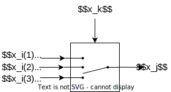

Set the output state to one among $$n$$ input states, based on the value of a controlling state.

## Diagram



example for $$n=3$$

Syntax:  

- function name: switch
- input variable : $$x_i(l),  l \in \{1, 2, ... , n \}$$
- variable $$x_k$$
- variable $$x_j$$

Internal states : none

Discrete variable : $$ z \in \{1, 2, ... , n \} $$

## Equations

$$ 0 = x_j - x_i(z) $$

## Discrete transitions

```

z ← max(1, min(n, nint(xk)))
```
where nint function returns the nearest integer.

## Initialisation of discrete variables

Same code as for the discrete transitions.
