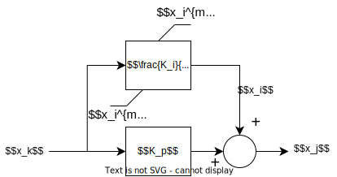

## Diagram



Syntax:  

- function name: pictllim
- input variable : $$x_k$$
- output variable: $$x_j$$
- data name, parameter name or math expression for $$K_I$$
- data name, parameter name or math expression for $$K_p$$
- data name, parameter name or math expression for $$x_i^{min}$$
- data name, parameter name or math expression for $$x_i^{max}$$

Internal states : variable $$x_i$$

Discrete variable :  $$ z \in \{-1,0,1\} $$

## Equations

$$
 \left\{
    \begin{array}{lll}
         \dot{x_i} = K_i x_k & if & z=0 \\
        0= x_i - x_i^{min} & if & z=-1 \\
        0 = x_i - x_i^{max} & if & z=1
    \end{array}
\right.
$$

$$ 0 = K_p x_k + x_i - x_j $$

## Discrete transitions

```

if z = 0 then
    if xi > xmaxi then
        z ← 1
    else if xi < xmini then
        z ← −1
    end if
else if z = 1 then
    if Ki*xk < 0 then
        z ← 0
    end if
else if z = −1 then
    if Ki*xk > 0 then
        z ← 0
    end if
end if
```

## Initialization of internal state variables and discrete variables

```
if Ki*xk > 0 then
    z ← 1
    xi ← xmaxi
else if Ki*xk < 0 then
    z ← −1
    xi ← xmini
else
    z ← 0
    xi ← xj
end if
```