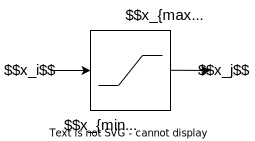

## Diagram



Syntax:  

- function name: lim
- input variable : $$x_i$$
- output variable: $$x_j$$
- data name, parameter name or math expression for $$x_{min}$$
- data name, parameter name or math expression for $$x_{max}$$

Internal states : none

Discrete variable : $$ z \in \{-1,0, 1\} $$

## Equations

$$
0 = \left\{
    \begin{array}{lll}
        x_j - x_i & if & z=0 \\
        x_j - x_{min} & if & z=-1 \\
        x_j - x_{max} & if & z=1
    \end{array}
\right.
$$

## Discrete transitions

```

if z = 0 then
    if xi > xmax then
        z ← 1
    else if xi < xmin then
        z ← −1
    end if
else if z = 1 then
    if xi < xmax then
        z ← 0
    end if
else if z = −1 then
    if xi > xmin then
        z ← 0
    end if
end if
```

## Initialisation of discrete variables

```
if xj > xmax then
    z ← 1
else if xj < xmin then
    z ← −1
else
    z ← 0
end if
```