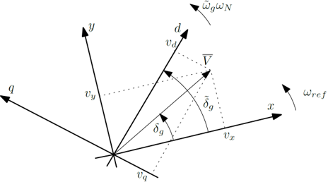
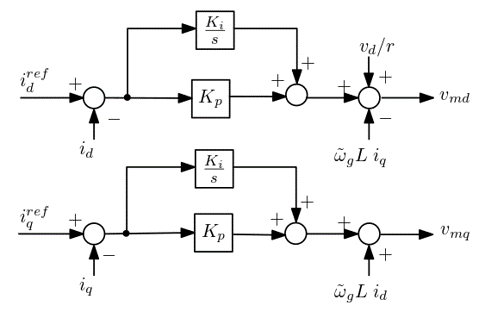
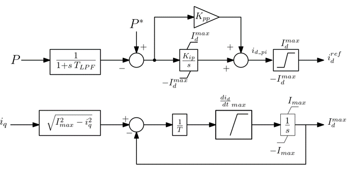
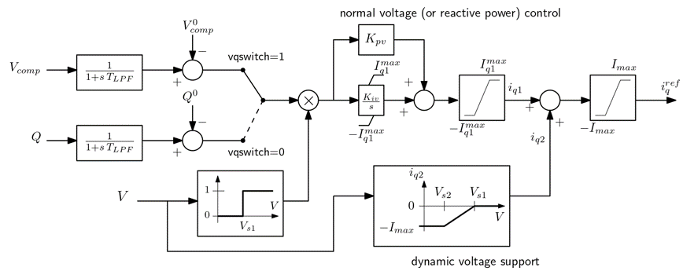
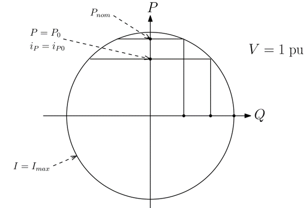

# RMS grid following voltage source converter

## Context

This grid following voltage source converter is a generic RMS model that doesn't aim at embedding the “best” design and/or tuning of VSC controls, but rather encompass many variants from the literature by its genericity.
It has been developed by Professor Thierry Van Cutsem in 2021 with a view to building test cases to study the impact of converters on stability of power networks.

## Model use, assumptions, validity domain and limitations

This RMS model is an MMC-type converter connected to grid through transformer without LC filter, and no DC side model ($$v_c$$ is constant). Hence, only the AC dynamics of the model can be taken into account.
However, the dynamics in the transformer are taken into account in order to capture fast dynamics of converter.

It can be used for voltage, frequency, transient, and slow interaction converter stability studies, but not in EMT studies.
As it is generic, it can't be used for studying a specific behavior of a real-life converter.

## Model description

The model is constituted of :

- the physical part that include a MMC-type converter represented by a voltage injector, in serie with a resistance and reactance and an ideal transformer before its connection to the point of common coupling.
- some controls : PLL, current control loop, active power and reactive power loops,

### Physical part

The physical part is presented on the following figure:

The reference frame of the network is different from the one of the converter and can be related by:

 where:

- $$(𝑥,𝑦)$$ axes are rotating at angular speed $$𝜔_{𝑟𝑒𝑓}$$ in (rad/s)
- $$𝑣_𝑥, 𝑣_𝑦$$ are the rectangular components of PCC voltage phasor $$\bar{𝑉}$$
- $$(𝑑,𝑞)$$ axes are tracking the voltage phasor and are given by Phase Locked Loop
- $$𝑣_𝑑, 𝑣_𝑞$$ are the $$𝑑,𝑞$$ components of $$\bar{𝑉}$$
- $$𝛿_𝑔$$ are phase angle of  $$\bar{𝑉}$$ with regard to $$𝑥$$ in (rad)
- $$\tilde{𝛿}_𝑔$$ is the angle between $$𝑑$$ and $$𝑥$$ (rad). In steady-state : $$\tilde{𝛿}_𝑔= 𝛿_𝑔$$
- $$\tilde{𝜔}_𝑔$$ : angular speed of $$(𝑑,𝑞)$$ axes in (pu/s)
- $$\omega_N$$ is the nominal angular speed (in rad/s)

The equations of the physical part are the following :

Change in the reference from $$(x,y)$$  to $$(d,q)$$ representation :

$$ v_d = v_x * cos(\tilde{\delta}_g) + v_y * sin(\tilde{\delta}_g) $$
$$ i_d = r * i_x * cos(\tilde{\delta}_g) + r* i_y * sin(\tilde{\delta}_g) $$

Dynamics of current in transformer in $$(𝑑,𝑞)$$ reference frame:

$$ L_{pr} \frac{di_d}{dt} = \omega_N* ( v_{md} - \frac{v_d}{r} - R_{pr} i_d + \tilde{\omega}_g L_{pr} i_q)$$
$$ L_{pr} \frac{di_q}{dt} = \omega_N* ( v_{mq} - \frac{v_q}{r} - R_{pr} i_q + \tilde{\omega}_g L_{pr} i_d)$$

### PLL

The PLL has the following diagram:

where the following gains are in per unit on the Snom base (nominal apparent power of converter):

- $$K_{p\omega} = \frac{10}{T_{PLL} \omega_N}$$ 
- $$K_{i\omega} = \frac{25}{T_{PLL}^2 \omega_N}$$
- $$T_{PLL} =100 ms$$

The PLL can be blocked/unblocked for low voltage by defining $$V_{PLL1}$$ and  $$V_{PLL2}$$ (typical values can be 0.4 pu and 0.5pu)

### d-q current control

The d-q current control loop has the following diagram:

!

where:

- $$K_{i}= R_{pr} \omega_c $$
- $$K_{p}= L_{pr} \frac{\omega_c}{\omega_N} $$

### Active power control

The active power control has the following diagram:

where:

- $$T{LPF} = \frac{1}{\omega_{LPF}}$$
- $$𝐾_{𝑝𝑝}= \frac{𝐾_{𝑖𝑝}}{𝜔_{𝐿𝑃𝐹}} $$
- I_max is the maximum allowed current in pu

The lower block-diagram aims at limiting the rate of recovery of  $$𝐼_𝑑^{𝑚𝑎𝑥}$$ after it has been decreased by an increase of $$𝑖_𝑞$$. The priority is given to the reactive current.

### Reactive power control

The reactive power control loop has the following diagram:

where:

- $$𝑄$$ is the reactive power injected into the grid  (in pu)
- $$T_{LPF}$$ is the time constant of the low pass filter in ms
- $$𝑉_{𝑐𝑜𝑚𝑝}$$ is the compensated voltage :

Dynamic voltage support can be discarded  by putting $$𝑖_{𝑞2}=0$$.

### Limitations of current

The current limitations can be explained with the following scheme:

## Open source implementations (if any)

_This section give a list of the different open source implementations of this model.It provides the reader with links and languages/software used for each implementations._

The markdown table can be used to display such list, for example:

This model has been successfully implemented in :

| Software      | URL | Language | Open-Source License | Last consulted date | Comments |
| --------------| --- | --------- | ------------------- |------------------- | -------- |
| STEPSS | [Link](https://github.com/CRESYM/BiGER/tree/main/testModels/gridFollowing/STEPPS) | txt | [MPL v2.0](https://www.mozilla.org/en-US/MPL/2.0/)  | 17/05/2024 | - |
| dynawo | [Link](https://github.com/dynawo/dynawo/compare/master...3093_GFL_VSC) | modelica | [MPL v2.0](https://www.mozilla.org/en-US/MPL/2.0/)  | 17/05/2024 | - |

## Table of references
