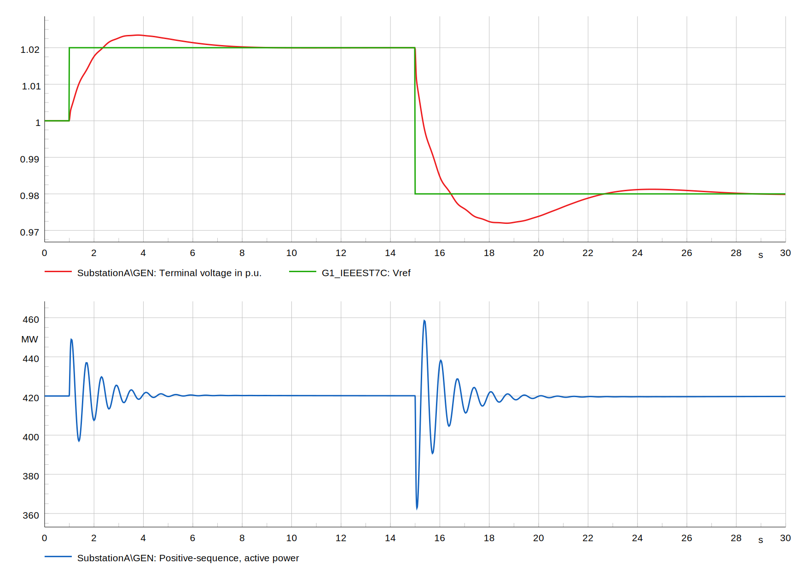
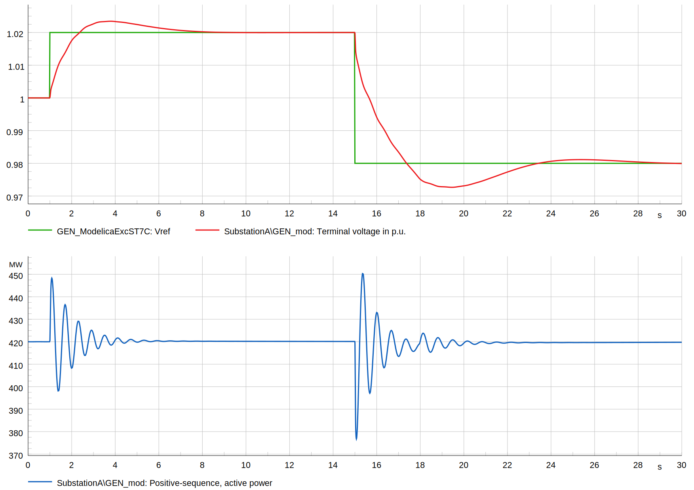
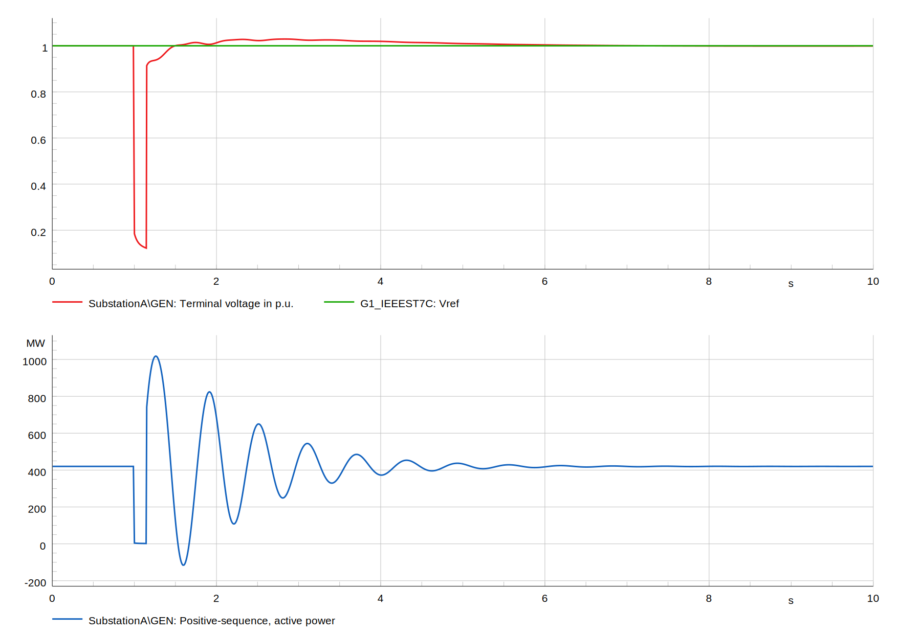
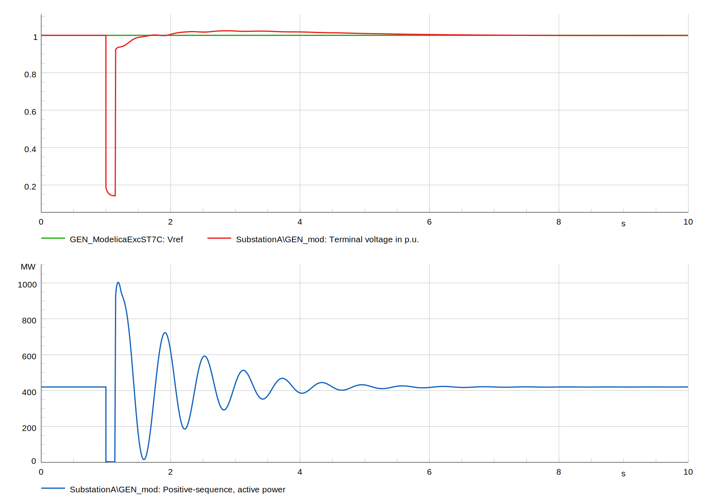
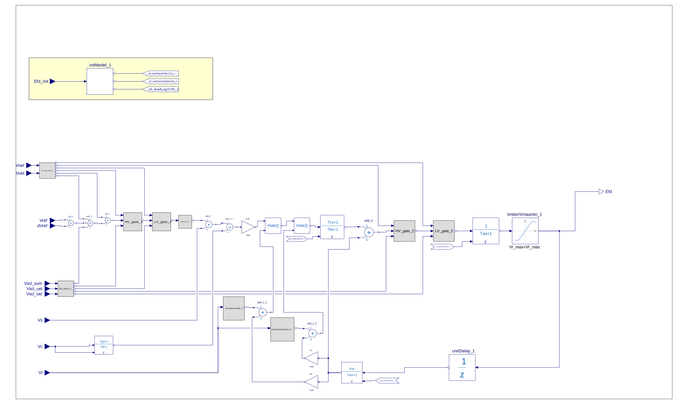

# Excitation System Model – Type IEEEST7C

## Context

The model ST7C is fully described in section 8.15 of the IEEE 421.5-2016. The model 
is also included as a standard model in the dynamics part of the Common Information 
Model (CIM) -  IEC 61970-600-302:2024 and IEC 61970-457:2024 which allows the model to 
be exchanged between different applications.

## Model use, assumptions, validity domain and limitations

In accordance with IEEE 421.5-2016, the model ST7C is intended to 
facilitate the use of field test data. However, it is a reduced order model which do 
not necessarily represent all of the control loops of the system. The model is suitable 
for the analysis of transient stability and small-signal stability (rotor angle 
stability), as defined by the IEEE/CIGRÉ Joint Task Force [4]. The model is also 
suitable for short-term simulations associated with frequency stability and voltage 
stability. It can be used with the generator models defined in IEEE Std 1110™ [5].

## Model description

The model ST7C is representative of static potential source excitation systems. In 
this system, the AVR consists of a proportional-integral (PI) voltage regulator. 
A phase lead-lag filter in series allows introduction of a derivative function, 
although this is typically used only with brushless excitation systems. In that case, 
the regulator is of the PID type. In addition, the terminal voltage channel includes 
a phase lead-lag filter.
The AVR includes the appropriate inputs at its reference for overexcitation limiter (OEL)
, underexcitation limiter (UEL), and stator current limiter (SCL). These limiters, 
when they work at voltage reference level, keep the PSS VS in operation. However, 
the UEL limiter could also be connected to the HV gate acting on the output signal, 
representing a takeover action. Similarly, the AVR output signal passes through an LV 
gate that could be used to represent a takeover overexcitation limiter.

### Model validation
The model is compared between different implementations i.e. as standard model and as use defined model using Modelica equations. The following tests are performed
- step response characteristic +2% Vref at 1 sec and -2% Vref at 15 sec. 
- short circuit at one of the nodes of the test grid.
The simulations are performed in DIgSILENT PowerFactory 2024.

Figure 1: Step response characteristic +2% Vref at 1 sec and -2% Vref at 15 sec. Standard model

Figure 2: Step response characteristic +2% Vref at 1 sec and -2% Vref at 15 sec. Modelica based model

igure 3: Short circuit event. Standard model

Figure 4: Short circuit event. Modelica based model

### Implementations mapping
The following table provides information on model implementations in different applications 

| Application                     | Model name             |
|:--------------------------------|:-----------------------|
| DIgSILENT PowerFactory 2024 SP5 | exc_CGMES_3_1_IEEEST7C |
| Siemens PSS/E                   | ST7C                   | 

### Modelica implementation
XXX

### Model schema

The block diagram of the model is provided in IEEE 421.5-2016. The block diagram below is the diagram of the model represented as user defined model based on Modelica equations.

Figure 5: Model block diagram

### Parameters

Table 1: Parameters

| name                   | type  | unit | IEC name | description                                                                                                | typical value |
|:-----------------------|:------|:-----|:---------|:-----------------------------------------------------------------------------------------------------------|:--------------|
| $$T_\mathrm{g}$$       | float | s    | Tg       | Regulator input filter time constant                                                        | 0.3           |
| $$T_\mathrm{f}$$       | float | s    | Tf       | Voltage regulator lag time constant                                  | 1.6           |
| $$K_\mathrm{pa}$$      | float | pu   | Kpa      | Voltage regulator gain                                                                          | 60            |
| $$T_\mathrm{b}$$       | float | s    | Tb       | Voltage regulator lag time constant                                                                          | 0.01          |
| $$T_\mathrm{c}$$       | float | s    | Tc       | Voltage regulator lead time constant                                      | 0.6           |
| $$T_\mathrm{a}$$       | float | s    | Ta       | Thyristor bridge equivalent time constant | 0.004         |
| $$K_\mathrm{l}$$       | float | pu   | Kl       | Minimum excitation limit gain                                                                                      | 1             |
| $$K_\mathrm{h}$$       | float | pu   | Kh       | Maxcimum excitation limit gain                                                                                     | 1             |
| $$K_\mathrm{ia}$$      | float | pu   | Kia      | PI regulator feedback gain                                                                                      | 1             |
| $$T_\mathrm{ia}$$      | float | s    | Tia      | PI regulator Feedback time constant                                                                                      | 2             |
| $$Vuel_\mathrm{in}$$   | int   | -    | Vuel in  | UEL type/position selector (0=sum, 1/2= Takeover)                                                                                      | 0             |
| $$Voel_\mathrm{in}$$   | int   | -    | Voel in  | OEL type/position selector (0=sum, 1/2= Takeover)                                                                                      | 0             |
| $$Vscl_\mathrm{in}$$   | int   | -    | Vscl in  | SCL type/position selector (0=sum, 1/2= Takeover)                                                                                      | 0             |
| $$V_\mathrm{min}$$     | float | pu   | Vmin     | Minimum voltage reference                                                                                      | 0.9           |
| $$Vr_\mathrm{min}$$    | float | pu   | Vrmin    | Minimum regulator output                                                                                      | -8            |
| $$V_\mathrm{max}$$     | float | pu   | Vmax     | Maximum voltage reference                                                                                      | 1.1           |
| $$Vr_\mathrm{max}$$    | float | pu   | Vrmax    | Maximum regulator output                                                                                  | 6             |

### Variables

#### Inputs

Table 2: Inputs

| name               | type  | unit | modelica name | IEC name | description                        |
|--------------------|-------|------|---------------|----------|------------------------------------|
| $$V_\mathrm{ref}$$ | float | pu   | Vref          | Vref     | voltage setpoint                   |
| $$V_\mathrm{c}$$   | float | pu   | Vc            | Vc       | voltage                            |
| $$V_\mathrm{s}$$   | float | pu   | Vs            | Vs       | PSS input                          |

### Outputs

Table 3: Outputs

| name              | type  | unit | modelica name | IEC name | description             |
|-------------------|-------|------|---------------|----------|-------------------------|
| $$E_\mathrm{fd}$$ | float | pu   | Efd           | Efd      | Generator field voltage |

### Equations & algorithm  

The equations related to the model are available in a [document](../IEEEST7C/ModelEquations.docx).

## Open source implementations

This model has been successfully implemented in:

| Software/ Data exchange standard/artifact | URL                                        | Language    | Open-Source License                                | Last consulted date | Comments                                                                                              |
|-------------------------------------------| ------------------------------------------ |-------------| -------------------------------------------------- |---------------------|-------------------------------------------------------------------------------------------------------|
| CGMES                                     | [Dynawo](https://github.com/dynawo/dynawo) | CIMXML      | [CC-BY-4.0](https://creativecommons.org/licenses/by/4.0/legalcode) | 04/11/2024          | Modelled as standard model. |
| CGMES                                     | [Dynawo](https://github.com/dynawo/dynawo) | CIMXML      | [CC-BY-4.0](https://creativecommons.org/licenses/by/4.0/legalcode) | 04/11/2024          | Modelled as user defined (detailed model) model with explicit equations in Modelica. |
| CGMES                                     | [Dynawo](https://github.com/dynawo/dynawo) | CIMXML      | [CC-BY-4.0](https://creativecommons.org/licenses/by/4.0/legalcode) | 04/11/2024          | Modelled as used defined (detailed model) using compiled PowerFactory model. |
| CGMES                                     | [Dynawo](https://github.com/dynawo/dynawo) | CIMXML      | [CC-BY-4.0](https://creativecommons.org/licenses/by/4.0/legalcode) | 04/11/2024          | Modelled as used defined (detailed model) using compiled FMU model.                                   |
| PowerFactory                              | [Dynawo](https://github.com/dynawo/dynawo) | Proprietary | [CC-BY-4.0](https://creativecommons.org/licenses/by/4.0/legalcode) | 04/11/2024          | Compiled model.                                                                                       |
| FMU                                       | [Dynawo](https://github.com/dynawo/dynawo) | Modelica    | [CC-BY-4.0](https://creativecommons.org/licenses/by/4.0/legalcode) | 04/11/2024          | Compiled model.                                                                                       |

## Table of references

[1]
IEEE 421.5-2016, IEEE Recommended Practice for 
Excitation System Models for Power System Stability Studies.

[2]
IEC 61970-302:2024, Energy management system 
application program interface (EMS-API) - Part 302: Common information model (CIM) 
dynamics.

[3]
IEC 61970-457:2024, Energy management 
system application program interface (EMS-API) - Part 457: Dynamics profile.

[4]
IEEE/CIGRÉ Joint Task Force on Stability Terms 
and Definitions, “Definition and classification of power system stability,”
IEEE Transactions on Power Systems, vol. 19, no. 3, pp. 1387–1401, Aug. 2004.

[5]
IEEE Std 1110™, IEEE Guide for Synchronous 
Generator Modeling Practices and Applications in Power System Stability Analyses.

