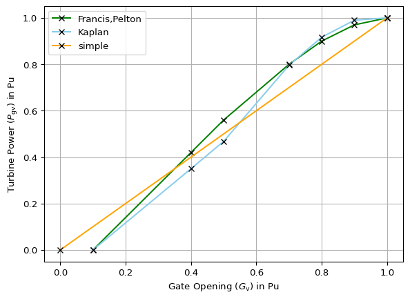

## Context

The following information has been gathered from [1], [2] and [3].

In a hydroelectric power plant, the governing system’s main function is
to control the speed or load of the turbine by the means of gate
opening. The prime movers convert the kinetic energy of the water into
mechanical energy, which is then converted into electrical energy by a
synchronous generator. The governor monitors the speed of the turbine
and adjusts the position of the gates that control the water flow to
keep the speed steady. It does this by comparing the actual speed with
the desired speed and making changes accordingly [1].

For more details also see [4] and [5].

### Types of turbines

Turbines used in the hydro power plants are mainly classified into two
types [1]:

- **Impulse turbines** like the Pelton wheel and simple turbine, are
  used for high heads, typically 300 meters or more. They work by
  directing high-velocity water jets onto spoon-shaped buckets on a
  runner, converting potential energy to kinetic energy entirely at
  atmospheric pressure.
- **Reaction turbines** such as the Francis and propeller turbines work
  with water’s kinetic and potential energy. In the Francis turbine,
  water flows axially through guide vanes, impacting the runner
  tangentially, suitable for heads up to 360 meters.

These distinctions are crucial for understanding the dynamics of hydro
governors.

## Model use, assumptions, validity domain and limitations

GovHydro4 is a general model that can be used to represent simple,
Francis/Pelton or Kaplan turbines [3].

The model is a positive-sequence RMS model, hence it assumes symmetrical
operating conditions and neglects high-frequency dynamics. This type of
model is often used in large-scale stability studies, for which it
reflects the relevant phenomena. It is not a detailed physical model of
the unit. Also for some stability phenomena (e.g. resonance stability)
this model is not sufficient and EMT models or other approaches may be
necessary.

The gates operate within a range of 0 to 1 PU, transitioning from fully
closed to fully open. At zero power, the gates maintain a position
greater than zero, and typically remain below 1 PU when power is at 1
PU. The operating limits are defined by Gmax and Gmin.

The dynamic analysis of hydraulic turbines is typically based on the
following assumptions regarding the stability of the water column [1]:

- Hydraulic resistance is considered negligible.
- The penstock pipe is assumed to be inelastic, and the water is treated
  as incompressible.
- Water velocity is directly proportional to the gate opening and to the
  square root of the net head.
- Turbine output power is directly proportional to the product of the
  head and the volumetric flow rate.

## Model description

- The curve defined in <a href="#fig-gate-head-flow-characteristics"
  class="quarto-xref">Figure 1</a> represents the relationship between
  the flow of water $$q$$ through the turbine and the stroke $$G$$ of the
  gate actuating servomotor.

### Gate-opening-to-turbine-power characteristic:

- **Simple turbine:** The gate opening-to-turbine power characteristic
  is represented by a line with a slope of At and an intercept of Qnl,
  as depicted in the GovHydro4SimpleHydroTurbine diagram. This curve is
  proportional to turbine power, with the constant of proportionality
  determined by the turbine gain.
- **Francis/Pelton:** The non-linear gate opening-to-turbine power
  characteristic is described by points in the green curve
  <a href="#fig-gate-head-flow-characteristics"
  class="quarto-xref">Figure 1</a>.
- **Kaplan:** This model uses points through the blue curve from the
  <a href="#fig-gate-head-flow-characteristics"
  class="quarto-xref">Figure 1</a> to define the non-linear
  characteristics of gate opening-to-turbine power and gate
  opening-to-blade angle.

Figure 1: The gate-head-flow-power characteristics for a kaplan turbine
model [3]

Table 1: Gate head flow characteristics

| $$G_\mathrm{v}$$ | $$P_\mathrm{gv}$$ (Francis) | $$P_\mathrm{gv}$$ (Kaplan) | $$P_\mathrm{gv}$$ (Simple) |
|:---|:---|:---|:---|
| 0 | 0 | 0 | 0 |
| 0.1 | 0 | 0 | 0.1 |
| 0.4 | 0.42 | 0.35 | 0.4 |
| 0.5 | 0.56 | 0.468 | 0.5 |
| 0.7 | 0.8 | 0.796 | 0.7 |
| 0.8 | 0.9 | 0.917 | 0.8 |
| 0.9 | 0.97 | 0.99 | 0.9 |
| 1 | 1 | 1 | 1 |

> [!NOTE]
>
> The output signal of the lookup-tabl actually represents a flow rate,
> not a power value ($$q_\mathrm{f}$$ in
> <a href="#fig-control_diagram" class="quarto-xref">Figure 2</a>).
> Since in [3] the power variable $$P_\mathrm{gv}$$ is used instead,
> this is also used here in
> <a href="#fig-gate-head-flow-characteristics"
> class="quarto-xref">Figure 1</a> and
> <a href="#tbl-turb_parameters" class="quarto-xref">Table 3</a>

### Transient droop

Hydro power turbines have a unique behavior, where adjusting the gate
position for controlling water flow results in an immediate but
temporary change in turbine power output to the opposite direction,
known as non-minimum phase behavior. To address this, a mechanism called
transient droop compensation is employed. This mechanism, which shown in
the upper half of the
<a href="#fig-control_diagram" class="quarto-xref">Figure 2</a>,
involves rate feedback or transient gain reduction, which slows down or
limits gate movement until water flow and power output have had time to
adjust. As the system stabilizes, the governor returns to normal
operation with permanent droop $$R_\mathrm{perm}$$, responding more
sensitively to speed deviations to maintain steady-state operation. This
compensation mechanism ensures stable control performance, crucial for
maintaining the stability of hydroelectric power plants [1].

### Dead bands

There is a difference between the intentional deadband
($$\Delta \omega_\mathrm{db}$$, $$\Delta \omega_\mathrm{\varepsilon}$$) and
the unintentional deadband ($$\Delta P_\mathrm{db}$$). The former is
intentionally added to the control to prevent continuous adjustment of
the mechanical power in response to minor frequency deviations. It has a
fixed region with zero output. The latter implements a hysteresis around
the operating point, representing backlash of the mechanical actuator [5].

## Model schema

The block diagram of GovHydro4 is depicted in
<a href="#fig-control_diagram" class="quarto-xref">Figure 2</a>.

Figure 2: Control diagram

## Parameters

Per-unit parameters are on base of $$P_\mathrm{base}$$, which is normally
the capability of the turbine in MW. Per-unit angular velocity
parameters are based on nominal frequency.

Table 2: Parameters

| name                                   | type  | unit | IEC name | description                                                             | typical value                                                      |
| :------------------------------------- | :---- | :--- | :------- | :---------------------------------------------------------------------- | :----------------------------------------------------------------- |
| $$A_\mathrm{turb}$$                    | float | pu   | at       | Turbine gain                                                            | 1.2                                                                |
| $$B_\mathrm{max}$$                     | float | pu   | bmax     | Maximum blade adjustment factor                                         | see <a href="#tbl-turb_parameters" class="quarto-xref">Table 3</a> |
| $$\Delta \omega_\mathrm{\varepsilon}$$ | float | pu   | eps      | Intentional deadband discontinuity step size                            | 0                                                                  |
| $$\Delta \omega_\mathrm{db}$$          | float | pu   | db1      | Intentional deadband width                                              | 0                                                                  |
| $$\Delta P_\mathrm{db}$$               | float | pu   | db2      | Unintentional dead-band                                                 | 0                                                                  |
| $$D_\mathrm{turb}$$                    | float | pu   | dturb    | Turbine damping factor                                                  | see <a href="#tbl-turb_parameters" class="quarto-xref">Table 3</a> |
| $$G_\mathrm{max}$$                     | float | pu   | gmax     | Maximum gate opening                                                    | 1                                                                  |
| $$G_\mathrm{min}$$                     | float | pu   | gmin     | Minimum gate opening                                                    | 0                                                                  |
| $$h_\mathrm{dam}$$                     | float | pu   | hdam     | Head available at dam                                                   | 1                                                                  |
| $$M_\mathrm{set}$$                     | int   | \-   | model    | The kind of model being represented (simple, Francis/Pelton or Kaplan). | \-                                                                 |
| $$q_\mathrm{nl}$$                      | float | pu   | qnl      | No-load flow at nominal head                                            | see <a href="#tbl-turb_parameters" class="quarto-xref">Table 3</a> |
| $$R_\mathrm{perm}$$                    | float | pu   | rperm    | Permanent droop                                                         | 0.05                                                               |
| $$R_\mathrm{temp}$$                    | float | pu   | rtemp    | Temporary droop                                                         | 0.3                                                                |
| $$T_\mathrm{blade}$$                   | float | s    | tblade   | Blade servo time constant                                               | 100                                                                |
| $$T_\mathrm{g}$$                       | float | s    | tg       | Gate servo time constant                                                | 0.5                                                                |
| $$T_\mathrm{p}$$                       | float | s    | tp       | Pilot servo time constant                                               | 0.1                                                                |
| $$T_\mathrm{r}$$                       | float | s    | tr       | Dashpot time constant                                                   | 5                                                                  |
| $$T_\mathrm{w}$$                       | float | s    | tw       | Water inertia time constant                                             | 1                                                                  |
| $$U_\mathrm{c}$$                       | float | pu   | uc       | Max gate closing velocity                                               | -0.2                                                               |
| $$U_\mathrm{o}$$                       | float | pu   | uo       | Max gate opening velocity                                               | 0.2                                                                |

### Typical values for the parameters that vary with turbine type

Table 3: Turbine type dependent parameters

| Parameter name    | Simple | Francis | Pelton | Kaplan |
|-------------------|--------|---------|--------|--------|
| $$B_\mathrm{max}$$  | 0      | 0       | 0      | 1.1276 |
| $$D_\mathrm{turb}$$ | 0.5    | 1.1     | 1.1    | 1.1    |
| $$q_\mathrm{nl}$$   | 0.08   | 0       | 0      | 0      |

> [!NOTE]
>
> The simple turbine model uses a proportional turbine characteristic
> without no-load offset, hence the $$q_\mathrm{nl}$$ = 0.08 pu are to
> compensate for that simplification. In the other turbine models,
> no-load flow is already included in their characteristic (see
> <a href="#fig-gate-head-flow-characteristics"
> class="quarto-xref">Figure 1</a>), hence $$q_\mathrm{nl}$$ = 0 pu. In
> the model the turbine dependent parameters are chosen automatically by
> selecting a turbine type.

## Variables

### Inputs

Table 4: Inputs

| name                    | type  | unit | IEC name                | description            |
| ----------------------- | ----- | ---- | ----------------------- | ---------------------- |
| $$\Delta\omega$$        | float | pu   | $$\omega$$              | rotor speed            |
| $$\omega_\mathrm{ref}$$ | float | pu   | $$\omega_\mathrm{ref}$$ | rotor speed reference  |
| $$P_\mathrm{ref}$$      | float | pu   | pref                    | Reference Power demand |

> [!NOTE]
>
> During initialization $$P_\mathrm{ref}$$ is calculated. Its value does
> not correspond to the power output. This approach has historical
> roots: Initially, a manual actuator for $$P_\mathrm{ref}$$ was adjusted
> without a display to show the precise value. Operators would move the
> actuator while observing the turbine’s output power, so the exact
> value of $$P_\mathrm{ref}$$ was not critical.

### Outputs

Table 5: Outputs

| name             | type  | unit | IEC name | description      |
| ---------------- | ----- | ---- | -------- | ---------------- |
| $$P_\mathrm{m}$$ | float | pu   | Pm       | mechanical power |

## Equations & algorithm  

The initial values for the system’s states are calculated from the
initial mechanical power $$P_\mathrm{m\,0}$$ Pu.

The lookup-table $$L_\mathrm{turb}$$ of the turbine characteristics is
used in the model to translate gate opening $$G$$ to water flow $$q$$. Its
inverse lookup-table $$L^{-1}_\mathrm{turb}$$ is used in the following
equations for initialization. It translates water flow to gate opening:
$$G =  L^{-1}_\mathrm{turb}(q)$$.

### Initial equations

The variable $$G_\mathrm{0}$$ is used for an easier initialization.

$$G_\mathrm{0} = L^{-1}_\mathrm{turb}\left(P_\mathrm{m\,0} / A_\mathrm{turb} + Q_\mathrm{nl}\right)$$

$$P_\mathrm{ref\,0} = G_\mathrm{0} \cdot R_\mathrm{perm}$$

$$x_\mathrm{Tw\,0} = P_\mathrm{m0} / A_\mathrm{turb} + Q_\mathrm{nl}$$

$$x_\mathrm{G\,0}= G_\mathrm{0}$$

$$x_\mathrm{tfRTemp\,0} = 0$$

$$x_\mathrm{Tp\,0} = 0$$

$$P_\mathrm{ref\,0}  = G_\mathrm{0} \cdot R_\mathrm{perm}$$

## Open source implementations

This model has been successfully implemented in :

| Software               | URL                                        | Language | Open-Source License                                | Last consulted date | Comments                                                                                              |
| ---------------------- | ------------------------------------------ | -------- | -------------------------------------------------- | ------------------- | ----------------------------------------------------------------------------------------------------- |
| Open Modelica / Dynawo | [Dynawo](https://github.com/dynawo/dynawo) | modelica | [MPL v2.0](https://www.mozilla.org/en-US/MPL/2.0/) | 30/10/2024          | For modeling assumptions and test results, see [Dynawo](https://github.com/dynawo/dynawo) repository. |

## Table of references & license

[1]
P. Kundur, *Power System Stability
and Control*. New York: McGraw-Hill Education Ltd, 1994.

[2]
Neplan, “TURBINE-GOVERNOR MODELS –
Standard Dynamic Turbine-Governor Systems in NEPLAN Power System
Analysis Tool.” 2015. Available:
[www.neplan.ch](https://www.neplan.ch)

[3]
IEC, “IEC 61970-302:2024 Energy
management system application program interface (EMS-API) - Part 302:
Common information model (CIM) dynamics.” VDE, 2024. Accessed: Oct. 30,
2024. [Online]. Available:
<https://www.vde-verlag.de/iec-normen/252516/iec-61970-302-2024.html>

[4]
IEEE, “Dynamic Models for
Turbine-Governors in Power System Studies.” Jan. 2013.

[5]
J. Feltes *et al.*, “Review of
Existing Hydroelectric Turbine-Governor Simulation Models,”
ANL/DIS-13/05, 1098022, Oct. 2013. doi:
[10.2172/1098022](https://doi.org/10.2172/1098022).

