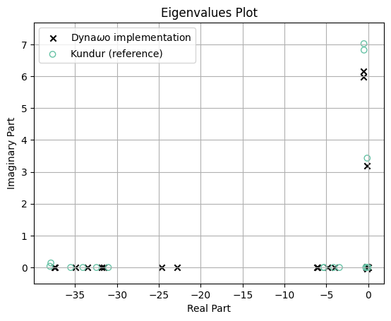
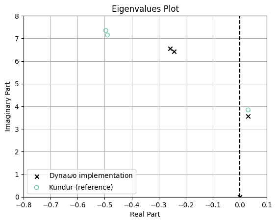
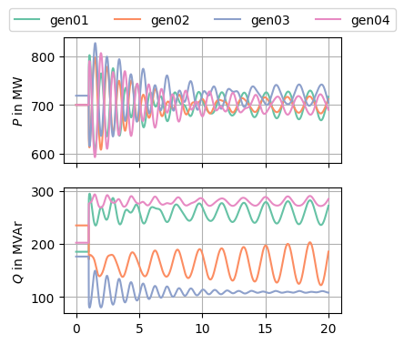

## Use case purpose​ and context

The *Kundur two area system* is a test system for studies on dynamic
stability, oscillations, damping, power exchange and other use cases. It
is a widely used standard test case defined in Kundur’s *Power system
stability and control* [1] (Fig. E12.8).

## Table of references

[1]
P. Kundur, *Power System Stability
and Control*. New York: McGraw-Hill Education Ltd, 1994.

[2]
R. Ramos and I. Hiskens,
“PES-TR18: Benchmark Systems for Small-Signal Stability Analysis and
Control,” Aug. 2015.

[3]
Shackshaft and Henser, “Model of
generator saturation for use in power system studies.” Apr. 1979.

## Network ​description

Figure 1: Kundur’s two-area test system [1]

In <a href="#fig-two-area-system" class="quarto-xref">Figure 1</a> the
test system is shown. As [1] describes it, it consists of two similar
areas connected by a weak tie.

The parameters are listed in
<a href="#sec-data" class="quarto-xref">Section 5</a>. The system
consists of 11 buses connected by lines or transformers. There are 4
generators G1…G4, two loads L7 and L9 as well as two shunt capacitors C7
and C9.

## Static and Dynamic models​ description

This test case includes the following components:

### Generators

#### Governors

The generator model **does not include a governor**.

#### AVRs

The following AVRs are used in this test system, depending on the used
scenario:

- no AVR: Manual excitation, i.e. constant field voltage
- AVR DC1A (similar to DC1C, [see colib page
  here](https://colib.net/pages/models/regulations/avr/DC1C/))
  - $$K_\mathrm{a}=$$ 20 pu
  - $$K_\mathrm{a}=$$ 200 pu
- AVR ST1A (similar to ST1C, [see colib page
  here](https://colib.net/pages/models/regulations/avr/ST1C/))
  - (with/without transient gain reduction (TGR) and/or power system
    stabilizer (PSS))

For details on the scenarios, see
<a href="#sec-scenarios" class="quarto-xref">Section 6</a>. The
parameters are given in the tables of
<a href="#sec-data" class="quarto-xref">Section 5</a>.

### Loads (static ZIP model)

<a href="#eq-zipload-p" class="quarto-xref">Equation 1</a> and
<a href="#eq-zipload-q" class="quarto-xref">Equation 2</a> define ZIP
load model. Depending on the coefficients in
<a href="#tbl-zip-load-parameters" class="quarto-xref">Table 1</a> it
models a constant impedance, current or power load.

$$
P = P_\mathrm{Ref} \cdot (1 + \Delta P) \cdot \left(Z_\mathrm{p} \cdot \left(\frac{U}{U_\mathrm{0}}\right)^2 + I_\mathrm{p} \cdot \frac{U}{U_\mathrm{0}} + P_\mathrm{p}\right)
 \qquad(1)$$ $$
Q = Q_\mathrm{Ref} \cdot (1 + \Delta Q) \cdot \left(Z_\mathrm{q} \cdot \left(\frac{U}{U_\mathrm{0}}\right)^2 + I_\mathrm{q} \cdot \frac{U}{U_\mathrm{0}} + P_\mathrm{q}\right)
 \qquad(2)$$

Table 1: ZIP Load parameters

| parameter      | description                              |
|:---------------|:-----------------------------------------|
| $$I_\mathrm{p}$$ | Current coefficient for active power     |
| $$I_\mathrm{q}$$ | Current coefficient for reactive power   |
| $$P_\mathrm{p}$$ | Power coefficient for active power       |
| $$P_\mathrm{q}$$ | Power coefficient for reactive power     |
| $$Z_\mathrm{p}$$ | Impedance coefficient for active power   |
| $$Z_\mathrm{q}$$ | Impedance coefficient for reactive power |

In [1] it is stated that the active power should be modelled as
constant current and the reactive power as constant impedance: All
coefficients can be set to zero except
$$I_\mathrm{p} = Z_\mathrm{q} = 1$$.

> [!IMPORTANT]
>
> Loads L7, L9 and shunt capacitors C7, C9 can all be modeled as ZIP
> loads. To reproduce the **load flow results** from Kundur, the loads
> need to be modeled as constant power (P and Q), while the shunt
> capacitors need to be modeled as constant impedance.

## Input Data

Table 2: Synchronous machine parameters 

| parameter            | value                                              | pu base                                   |
| :------------------- | :------------------------------------------------- | ----------------------------------------- |
| $$A_\mathrm{Sat}$$   | 0.015                                              | \-                                        |
| $$B_\mathrm{Sat}$$   | 9.6                                                | \-                                        |
| $$H$$                | 6.5 s (for G1 and G2) and 6.175 pu (for G3 and G4) | \-                                        |
| $$K_\mathrm{D}$$     | 0                                                  | \-                                        |
| $$\Psi_\mathrm{T1}$$ | 0.9                                                | \-                                        |
| $$R_\mathrm{a}$$     | 0.0025 pu                                          | $$U_\mathrm{n\,SM}^2 / S_\mathrm{r\,SM}$$ |
| $$S_\mathrm{r\,SM}$$ | 900 MVA                                            | \-                                        |
| $$T_\mathrm{d0}'$$   | 8.0 s                                              | \-                                        |
| $$T_\mathrm{d0}''$$  | 0.03 s                                             | \-                                        |
| $$T_\mathrm{q0}'$$   | 0.4 s                                              | \-                                        |
| $$T_\mathrm{q0}''$$  | 0.05 s                                             | \-                                        |
| $$U_\mathrm{n\,SM}$$ | 20 kV                                              | \-                                        |
| $$X_\mathrm{d}$$     | 1.8 pu                                             | $$U_\mathrm{n\,SM}^2 / S_\mathrm{r\,SM}$$ |
| $$X_\mathrm{d}'$$    | 0.3 pu                                             | $$U_\mathrm{n\,SM}^2 / S_\mathrm{r\,SM}$$ |
| $$X_\mathrm{d}''$$   | 0.25 pu                                            | $$U_\mathrm{n\,SM}^2 / S_\mathrm{r\,SM}$$ |
| $$X_\mathrm{l}$$     | 0.2 pu                                             | $$U_\mathrm{n\,SM}^2 / S_\mathrm{r\,SM}$$ |
| $$X_\mathrm{q}$$     | 1.7 pu                                             | $$U_\mathrm{n\,SM}^2 / S_\mathrm{r\,SM}$$ |
| $$X_\mathrm{q}'$$    | 0.55 pu                                            | $$U_\mathrm{n\,SM}^2 / S_\mathrm{r\,SM}$$ |
| $$X_\mathrm{q}''$$   | 0.25 pu                                            | $$U_\mathrm{n\,SM}^2 / S_\mathrm{r\,SM}$$ |

Table 3: AVR DC1A parameters, see [2]

| Parameter           | Value     | Description                           |
|:--------------------|:----------|:--------------------------------------|
| $$A_\mathrm{ex}$$     | 0.0056 pu | Exciter saturation factor             |
| $$B_\mathrm{ex}$$     | 1.075 pu  | Exciter saturation factor             |
| $$K_\mathrm{A}$$      | 20 pu     | AVR steady state gain                 |
| $$K_\mathrm{E}$$      | 1 pu      | Exciter feedback time constant        |
| $$K_\mathrm{F}$$      | 0.125 pu  | Stabilizer feedback gain              |
| $$T_\mathrm{A}$$      | 0.055 s   | AVR equivalent time constant          |
| $$T_\mathrm{B}$$      | 0 s       | TGR block 1 denominator time constant |
| $$T_\mathrm{C}$$      | 0 s       | TGR block 2 numerator time constant   |
| $$T_\mathrm{C}$$      | 0 s       | TGR block 2 numerator time constant   |
| $$T_\mathrm{C}$$      | 0 s       | TGR block 2 numerator time constant   |
| $$T_\mathrm{E}$$      | 0.36 s    | Exciter time constant                 |
| $$T_\mathrm{F1}$$     | 1.8 s     | Stabilizer feedback time constant     |
| $$T_\mathrm{R}$$      | 0.05 s    | Voltage transducer time constant      |
| $$V_\mathrm{R\,max}$$ | 5 pu      | Max. AVR output                       |
| $$V_\mathrm{R\,min}$$ | -3 pu     | Min. AVR output                       |

Table 4: AVR ST1A parameters, see [2]

| parameter           | Value  | Description                               |
|:--------------------|:-------|:------------------------------------------|
| $$I_\mathrm{LR}$$     | 3 pu   | Field current instantaneous limit         |
| $$K_\mathrm{A}$$      | 200 pu | AVR steady state gain                     |
| $$K_\mathrm{C}$$      | 0 pu   | Commutation factor for rectifier bridge   |
| $$K_\mathrm{F}$$      | 0 pu   | Stabilizer feedback gain                  |
| $$K_\mathrm{LR}$$     | 0 pu   | Field current limiter gain                |
| $$T_\mathrm{A}$$      | 0 s    | Rectifier bridge equivalent time constant |
| $$T_\mathrm{B}$$      | 10 s   | TGR block 1 denominator time constant     |
| $$T_\mathrm{B1}$$     | 0 s    | TGR block 1 denominator time constant     |
| $$T_\mathrm{C}$$      | 1 s    | TGR block 1 numerator time constant       |
| $$T_\mathrm{C1}$$     | 0 s    | TGR block 2 numerator time constant       |
| $$T_\mathrm{F}$$      | 1 s    | Stabilizer feedback time constant         |
| $$T_\mathrm{R}$$      | 0.01 s | Voltage transducer time constant          |
| $$V_\mathrm{A\,max}$$ | 4 pu   | Max. AVR output                           |
| $$V_\mathrm{A\,min}$$ | -4 pu  | Min. AVR output                           |
| $$V_\mathrm{I\,max}$$ | 99 pu  | Max. voltage error                        |
| $$V_\mathrm{I\,min}$$ | -99 pu | Min. voltage error                        |
| $$V_\mathrm{R\,max}$$ | 4 pu   | Max. rectifier bridge output              |
| $$V_\mathrm{R\,min}$$ | -4 pu  | Min. rectifier bridge output              |

Table 5: PSS parameters, see [2]

| parameter           | Value    | Description                             |
|:--------------------|:---------|:----------------------------------------|
| $$A_\mathrm{1}$$      | 0        | 2nd order denominator coefficient       |
| $$A_\mathrm{2}$$      | 0        | 2nd order denominator coefficient       |
| $$A_\mathrm{3}$$      | 0        | 2nd order numerator coefficient         |
| $$A_\mathrm{4}$$      | 0        | 2nd order numerator coefficient         |
| $$A_\mathrm{5}$$      | 0        | 2nd order denominator coefficient       |
| $$A_\mathrm{6}$$      | 0        | 2nd order denominator coefficient       |
| $$K_\mathrm{S}$$      | 20 pu    | PSS gain                                |
| $$L_\mathrm{S\,max}$$ | 0.05 pu  | PSS max. output                         |
| $$L_\mathrm{S\,min}$$ | -0.05 pu | PSS min. output                         |
| $$T_\mathrm{1}$$      | 0.05 s   | 1st lead-lag numerator time constant    |
| $$T_\mathrm{2}$$      | 0.02 s   | 1st lead-lag denominator time constant  |
| $$T_\mathrm{3}$$      | 3 s      | 2nd lead-lag numerator time constant    |
| $$T_\mathrm{4}$$      | 5.4 s    | 2nd lead-lag denominator time constant  |
| $$T_\mathrm{5}$$      | 10 s     | Washout block numerator time constant   |
| $$T_\mathrm{6}$$      | 10 s     | Washout block denominator time constant |
| $$V_\mathrm{CL}$$     | 0 pu     | Lower voltage limit for PSS operation   |
| $$V_\mathrm{CU}$$     | 0 pu     | Upper voltage limit for PSS operation   |

Table 6: Step-up transformer parameters 

| parameter                     | value        | pu base                                   |
| :---------------------------- | :----------- | ----------------------------------------- |
| off-nominal ratio             | 1            | \-                                        |
| $$S_\mathrm{r\,Tr}$$          | 900 MVA      | \-                                        |
| $$ü$$                         | 230kV/20kV   | \-                                        |
| $$\underline{X}_\mathrm{Tr}$$ | 0 + j0.15 pu | $$U_\mathrm{n\,Tr}^2 / S_\mathrm{r\,Tr}$$ |

Table 7: Grid parameters

| parameter              | value                                                               | pu base                                       |
| :--------------------- | :------------------------------------------------------------------ | --------------------------------------------- |
| $$b_\mathrm{C}$$       | 0.00175 pu / km                                                     | $$S_\mathrm{r\,grid} / U_\mathrm{n\,grid}^2$$ |
| line length $$l$$      | see <a href="#fig-two-area-system" class="quarto-xref">Figure 1</a> | \-                                            |
| $$r$$                  | 0.0001 pu / km                                                      | $$U_\mathrm{n\,grid}^2 / S_\mathrm{r\,grid}$$ |
| $$S_\mathrm{r\,grid}$$ | 100 MVA                                                             | \-                                            |
| $$U_\mathrm{n\,grid}$$ | 230 kV                                                              | \-                                            |
| $$x_\mathrm{L}$$       | 0.001 pu / km                                                       | $$U_\mathrm{n\,grid}^2 / S_\mathrm{r\,grid}$$ |

Table 8: Load parameters

| parameter       | value    |
|:----------------|:---------|
| $$P_\mathrm{C7}$$ | 0 MW     |
| $$P_\mathrm{C9}$$ | 0 MW     |
| $$P_\mathrm{L7}$$ | 967 MW   |
| $$P_\mathrm{L9}$$ | 1767 MW  |
| $$Q_\mathrm{C7}$$ | 200 MVAr |
| $$Q_\mathrm{C9}$$ | 350 MVAr |
| $$Q_\mathrm{L7}$$ | 100 MVAr |
| $$Q_\mathrm{L9}$$ | 100 MVAr |

## Scenarios

The following sceniarios are taken from [1] and [2], which are also
considered for reference results.

The shown results are obtained from the Dyna$$\omega$$o Modelica
implementation of the test case.

### Load flow

The load flow results are given in
<a href="#tbl-loadflowU" class="quarto-xref">Table 9</a> and
<a href="#tbl-loadflowS" class="quarto-xref">Table 10</a>.

Table 9: Loadflow voltages of Dynawo implementation

| Bus name | Complex voltage in pu     | Kundur reference voltage in pu |
| :------- | :------------------------ | :----------------------------- |
| bus01    | $$1.030 \angle 20.200°$$  | $$1.03 \angle 20.2°$$          |
| bus02    | $$1.010 \angle 10.433°$$  | $$1.01 \angle 10.5°$$          |
| bus03    | $$1.030 \angle -6.885°$$  | $$1.03 \angle -6.8°$$          |
| bus04    | $$1.010 \angle -17.074°$$ | $$1.01 \angle -17.0°$$         |
| bus05    | $$1.006 \angle 13.737°$$  | \-                             |
| bus06    | $$0.978 \angle 3.651°$$   | \-                             |
| bus07    | $$0.961 \angle -4.759°$$  | \-                             |
| bus08    | $$0.949 \angle -18.633°$$ | \-                             |
| bus09    | $$0.971 \angle -32.234°$$ | \-                             |
| bus10    | $$0.983 \angle -23.819°$$ | \-                             |
| bus11    | $$1.008 \angle -13.511°$$ | \-                             |

Table 10: Loadflow generator powers of Dynawo implementation

| Generator name | Complex power in MVA            | Kundur reference power in MVA |
| :------------- | :------------------------------ | :---------------------------- |
| G1             | $$700.105 + \mathrm{j}185.067$$ | $$700 + \mathrm{j}185$$       |
| G2             | $$700.000 + \mathrm{j}234.676$$ | $$700 + \mathrm{j}235$$       |
| G3             | $$719.000 + \mathrm{j}175.986$$ | $$719 + \mathrm{j}176$$       |
| G4             | $$700.000 + \mathrm{j}202.071$$ | $$700 + \mathrm{j}202$$       |

- The active power exchange from Area 1 to Area 2 (see
  <a href="#fig-two-area-system" class="quarto-xref">Figure 1</a>) is
  400.431 MW in the Dyna$$\omega$$o implementation and 400 MW in the
  Kundur reference.

### Example a

*Example a* examines small-signal performance of the system with
constant excitation.

- All four generators are on manual excitation (field voltage
  $$E_\mathrm{fd} = \mathrm{const.}$$)
- Constant current characteristics of active load components
- Constant impedance characteristics of reactive load components

<a href="#fig-example-a-eigenvalues" class="quarto-xref">Figure 2</a>
shows the result of an eigenvalue analysis of this system, compared to
the reference values from [1]. The remaining differences probalby
originate from differing model implementations of the synchronous
machines in Dyna$$\omega$$ compared to the ones used by Kundur.

Figure 2: Eigenvalues of the system with constant excitation voltage

### Example b

> [!NOTE]
>
> To obtain a steady state initial condition, the exact values for the
> generators active and reactive power and voltage angles from load flow
> (<a href="#sec-loadflow" class="quarto-xref">Section 6.1</a>) need to
> be used as initial values in the dynamic simulation.

> [!NOTE]
>
> In the Dyna$$\omega$$o implementation, if the voltage transducer time
> constant $$T_\mathrm{R}$$ = 0.01 s, then the voltage measurement first
> order lag and the field flux linkage $$\lambda_\mathrm{f}$$ oscillate
> against each other with high amplitude. This is not represented in the
> reference results of [2]. To avoid this behaviour, set
> $$T_\mathrm{R} = 10^{-6}$$ s. This has been done for the Dyna$$\omega$$o
> implementation.

#### Part 1: Self-excieted dc exciter (DC1A)

Instead of constant excitation voltage as in
<a href="#sec-exampleA" class="quarto-xref">Section 6.2</a>, now the
self-excited DC exciter DC1A is used. For parameters, see
<a href="#tbl-dc1a-parameters" class="quarto-xref">Table 3</a>.

In [2] this case has not been taken into account for comparative
analysis. Like there, it has not been investigated using the
Dyna$$\omega$$o implementation.

#### Part 2: Thyristor exciter (ST1A) with high transient gain

Instead of constant excitation voltage as in
<a href="#sec-exampleA" class="quarto-xref">Section 6.2</a>, now the
thyristor exciter ST1A is used. For parameters, see
<a href="#tbl-dc1a-parameters" class="quarto-xref">Table 3</a>. It has
high transient gain, i.e. no transient gain reduction.

The implementation in Dyna$$\omega$$o does not allow to set saturation
parameters $$A_\mathrm{sat}$$ and $$B_\mathrm{sat}$$ as in
<a href="#tbl-sm-parameters" class="quarto-xref">Table 2</a> because its
synchronous machine model uses a different saturation model. Instead of
the model from Kundur [1], the Shackshaft model [3] is used. To get
the unstable pole close to the one in the Kundur reference, the
Shackshaft parameters have been set to $$m_\mathrm{d}=1$$,
$$m_\mathrm{q}=1$$, $$n_\mathrm{d}=9$$, $$n_\mathrm{q}=9$$.

The voltage transducer time constant has been

Figure 3: Unstable eigenvalue of the system with exciter ST1A

As in [2], a steps to the synchronous machines’ voltege references
have been applied according to
<a href="#tbl-example-b-steps" class="quarto-xref">Table 11</a>. Those
were selected to excite the inter-area oscillation mode and the other
electromechanical modes in the system [2].

Table 11: Voltage reference steps as in [2]

| Generator | Step of $$U_\mathrm{ref}$$ |
| :-------- | :------------------------- |
| G1        | +3%                        |
| G2        | -1%                        |
| G3        | -3%                        |
| G4        | +1%                        |

The step response of the generators can be seen in
<a href="#fig-example-b-2-stepresponse" class="quarto-xref">Figure 4</a>.

Figure 4: Unstable step response of the system with ST1A without
transient gain reduction

#### Part 3: Thyristor exciter (ST1A) with transient gain reduction (TGR)

Simlilarly to
<a href="#sec-exampleB2" class="quarto-xref">Section 6.3.2</a>, the ST1A
exciter is used. In this case, transient gain reduction (TGR) is
activated by setting $$T_\mathrm{A} = 1$$.

#### Part 4: Thyristor exciter (ST1A) with high transient gain and PSS

Simlilarly to
<a href="#sec-exampleB2" class="quarto-xref">Section 6.3.2</a>, the ST1A
exciter is used. In this case, a power system stabilizer according to
[1] (Figure 6-8) is activated and parameterized according to
<a href="#tbl-pss-parameters" class="quarto-xref">Table 5</a>.

## Open source implementations

This model has been successfully implemented in :

| Software               | URL                                        | Language | Open-Source License                                | Last consulted date | Comments |
| ---------------------- | ------------------------------------------ | -------- | -------------------------------------------------- | ------------------- | -------- |
| Open Modelica / Dynawo | [Dynawo](https://github.com/dynawo/dynawo) | modelica | [MPL v2.0](https://www.mozilla.org/en-US/MPL/2.0/) | 15/08/2024          | \-       |
